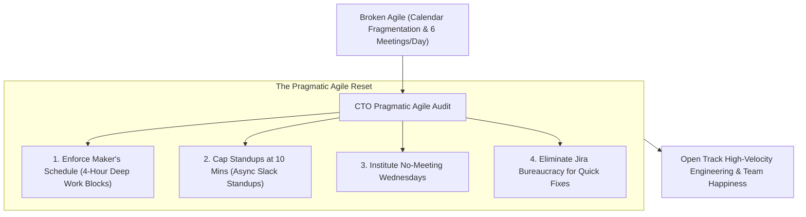
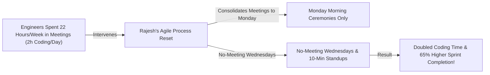

```ppt
# Slide 1: Fixing Broken Agile & Process Bloat
- **The Core Leadership Reset:** Eliminating meeting bloat, micromanagement, and process bureaucracy to restore deep, uninterrupted developer coding time.
- **Executive Reality:** Agile was created to serve software developers — developers were not created to serve Agile process ceremonies!
- **Author:** Pankaj Kumar | Associate Architect & Tech Leadership
<!-- slide -->
# Slide 2: The Meeting Interruption Highway Analogy
- **Broken Bureaucratic Process (Dark Agile):** Forcing a high-speed Formula 1 driver to pull into the pit stop every 3 laps for mandatory 45-minute status meetings (*Meeting Fragmentation*). The car spends more time sitting in the pit than racing on the track!
- **Lean High-Velocity Engineering (Pragmatic Agile):** Eliminating unnecessary pit stops, keeping daily standups to **10 minutes**, and giving drivers 4 hours of uninterrupted open track time (**Deep Work Focus Blocks**)!
<!-- slide -->
# Slide 3: The 4 Symptoms of "Dark Agile"
- **1. Calendar Fragmentation:** 6 scattered 30-minute meetings throughout the day destroying focus.
- **2. Status Report Standups:** Daily standups turning into 45-minute manager interrogations.
- **3. Story Point Tyranny:** Management using velocity to pressure developers into working weekends.
- **4. Ticket Creation Bureaucracy:** Requiring a 3-page Jira ticket to fix a 1-line CSS typo.
<!-- slide -->
# Slide 4: Real-World Case Study: Rajesh's Maker's Schedule Reset
- **The Problem:** Software engineers on Lead Architect **Rajesh Sharma's** team spent 22 hours per week in meetings, leaving only 2 hours per day for actual coding.
- **The Process Reset:** Rajesh implemented **"Maker's Schedule"**: Consolidated all Agile ceremonies into Monday morning, instituted **No-Meeting Wednesdays**, and capped daily standups at 10 minutes.
- **The Result:** Doubled developer coding time, boosted sprint completion by 65%, and restored team happiness!
<!-- slide -->
# Slide 5: The Maker vs. Manager Schedule
- **Manager's Schedule:** Day divided into 1-hour meeting blocks (Easy to switch contexts).
- **Maker's Schedule:** Day divided into 4-hour uninterrupted deep focus blocks (Interruption destroys mental momentum!).
<!-- slide -->
# Slide 6: Pragmatic Agile Audit Checklist
- **Audit Rule 1:** If a recurring meeting doesn't result in a decision or unblock developers, cancel it!
- **Audit Rule 2:** Asynchronous Slack standups for distributed teams.
- **Audit Rule 3:** Empower developers to decline non-essential meetings.
<!-- slide -->
# Slide 7: Common Misconception
- **Myth:** "Adopting Agile means strictly adhering to every ceremony in the Scrum guide without exception."
- **Fact:** The first principle of the Agile Manifesto is *"Individuals and Interactions over Processes and Tools"*!
<!-- slide -->
# Slide 8: Summary for Beginners
- Fix broken Agile: protect Maker's Schedule focus blocks, trim meeting bloat, simplify Jira bureaucracy, and put developer coding time first!
```

# Fixing Broken Agile: When Process Gets in the Way of Coding

In 2001, seventeen software leaders gathered in Utah to write the **Agile Manifesto**.

Their primary objective was to free developers from rigid waterfall bureaucracy and restore focus on writing great software. The very first line of the manifesto states:  
> **"Individuals and interactions over processes and tools."**

Yet, two decades later, many engineering organizations suffer from **"Dark Agile" (Process Bloat):**
- Developers attend 6 scattered meetings a day, leaving only 90 minutes for actual coding.
- Daily standups drag on for 45 minutes as managers interrogate engineers for status updates.
- Engineers must write a 3-page Jira ticket just to fix a 1-line CSS typo.
- Velocity metrics are weaponized to force developers into working weekends.

When process gets in the way of coding, **developers get burnt out, software quality drops, and top engineers quit!**

How do visionary CTOs fix broken Agile and restore high-velocity engineering?

Let's understand Fixing Broken Agile using **The Formula 1 Pit Stop Analogy**!

---

## 🏎️ The Formula 1 Pit Stop Analogy

Imagine managing a Formula 1 racing team during a championship race:



- **The Broken Bureaucratic Team (Dark Agile):**  
  Forcing a high-speed Formula 1 driver to pull into the pit stop every 3 laps for mandatory 45-minute status meetings (**Meeting Fragmentation**). The race car spends more time sitting idle in the pit lane than racing at 200 mph on the track!

- **The High-Velocity Racing Squad (Pragmatic Agile):**  
  Eliminating unnecessary pit stops, keeping standups to **10 minutes**, and giving drivers 4 hours of uninterrupted open track time (**Maker's Schedule Focus Blocks**)! The driver achieves peak performance.

---

## 📊 Real-World Case Study: Rajesh's Maker's Schedule Reset

Consider a cloud engineering squad led by Lead Architect **Rajesh Sharma**.



1. **The Problem:** Rajesh conducted a calendar audit and discovered his developers were spending **22 hours per week** sitting in meetings. Because meetings were scattered throughout the day, developers had zero uninterrupted focus blocks to write complex code.
2. **The Pragmatic Reset:**  
   - Rajesh eliminated status meetings and introduced **The Maker's Schedule**:
   - **Ceremony Consolidation:** All Sprint Planning, Refinement, and Retrospective meetings were consolidated into Monday morning.
   - **No-Meeting Wednesdays:** Wednesdays were designated as 100% meeting-free deep coding days across the entire engineering department.
   - **10-Minute Standups:** Daily standups were capped at 10 minutes (standing up!), focusing strictly on blockers.
3. **The Result:** Developer deep coding time **doubled**, sprint completion rates jumped by **65%**, and developer satisfaction scores reached an all-time high!

---

## 📊 "Dark Agile" Process Bloat vs. Pragmatic High-Velocity Agile

| Process Dimension | "Dark Agile" Process Bloat (Avoid) | Pragmatic High-Velocity Agile (Adopt) |
| :--- | :--- | :--- |
| **Core Philosophy** | Process adherence & tool compliance | Developer productivity & customer outcome delivery |
| **Daily Standup** | 45-minute manager interrogation call | 10-minute standing huddle or async Slack check-in |
| **Developer Calendar** | Fragmented with 5+ scattered meetings daily | 4-hour uninterrupted "Maker's Schedule" focus blocks |
| **Jira Governance** | Heavy administrative paperwork for minor code changes | Lightweight, simple tickets with clear DoR/DoD gates |
| **Sprint Velocity** | Weaponized to pressure developers into overtime | Internal team planning baseline used with psychological safety |

---

## 💡 Summary for Beginners

- **Maker's Schedule** = A calendar structure dividing the day into half-day (4-hour) uninterrupted blocks dedicated to deep creative work like software engineering.
- **Dark Agile** = The anti-pattern of turning Agile principles into rigid, bureaucratic process overhead and micromanagement.
- **CTO Golden Rule** = **"Agile exists to serve developers — protect Maker's Schedule focus blocks, eliminate meeting bloat, and keep process lean!"**

---

*Written by **Pankaj Kumar** | Associate Architect & Tech Leadership.*
