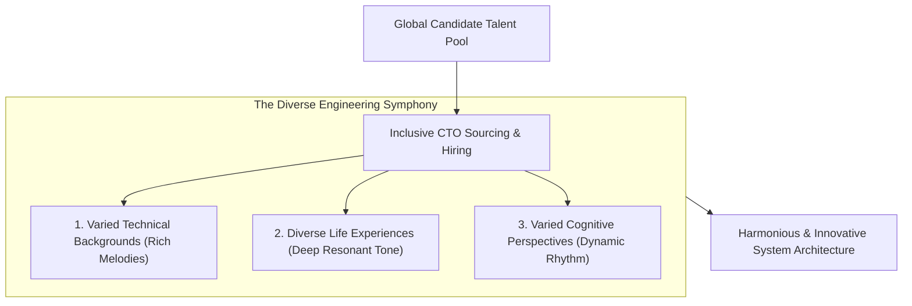

```ppt
# Slide 1: Diversity & Inclusion in Engineering
- **The Core Discipline:** Building diverse, inclusive, and equitable software engineering teams that drive innovative problem-solving.
- **Executive Rule:** Diversity is not a PR metric — diverse teams architect better software and eliminate cognitive blind spots!
- **Author:** Pankaj Kumar | Associate Architect & Tech Leadership
<!-- slide -->
# Slide 2: The Multi-Instrument Orchestra Analogy
- **Single-Instrument Ensemble (Monolithic Culture):** An orchestra consisting exclusively of 50 snare drums! They play loud and fast, but can only produce a single repetitive rhythm.
- **Diverse Symphony Orchestra (Inclusive Engineering Culture):** Combines violins, cellos, flutes, brass, and percussion! Each instrument brings a unique range, creating rich, complex musical harmony that no single instrument could achieve alone!
<!-- slide -->
# Slide 3: Why Diversity Matters in Software Engineering
- **1. Eliminating Cognitive Blind Spots:** Diverse backgrounds catch usability, accessibility, and algorithmic bias flaws early.
- **2. Broader Talent Pipeline:** Accessing 100% of the available engineering talent pool.
- **3. Higher Team Innovation:** Studies show diverse technical teams are 35% more likely to outperform homogenous peers.
<!-- slide -->
# Slide 4: 4 Pillars of Inclusive Engineering Leadership
- **1. Inclusive Sourcing:** Expanding job postings beyond traditional networks to diverse tech communities.
- **2. Anonymized Resume Reviews:** Masking candidate names and universities during initial screening to eliminate unconscious bias.
- **3. Equitable Career Ladders:** Ensuring equal access to high-visibility architecture projects and Staff Engineer promotions.
- **4. Inclusive Meeting Culture:** Ensuring introverted and underrepresented engineers are heard during design reviews.
<!-- slide -->
# Slide 5: Inclusive Technical Architecture & AI Ethics
- **Algorithmic Fairness:** Auditing machine learning training data to prevent demographic bias.
- **Universal Accessibility (a11y):** Building software that works seamlessly for users with disabilities.
<!-- slide -->
# Slide 6: Measuring Inclusion Metrics
- **Retention Parity:** Ensuring underrepresented engineers have equal 2-year retention rates.
- **Promotion Equity:** Tracking promotion velocity across diverse demographics.
<!-- slide -->
# Slide 7: Common Misconception
- **Myth:** "Prioritizing diversity means lowering technical standards for engineering hires."
- **Fact:** True inclusion elevates technical standards by attracting top talent from the entire global candidate pool!
<!-- slide -->
# Slide 8: Summary for Beginners
- Build an inclusive engineering symphony: expand sourcing, eliminate bias, ensure promotion equity, and eliminate cognitive blind spots!
```

# Fostering Diversity & Inclusion in Engineering Teams

In modern software engineering, the most dangerous architectural flaw is **Cognitive Homogeneity** — when an entire engineering department consists of people with identical backgrounds, identical educations, and identical life experiences.

When homogenous engineering teams build software:
- They miss critical user accessibility flaws.
- They train machine learning models that contain severe demographic bias.
- They fall into "groupthink" during system design reviews, missing obvious edge cases.

To build world-class, resilient software products, **CTOs must actively foster Diversity, Equity, and Inclusion (DEI)!**

Let's understand Diversity & Inclusion using **The Multi-Instrument Orchestra Analogy**!

---

## 🎻 The Multi-Instrument Orchestra Analogy

Imagine composing a world-class musical masterpiece:



- **The Monolithic Drum Corps (Homogenous Team):**  
  An ensemble consisting of 50 snare drums! They play loud and fast, but can only produce one single, repetitive rhythm. They are completely incapable of playing complex, multi-layered musical compositions.

- **The Diverse Symphony Orchestra (Inclusive CTO Culture):**  
  Combines violins, cellos, flutes, french horns, and percussion! Each instrument brings a unique pitch, timbre, and range. Together, they create rich, breathtaking musical harmony that no single instrument could ever achieve alone!

---

## 📊 Homogenous Tech Team vs. Inclusive Engineering Culture

| Workplace Dimension | Homogenous Tech Team (Avoid) | Inclusive Engineering Culture (Adopt) |
| :--- | :--- | :--- |
| **Sourcing Channels** | Hiring exclusively from 3 local universities & referral networks | Broad sourcing across diverse engineering communities (Grace Hopper, NSBE, Out in Tech) |
| **Resume Screening** | Subjective screening influenced by candidate name & background | Anonymized resume reviews masking names to eliminate unconscious bias |
| **Architecture Reviews** | Loudest voices dominate meetings; introverts interrupted | Structured round-robin design reviews ensuring every engineer's voice is heard |
| **Product Accessibility** | Accessibility treated as an optional afterthought | Accessibility (a11y) & algorithmic fairness baked into core DoD (*Definition of Done*) |

---

## 💡 Summary for Beginners

- **Diversity & Inclusion in Tech** = Building engineering teams that reflect the global diversity of software users.
- **Cognitive Diversity** = Bringing varied problem-solving approaches together to catch edge cases and drive innovation.
- **CTO Golden Rule** = **"Build an inclusive engineering symphony — diverse perspectives eliminate architectural blind spots and drive world-class innovation!"**

---

*Written by **Pankaj Kumar** | Associate Architect & Tech Leadership.*
