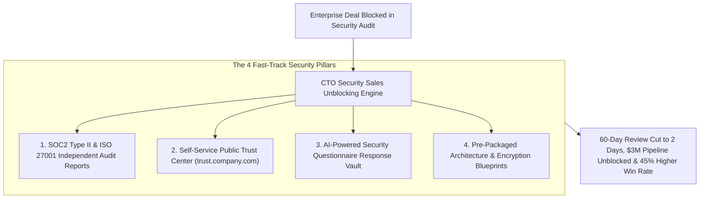
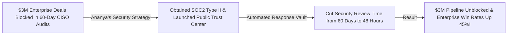

```ppt
# Slide 1: Handling Security Questionnaires & SOC2 Compliance
- **The Core Strategy:** Transforming enterprise security reviews from a 60-day sales bottleneck into a fast-track commercial advantage through SOC2 Type II certification, Trust Centers, and automated response repositories.
- **Executive Reality:** Enterprise deals don't stall on pricing — 70% of enterprise sales pipeline friction is caused by security questionnaires and compliance audits!
- **Author:** Pankaj Kumar | Associate Architect & Tech Leadership
<!-- slide -->
# Slide 2: Messy Paper Questionnaires vs. Certified Health Badge Analogy
- **Messy Paper Questionnaires (Sales-Blocking Friction):** A restaurant manager drowning in 500 pages of manual paper health questionnaires while a corporate client cancels a $100,000 banquet contract (**Manual Security Reviews**)!
- **Certified Gold Health Badge (SOC2 Trust Center):** A confident CTO hanging a glowing gold SOC2 & Health Compliance Certificate at the entrance (**Self-Service Security Trust Center**)! Corporate buyers inspect the certificate, skip manual reviews, and sign contracts instantly!
<!-- slide -->
# Slide 3: The 4 Pillars of Sales-Unblocking Security
- **1. SOC2 Type II & ISO 27001 Certification:** Independent third-party audit proving continuous security controls.
- **2. Self-Service Public Security Trust Center:** Hosting `trust.company.com` with NDA-gated SOC2 reports & penetration tests.
- **3. AI-Powered Questionnaire Automation:** Using pre-indexed security response vaults to complete 300-question vendor forms in 1 hour.
- **4. Standardized Security Packet:** Providing pre-packaged architecture diagrams, encryption specs, & incident SLAs.
<!-- slide -->
# Slide 4: Real-World Case Study: Ananya's Security Fast-Track
- **The Challenge:** A fintech SaaS startup led by VP **Ananya Verma** had $3M in enterprise deals blocked in CISO security reviews, taking 60 days per questionnaire.
- **The Security Overhaul:** Ananya secured SOC2 Type II compliance, launched a public Trust Center, and deployed automated questionnaire response tooling.
- **The Result:** Cut security review time from 60 days to 2 days, unblocked $3M in sales pipeline, and increased enterprise win rates by 45%!
<!-- slide -->
# Slide 5: The Security Review Acceleration Loop
- **Step 1 (Proactive Disclosure):** Send pre-packaged Trust Center link alongside commercial proposals.
- **Step 2 (Self-Service NDA Access):** Allow client CISOs to download SOC2 Type II reports autonomously.
- **Step 3 (Automated Response Vault):** Auto-fill remaining custom questionnaire items using verified engineering answer banks.
<!-- slide -->
# Slide 6: Essential Documents in a Vendor Security Packet
- **SOC2 Type II Report:** 12-month continuous audit report from an accredited CPA firm.
- **Third-Party Penetration Test Summary:** Recent executive summary from ethical security auditors.
- **Architecture & Data Flow Diagram:** Clear visual map of data encryption at rest & in transit.
<!-- slide -->
# Slide 7: Common Misconception
- **Myth:** "Security compliance is purely a defensive IT expense managed by legal."
- **Fact:** SOC2 Type II and Trust Centers are high-leverage sales acceleration tools that unlock multi-million-dollar enterprise deals!
<!-- slide -->
# Slide 8: Summary for Beginners
- Master security sales unblocking: achieve SOC2 Type II compliance, build a self-service Trust Center, automate security questionnaires, and turn security reviews into a competitive advantage!
```

# Handling Security Questionnaires & SOC2 to Unblock Sales

In enterprise B2B software sales, **Security is the Ultimate Gatekeeper.**

When an Account Executive (AE) verbally agrees on pricing with a Fortune 500 client, the deal does not go straight to contract signing:
- **The Security Bottleneck:** The deal is handed over to the client's Chief Information Security Officer (CISO) and Risk Audit team, who send a **300-Question Security Vendor Questionnaire** covering encryption, employee offboarding, penetration testing, and SOC2 compliance.
- **The Manual Nightmare:** If your team answers each question manually via email, the review takes 60 days, engineering resources are drained, and the client's budget year expires!
- **The Fast-Track Strategy:** If your company maintains **SOC2 Type II Certification** and a self-service **Public Security Trust Center (`trust.company.com`)**, the client CISO downloads certified audit reports in 5 minutes and approves the contract!

**Security Compliance is not a legal burden — it is a high-leverage Enterprise Sales Accelerator.**

How do CTOs build automated security compliance workflows that unblock sales pipelines and turn security audits into a commercial moat?

Let's understand Security Sales Unblocking using **The Messy Paper Questionnaires vs. Certified Health Badge Analogy**!

---

## 🎖️ The Messy Paper Questionnaires vs. Certified Health Badge Analogy


Imagine hosting major corporate banquets at a fine-dining establishment:



- **Messy Paper Questionnaires (Sales-Blocking Friction):**  
  A restaurant manager drowning in 500 pages of manual paper health inspection questionnaires while a corporate client cancels a $100,000 banquet contract (**Manual Security Reviews & Lost Deals**)!

- **Certified Gold Health Badge (SOC2 Trust Center):**  
  A confident CTO hanging a glowing gold SOC2 & Health Compliance Certificate at the glass entrance (**Self-Service Security Trust Center**)! Corporate buyers inspect the certified report, skip manual reviews, and sign contracts instantly.

---

## 📊 Real-World Case Study: Ananya's Security Fast-Track

Consider a fintech SaaS scale-up where **Ananya Verma** serves as Technology VP.



1. **The Challenge:** Ananya's fintech startup had **$3 Million in enterprise deals** stuck in security evaluation. Client CISOs sent custom spreadsheet questionnaires containing 250+ questions, taking senior architects 3 weeks to complete per prospect.
2. **The Security Fast-Track Execution:**  
   - Ananya spearheaded a **Proactive Compliance Strategy**:
   - **SOC2 Type II Audit:** Partnered with an accredited auditing firm to complete a 12-month continuous SOC2 Type II security audit.
   - **Self-Service Trust Center:** Launched `trust.company.com`, allowing client security teams to complete NDAs and instantly download SOC2 reports, penetration test summaries, and SLA documentation.
   - **Response Automation Vault:** Indexed 500 pre-approved engineering answers in a central knowledge base, allowing sales engineers to complete custom questionnaires in under 1 hour.
3. **The Result:** Security evaluation time dropped from **60 days to 2 days**, unblocking **$3 Million in stalled sales pipeline** and increasing enterprise deal win rates by **45%**!

---

## 📊 Manual Security Reviews vs. Proactive SOC2 Trust Center

| Dimension | Manual Security Reviews (Slow & Costly) | Proactive SOC2 Trust Center (Fast & Scalable) |
| :--- | :--- | :--- |
| **Review Duration** | 45–60 days per enterprise prospect | **48 hours via self-service Trust Center** |
| **Engineering Overhead** | Senior architects spending 15 hours filling spreadsheets | Zero architect time (Automated response vault) |
| **Client Perception** | Unorganized startup lacking security maturity | World-class enterprise platform with verified security |
| **Document Delivery** | Emailing loose PDFs and manual attachments | NDA-gated self-service portal (`trust.company.com`) |
| **Sales Impact** | Deals stalling in procurement and dying | **Accelerated deal velocity & higher win rates** |

---

## 💡 Summary for Beginners

- **SOC2 Type II** = An independent CPA audit report evaluating a company's security, availability, and confidentiality controls over a 12-month period.
- **Trust Center** = A public web portal where customers inspect security certifications, penetration test summaries, and compliance policies.
- **Vendor Security Questionnaire** = A detailed assessment sent by enterprise buyers to evaluate a vendor's cybersecurity risk before purchasing.
- **CTO Golden Rule** = **"Don't let security questionnaires kill enterprise deals — achieve SOC2 Type II compliance, launch a self-service Trust Center, and unblock sales pipelines!"**

---

*Written by **Pankaj Kumar** | Associate Architect & Tech Leadership.*
