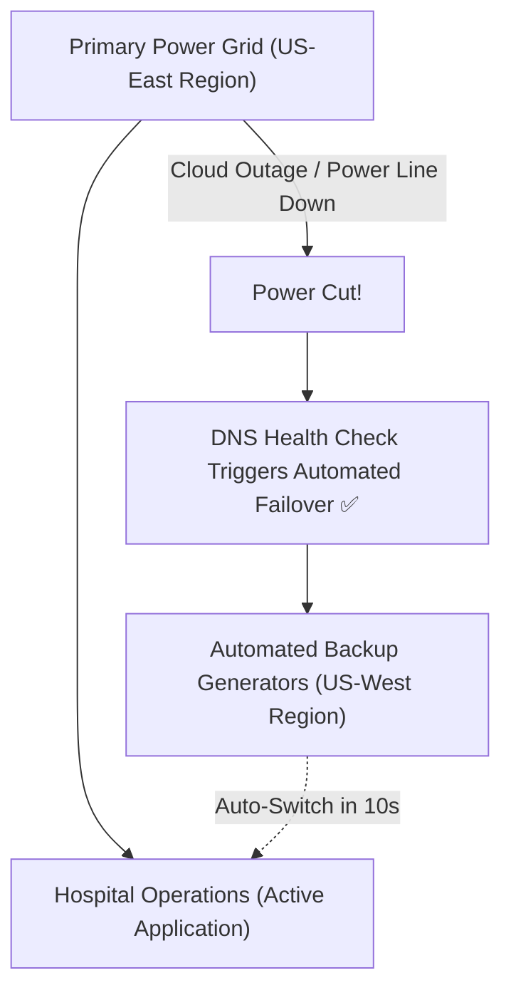

```ppt
# Slide 1: High Availability & Multi-Region Failover
- **The Core Objective:** Keeping software systems online 24/7/365, even when an entire Amazon/Google cloud data center burns down!
- **Key Concepts:** SLA, SLO, SLI, and Nines of Availability.
- **Author:** Pankaj Kumar | Associate Architect & Tech Leadership
<!-- slide -->
# Slide 2: The Hospital Backup Generator Analogy
- **Single-Region Setup:** A hospital relying on a single city power grid line (If a storm hits, power dies completely).
- **Multi-Region Failover:** A hospital equipped with instant automated diesel backup generators and dual power feeds from two separate cities!
<!-- slide -->
# Slide 3: Demystifying SLI, SLO, and SLA
- **1. SLI (Service Level Indicator):** The actual real-time measurement (e.g. Current uptime is 99.95%).
- **2. SLO (Service Level Objective):** Internal goal set by the engineering team (e.g. Target uptime is 99.9%).
- **3. SLA (Service Level Agreement):** The legal contract signed with customers specifying financial refunds if downtime exceeds targets!
<!-- slide -->
# Slide 4: The Cost of "Nines" of Availability
- **99% Uptime (Two Nines):** 87.6 hours of allowed downtime per year ($10k/mo cloud cost).
- **99.9% Uptime (Three Nines):** 8.76 hours of allowed downtime per year ($50k/mo cloud cost).
- **99.999% Uptime (Five Nines):** 5.26 minutes of allowed downtime per year ($1M+/mo cloud cost)!
<!-- slide -->
# Slide 5: Multi-Region Active-Passive vs Active-Active
- **Active-Passive (Primary + Backup):** Primary cloud region handles traffic; secondary backup region activates only during major disasters.
- **Active-Active (Dual Live Regions):** Traffic is split live between US-East and EU-West simultaneously!
<!-- slide -->
# Slide 6: Automated DNS Failover
- **Health Checks:** Route 53 / Cloudflare constantly pings primary servers every 10 seconds.
- **Auto-Rerouting:** If the primary region fails, DNS traffic is automatically redirected to the backup region in 30 seconds!
<!-- slide -->
# Slide 7: Common Beginner Misconception
- **Myth:** "We should aim for 100% uptime (Zero downtime forever)."
- **Fact:** 100% uptime is mathematically impossible and financially ruinous. Engineering teams manage "Error Budgets" instead!
<!-- slide -->
# Slide 8: Summary for Beginners
- Align availability targets (SLAs) with business costs and automate multi-region failover to withstand cloud disasters!
```

# High Availability & Multi-Region Failover: SLA, SLO, and SLI Demystified

In the modern digital economy, website outages mean lost revenue and damaged brand reputation.

When Amazon AWS experienced a major data center outage in Virginia, thousands of popular websites and apps went offline worldwide for over 5 hours. 

Why did some companies remain online without a single second of downtime during that exact same cloud outage?

Because high-performing tech companies design their systems for **High Availability & Multi-Region Failover**.

Let's demystify system reliability using **The Hospital Backup Generator Analogy**!

---

## 🏥 The Hospital Backup Generator Analogy

Imagine designing an emergency hospital:



- **Single-Region Setup (City Power Grid Only):**  
  The hospital plugs directly into the city power grid line. If a storm knocks down the power lines (*AWS Region Outage*), all operating room lights turn off, and surgeries stop!

- **Multi-Region Failover (Automated Diesel Generators):**  
  The hospital is connected to two separate power grids from two different cities. The moment City A's power grid fails, sensors detect the drop and automatically switch to City B's power grid in **10 seconds flat** without surgeons noticing a flicker!

---

## 📊 Demystifying SLI, SLO, and SLA

Engineers and executives often confuse these 3 reliability acronyms:

| Acronym | Full Form | Plain Definition | Example |
| :--- | :--- | :--- | :--- |
| **SLI** | Service Level Indicator | **What we are actually measuring right now.** | *"Our system uptime was 99.92% last month."* |
| **SLO** | Service Level Objective | **Our internal target goal.** | *"Engineering aims for 99.9% uptime."* |
| **SLA** | Service Level Agreement | **The legal contract with cash refunds.** | *"If uptime drops below 99.5%, we refund 20% of your bill."* |

---

## ⏳ The Exponential Cost of "Nines"

Each additional "nine" of uptime increases cloud infrastructure costs exponentially:

```
99% Uptime (2 Nines)   ➜ 3.65 Days Downtime / Year  (Cheap)
99.9% Uptime (3 Nines) ➜ 8.76 Hours Downtime / Year (Standard SaaS)
99.99% (4 Nines)       ➜ 52.6 Minutes Downtime / Year (Enterprise)
99.999% (5 Nines)      ➜ 5.26 Minutes Downtime / Year (High-Risk FinTech / Millions $)
```

---

## 💡 Summary for Beginners

- **High Availability (HA)** = Designing systems to operate continuously without single points of failure.
- **Error Budget** = The allowable amount of downtime (`100% minus SLO Target`) that engineers can use to release new features safely.
- **CTO Rule** = *"Never promise a 99.99% SLA to customers if your cloud budget can only afford 99.9% infrastructure!"*

---

*Written by **Pankaj Kumar** | Associate Architect & Tech Leadership.*
