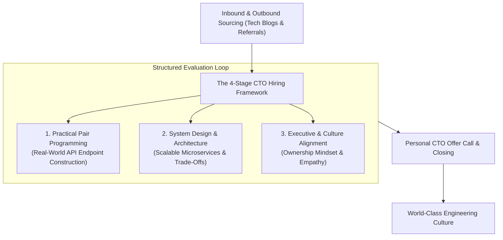

```ppt
# Slide 1: Hiring Top 1% Tech Talent
- **The Core Leadership Challenge:** Attracting, evaluating, and hiring elite software engineers and architects in a competitive market.
- **Series 4 Kickoff:** Engineering Culture, Hiring & Team Topologies.
- **Author:** Pankaj Kumar | Associate Architect & Tech Leadership
<!-- slide -->
# Slide 2: Pro Sports Scouting Academy Analogy
- **Amateur Recruiter:** Selects players based solely on height or who wears the flashiest jersey.
- **Pro Sports Talent Scout (The CTO Recruiter):** Evaluates tactical decision-making under pressure, game intelligence, teamwork, adaptability, and core athletic fundamentals!
<!-- slide -->
# Slide 3: Why Traditional Tech Interviews Fail
- **Rote LeetCode Trivia:** Memorizing obscure algorithm puzzles doesn't predict if a developer can build scalable production APIs.
- **Unstructured Interviews:** Inconsistent interviewer questions lead to hiring bias and poor candidate evaluation.
<!-- slide -->
# Slide 4: The 4-Stage CTO Sourcing Framework
- **Stage 1 (Inbound & Sourcing):** Employer branding, open-source contributions, technical tech blogs, and employee referrals.
- **Stage 2 (Practical Coding Take-Home / Pair Programming):** Real-world scenario building a clean API endpoint.
- **Stage 3 (System Design & Architecture):** Designing a scalable real-time microservices system with trade-offs.
- **Stage 4 (Culture & Executive Fit):** Assessing ownership mindset, empathy, and collaboration.
<!-- slide -->
# Slide 5: The Candidate Experience (DevEx in Hiring)
- **Fast Feedback Loop:** Responding to candidates within 24 hours after each interview round.
- **Respect Candidate Time:** Keeping take-home coding challenges under 3 hours.
<!-- slide -->
# Slide 6: Closing Top 1% Candidates
- **Beyond Salary:** Elite developers choose companies based on engineering autonomy, modern tech stack, and clear career growth.
- **Executive Pitch:** The CTO personally calling top candidates to share the company's 3-year vision.
<!-- slide -->
# Slide 7: Common Misconception
- **Myth:** "Hiring the fastest coder is always the best choice for an engineering team."
- **Fact:** High-performing engineering cultures value collaboration, clean architecture, and problem-solving over cowboy coders!
<!-- slide -->
# Slide 8: Summary for Beginners
- Scout for real-world problem solving, design structured interview loops, respect candidate time, and lead with technical vision!
```

# Hiring Top 1% Tech Talent: The CTO Sourcing Playbook

Welcome to **Series 4: Engineering Culture, Hiring & Team Topologies!**

In software engineering, the difference between an average developer and an elite, high-performing engineer is not 10%. **It is a 10x difference in output, architectural quality, and problem-solving speed!**

Yet, most tech startups and enterprise companies rely on broken hiring processes:
- Giving candidates 4-hour whiteboarding puzzles testing obscure computer science algorithms.
- Asking unstructured behavioral questions that result in hiring bias.
- Taking 4 weeks to make offer decisions, causing top candidates to accept offers elsewhere.

How does a CTO build a world-class pipeline to hire top 1% technology talent?

Let's understand Tech Talent Sourcing using **The Pro Sports Scouting Academy Analogy**!

---

## 🏈 The Pro Sports Scouting Academy Analogy

Imagine scouting players for an elite professional football team:



- **The Amateur Scout:**  
  Selects players based solely on who has the flashiest jersey or who can jump the highest in a gym, ignoring how they play during a real high-stakes match.

- **The Pro Sports Scout (The CTO Talent Leader):**  
  Analyzes game tape, measures decision-making under intense pressure, tests tactical field intelligence, and evaluates how well the player communicates with teammates. They draft players who make the entire team win!

---

## 📊 Traditional Tech Interviews vs. Practical CTO Sourcing

| Interview Stage | Broken Traditional Approach | Practical CTO Sourcing Playbook |
| :--- | :--- | :--- |
| **Stage 1: Initial Screen** | Recruiter asking trivia questions about framework syntax | 30-minute technical chat with an Engineering Lead reviewing past projects |
| **Stage 2: Coding Test** | Inverting binary trees on a whiteboard under pressure | 2-hour practical pair-programming session building a clean REST API |
| **Stage 3: System Design** | Memorizing generic Twitter clone architecture diagrams | Architectural discussion on scaling your company's actual production database |
| **Stage 4: Closing** | Standard automated HR email offer | Personal phone call from the CTO sharing company vision & career trajectory |

---

## 💡 Summary for Beginners

- **Top 1% Sourcing** = Building structured, real-world evaluation pipelines that measure practical problem-solving and team collaboration.
- **Speed to Offer** = Complete your interview loop within 5 business days to win top candidates before competitors.
- **CTO Golden Rule** = **"Never hire for raw coding speed alone — hire empathetic problem-solvers who elevate the architectural quality and morale of your entire team!"**

---

*Written by **Pankaj Kumar** | Associate Architect & Tech Leadership.*
