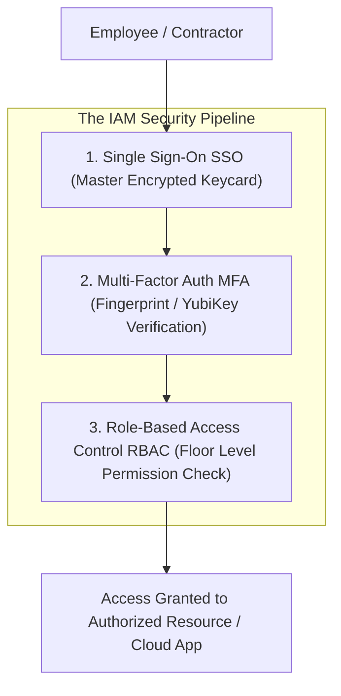
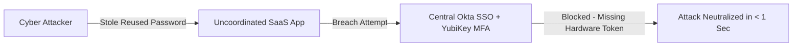

```ppt
# Slide 1: Identity & Access Management (IAM)
- **The Core Discipline:** Managing user identities, authentication protocols, and access authorization rules across enterprise systems.
- **Executive Security Rule:** Identity is the new security perimeter — control identity, control access!
- **Author:** Pankaj Kumar | Associate Architect & Tech Leadership
<!-- slide -->
# Slide 2: The Keycard & Fingerprint Scanner Analogy
- **Careless Building (Legacy Passwords):** Locks 50 office doors with 50 different brass keys. Employees write keys on yellow sticky notes taped under their desks. A thief finds one key and opens 10 offices!
- **Master High-Tech Skyscraper (IAM + SSO + MFA):** Every employee carries a single encrypted master keycard (*Single Sign-On SSO*) and must scan their fingerprint (*Multi-Factor Authentication MFA*) at every door. The security warden can revoke access to all 50 doors in 1 second!
<!-- slide -->
# Slide 3: Authentication vs. Authorization
- **Authentication (AuthN):** *"Who are you?"* (Verifying user identity via SSO, Password, Fingerprint).
- **Authorization (AuthZ):** *"What are you allowed to do?"* (Verifying permissions via Role-Based Access Control RBAC).
<!-- slide -->
# Slide 4: Real-World Case Study: Vikram's Fintech IAM Overhaul
- **The Vulnerability:** A fintech startup led by Lead Architect **Vikram Patel** suffered a breach because developers reused personal passwords across 20 uncoordinated cloud tools.
- **The Solution:** Vikram deployed Okta Central SSO with YubiKey hardware MFA and Role-Based Access Control (RBAC).
- **The Result:** 100% credential central visibility, zero password reuse, and instant 1-click employee offboarding!
<!-- slide -->
# Slide 5: The 3 Core Pillars of Modern IAM
- **1. Centralized Single Sign-On (SSO):** Authenticating users once through an Identity Provider (Okta, Azure AD, Google Workspace).
- **2. Phishing-Resistant MFA (FIDO2):** Replacing SMS text MFA with hardware security keys (YubiKey / WebAuthn).
- **3. Role-Based Access Control (RBAC):** Assigning permissions based on job roles (e.g. Developer, Finance Lead, Admin).
<!-- slide -->
# Slide 6: The Principle of Least Privilege (PoLP)
- **Default Deny:** Users receive zero access until explicitly granted permissions.
- **Just-In-Time (JIT) Access:** Granting temporary 2-hour elevated admin access for specific maintenance tasks.
<!-- slide -->
# Slide 7: Common Misconception
- **Myth:** "SMS text message codes are sufficient Multi-Factor Authentication (MFA) for enterprise security."
- **Fact:** SMS codes are easily intercepted via SIM-swapping cyberattacks — FIDO2 hardware keys or authenticator apps are required!
<!-- slide -->
# Slide 8: Summary for Beginners
- Master IAM: centralize identity with Single Sign-On (SSO), mandate FIDO2 hardware MFA, enforce Role-Based Access Control (RBAC), and grant least-privilege access!
```

# Identity and Access Management (IAM): SSO & MFA Best Practices

In traditional office buildings, physical security relied on brass keys and door locks.

In the modern cloud economy, **Identity is the New Security Perimeter.**

Because software developers, marketers, and finance leads access cloud applications from laptops, smartphones, and home networks worldwide, traditional office firewalls can no longer protect company assets.

If an attacker steals an employee's password, they gain access to customer databases, cloud servers, and proprietary source code.

To secure digital assets, **CTOs enforce Identity and Access Management (IAM) through Single Sign-On (SSO) and Multi-Factor Authentication (MFA)!**

Let's understand IAM using **The High-Tech Skyscraper Master Keycard Analogy**!

---

## 🏢 The High-Tech Skyscraper Master Keycard Analogy

Imagine managing security at a 50-story commercial skyscraper:



- **The Careless Office Building (Legacy Password Fatigue):**  
  Locks 50 different office doors with 50 different brass keys. Employees get confused, write key labels on sticky notes under their keyboards, and reuse the same weak key. A thief finds one key and opens 10 executive offices!

- **The Master High-Tech Skyscraper (IAM + SSO + MFA Architecture):**  
  Every employee carries a single encrypted master keycard (**Centralized SSO**), scans their fingerprint at the door (**Phishing-Resistant MFA**), and is restricted to their assigned floor (**Role-Based Access Control**). If an employee leaves, security deactivates their keycard across all 50 floors in **1 second**!

---

## 📊 Real-World Case Study: Vikram's Fintech Credential Overhaul

Consider a fast-growing fintech platform led by Lead Architect **Vikram Patel**.



1. **The Vulnerability:** Vikram's company used 25 different uncoordinated SaaS tools (Jira, GitHub, AWS, Slack, HubSpot). Employees reused the same simple passwords across multiple accounts, leading to a credential stuffing attack on an unmonitored staging server.
2. **The Solution:** Vikram implemented **Centralized IAM with Okta SSO and YubiKey Hardware MFA**:
   - Every employee logs in once per day via Okta SSO.
   - Access to production databases requires a physical YubiKey hardware tap (**FIDO2 WebAuthn**).
   - Role-Based Access Control (RBAC) maps permissions directly to job titles (e.g. `Role: Junior Developer` can push code, but cannot delete production AWS databases).
3. **The Result:** Zero password fatigue, 100% centralized audit logging, and instant 1-click employee access revocation!

---

## 📊 Authentication (AuthN) vs. Authorization (AuthZ)

| Security Dimension | Authentication (AuthN) | Authorization (AuthZ) |
| :--- | :--- | :--- |
| **Core Question** | *"Who are you?"* | *"What are you allowed to access?"* |
| **Primary Focus** | Verifying user or service identity credentials | Enforcing access permissions and boundaries |
| **Technologies Used** | Single Sign-On (SSO), Passwords, YubiKeys, MFA | Role-Based Access Control (RBAC), ABAC, IAM Policies |
| **Analogy** | Showing your passport at border control | Checking if your ticket permits access to VIP First Class |
| **Failure Risk** | Account Takeover (Attacker impersonates valid user) | Privilege Escalation (User accesses unauthorized data) |

---

## 💡 Summary for Beginners

- **Single Sign-On (SSO)** = A centralized authentication service allowing users to log in once to access all company applications securely.
- **Multi-Factor Authentication (MFA)** = Requiring two or more verification factors (Password + YubiKey hardware token) to log in.
- **Principle of Least Privilege (PoLP)** = Granting users the minimum access permissions necessary to perform their job duties.
- **CTO Golden Rule** = **"Treat identity as your primary security perimeter — centralize authentication with SSO, enforce YubiKey hardware MFA, and restrict access using Role-Based Access Control!"**

---

*Written by **Pankaj Kumar** | Associate Architect & Tech Leadership.*
