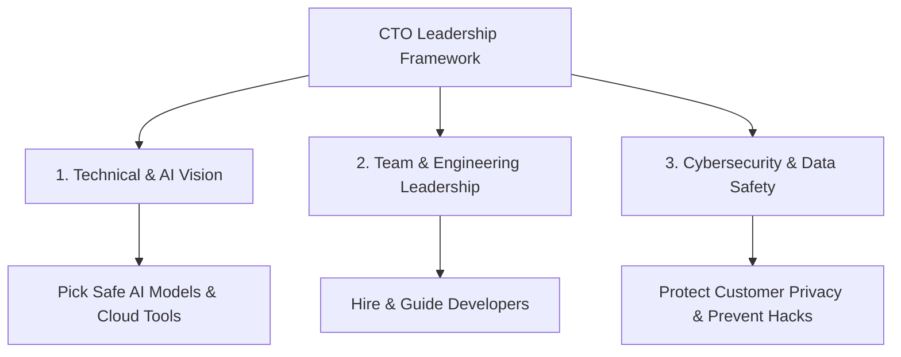

```ppt
# Slide 1: Who is a CTO? (The Simple Explanation)
- **Full Form:** Chief Technology Officer.
- **The Ship Analogy:** CEO is the Captain deciding destination; CTO is the Chief Engineer building the engine.
- **Main Goal:** Turning business ideas into real, working technology products.
- **Author:** Pankaj Kumar | Associate Architect & Tech Leadership Writer
<!-- slide -->
# Slide 2: Real-World Analogy: Car Engines & AI
- **Old World (Petrol Engine):** Writing line-by-line code manually.
- **AI World (Electric & Self-Driving):** AI handles routine driving; CTO builds safety systems and navigation.
- **Key Lesson:** CTOs guide AI tools so businesses run smoothly without crashes.
<!-- slide -->
# Slide 3: The 3 Core Responsibilities of a CTO
- **1. Technical Vision:** Deciding which technology and AI tools to build or buy.
- **2. Team Leadership:** Coaching developers, engineers, and data scientists.
- **3. Security & Safety:** Protecting user data and company secrets from cyber hacks.
<!-- slide -->
# Slide 4: Real-Time Example: Hospital AI Assistant
- **Problem:** Doctors spending 4 hours a day typing patient reports manually.
- **Without a CTO:** Buying risky AI software that leaks patient privacy data.
- **With a CTO:** Deploying an encrypted, safe AI model saving doctors 3 hours daily while keeping records 100% private.
<!-- slide -->
# Slide 5: Real-Time Example: E-Commerce Surge
- **Problem:** Online shopping store crashing during Black Friday sale rush.
- **CTO Solution:** Setting up automated cloud expansion (scaling) so 100,000 shoppers can buy simultaneously without delay.
<!-- slide -->
# Slide 6: What Has Changed in the AI-Led Era?
- **Speed:** Building apps in hours instead of months.
- **Cost:** Controlling cloud server and AI compute expenses.
- **AI Guardrails:** Ensuring AI models give factual answers without making up fake information (hallucinations).
<!-- slide -->
# Slide 7: C-Suite Teamwork: CEO, CFO, and CTO
- **CEO (Chief Executive Officer):** Sets business vision and market destination.
- **CFO (Chief Financial Officer):** Manages money, revenue, and budget limits.
- **CTO (Chief Technology Officer):** Builds high-speed technology engine staying within budget.
<!-- slide -->
# Slide 8: Common Beginner Misconceptions
- **Myth:** "CTO spends all day typing code in a dark room."
- **Fact:** CTO spends time on executive strategy, team leadership, AI safety, and business growth.
<!-- slide -->
# Slide 9: Key Takeaways for Beginners
- A CTO is the bridge connecting **Business Goals** with **Technology Power**.
- In the AI era, a CTO ensures companies innovate safely, quickly, and profitably.
<!-- slide -->
# Slide 10: Executive Summary
- Understanding technology leadership helps non-tech managers, founders, and beginners navigate the AI future with confidence!
```

# What is a CTO? The Importance of a CTO in the AI-Led Industry

If you are completely new to technology or business, terms like **CTO** can sound like confusing corporate jargon. But in today's fast-moving Artificial Intelligence (AI) world, understanding what a CTO does is simple, fascinating, and essential for anyone interested in apps, startups, or executive strategy.

Let's break everything down from absolute scratch using easy everyday analogies!

---

## 1. What Does "CTO" Actually Stand For?

**CTO** stands for **Chief Technology Officer**. 

### 🚢 The Ship & Captain Analogy
Imagine a massive ocean cruise ship sailing across the sea:
- **The CEO (Chief Executive Officer):** Is the **Captain** standing on the bridge, looking at the map and deciding which tropical island to sail towards.
- **The CTO (Chief Technology Officer):** Is the **Chief Engineer** deep in the engine room, designing, building, and maintaining the powerful engines, navigation radar, and power grid that get the ship to that island safely and quickly.

> **Key Takeaway:** A CTO is the executive technology leader responsible for selecting, building, and guiding all software tools, platforms, AI models, and engineering teams in a company.

---

## 2. Real-Time Example: Why Every Company Needs a CTO

Let's look at two real-world stories to understand why a CTO is essential:

### 🏥 Scenario A: The Hospital AI Assistant
- **The Problem:** A hospital's doctors are overwhelmed, spending 4 hours every evening typing patient medical reports manually.
- **Without a CTO:** The hospital management might panic and buy an unverified, expensive AI tool from the internet that accidentally leaks private patient records online.
- **With a CTO:** The CTO evaluates 50 AI tools, selects a private, encrypted AI model, tests it with the engineering team, and deploys it safely. Now doctors save 3 hours every day while patient records stay 100% secure.

### 🛍️ Scenario B: The Online Shopping Rush
- **The Problem:** An e-commerce store expects 500,000 shoppers during a big holiday sale.
- **Without a CTO:** The website crashes within 3 minutes of the sale starting, losing millions in revenue.
- **With a CTO:** The CTO builds an automated cloud system that expands server power as traffic grows, allowing all 500,000 users to checkout smoothly without a single glitch.

---

## 3. The 3 Core Responsibilities of a CTO



### 1️⃣ Technical & AI Vision (The Architecture)
Deciding which technology to build from scratch versus which ready-made software tools to rent or buy.

### 2️⃣ Team Leadership (The Orchestra Conductor)
Hiring software developers, data scientists, and cloud architects, and keeping them organized so everyone builds tools in sync.

### 3️⃣ Cybersecurity & Safety (The Bank Vault)
Ensuring customer passwords, credit card numbers, and private data are locked inside digital vaults protected from cyber attackers.

---

## 4. Quick Comparison: Traditional Era vs. AI-Led Era

| Business Aspect | Traditional Technology Era | Modern AI-Led Industry |
| :--- | :--- | :--- |
| **Development Speed** | Weeks or Months | Days or Hours (with AI assistance) |
| **CTO Primary Focus** | Managing Manual Code Writing | Strategic AI Selection & Data Guardrails |
| **Main System Risk** | Minor Software Bugs & Slow Servers | Data Privacy Leaks, AI Hallucinations & Cloud Bills |
| **Real-World Analogy** | Driving a Manual Stick-Shift Car | Operating a Fleet of Self-Driving Electric Vehicles |

---

## 5. Summary for Beginners

- **CTO** = **Chief Technology Officer** (The executive technology engineer).
- **The Role** = Guiding software tools, developer teams, cloud servers, and AI strategy.
- **Why It Matters** = AI is transforming every business; a CTO ensures technology is used safely, intelligently, and profitably.

---

*Written by **Pankaj Kumar** | Associate Architect & Tech Leadership Writer at CTO Insights | MyCodeYatra.*
