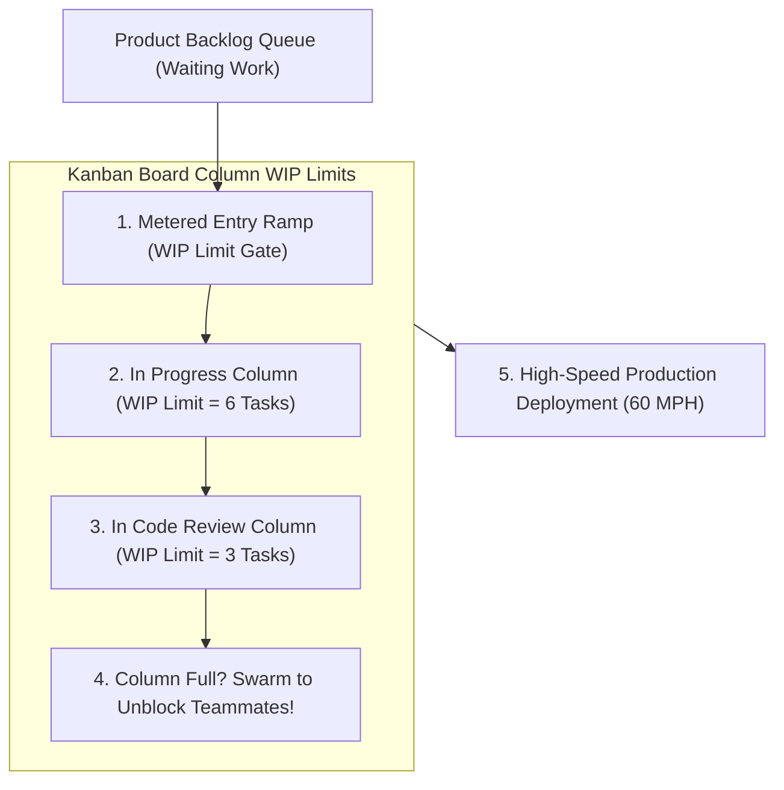
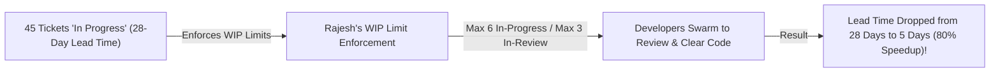

```ppt
# Slide 1: Kanban Work-in-Progress (WIP) Limits
- **The Core Discipline:** Setting strict caps on the maximum number of active tasks allowed in each stage of a Kanban workflow to prevent bottlenecks and maximize feature completion.
- **Executive Rule:** Stop starting — start finishing!
- **Author:** Pankaj Kumar | Associate Architect & Tech Leadership
<!-- slide -->
# Slide 2: The Highway Tunnel Traffic Bottleneck Analogy
- **Unrestricted Highway Tunnel (No WIP Limits):** 500 cars enter a 2-lane mountain tunnel simultaneously. The tunnel jams completely, nobody moves, and cars overheat in bumper-to-bumper traffic!
- **Smart Metered Highway Tunnel (Strict WIP Limits):** Metering ramp lights allow ONLY 20 cars inside the tunnel at a time (**WIP Limit = 20**). Cars zip through the tunnel at 60 mph and reach their destination in 2 minutes!
<!-- slide -->
# Slide 3: Little's Law & Flow Efficiency
- **Little's Law:** Lead Time = Work-in-Progress (WIP) / Throughput.
- **Direct Impact:** The more tasks developers juggle simultaneously, the longer every single task takes to reach production!
- **Context Switching Penalty:** Juggling 3 tasks wastes 40% of developer cognitive bandwidth on context switching.
<!-- slide -->
# Slide 4: Real-World Case Study: Rajesh's 80% Lead Time Reduction
- **The Bottleneck:** A cloud infrastructure squad led by Lead Architect **Rajesh Sharma** had 45 open Jira tickets in the "In Progress" column for a 6-person team. Lead time averaged 28 days!
- **The WIP Limit Fix:** Rajesh instituted strict column WIP limits: Max 6 tasks "In Progress", Max 3 tasks "In Code Review".
- **The Result:** Lead time dropped from 28 days to 5 days — an 80% speed improvement!
<!-- slide -->
# Slide 5: The Swarming Culture (Team Unblocking)
- **Stop Starting, Start Finishing:** When a column hits its WIP limit, developers are forbidden from pulling new work.
- **Swarming:** Developers "swarm" on existing in-review or blocked tickets to help teammates finish and clear the bottleneck!
<!-- slide -->
# Slide 6: Setting Initial Column WIP Limits
- **Rule of Thumb for In-Progress:** 1 to 1.5 tasks per developer (e.g. 6 devs = WIP limit of 6 to 8).
- **Rule of Thumb for Code Review:** Max 2 to 3 tasks total across the squad.
<!-- slide -->
# Slide 7: Common Misconception
- **Myth:** "Setting low WIP limits means developers sit idle and work less."
- **Fact:** WIP limits force teams to finish existing tasks faster, eliminating context switching and skyrocketing throughput!
<!-- slide -->
# Slide 8: Summary for Beginners
- Enforce Kanban WIP limits: cap active work per column, stop starting new tickets, swarm to clear bottlenecks, and reduce lead time!
```

# Kanban WIP Limits: Stopping Work-in-Progress Bottlenecks

Why do engineering teams with 10 talented developers struggle to ship features on time, even when everyone is working 50 hours a week?

When you inspect their Jira board, you find a chaotic pattern:
- The "In Progress" column has 45 open tickets for a 6-person team.
- Developers are juggling 4 different tasks simultaneously, switching contexts every 30 minutes.
- Code sits in the "In Code Review" column for 2 weeks waiting for peer feedback.

This operational disaster is caused by **Unrestricted Work-in-Progress (WIP).**

According to **Little's Law** (a fundamental mathematical law of operations research):  
$$\text{Lead Time} = \frac{\text{Work-in-Progress (WIP)}}{\text{Throughput}}$$

The more tasks your team starts simultaneously, the longer **every single task takes to reach production!**

To eliminate bottlenecks and accelerate delivery, **CTOs enforce Kanban Work-in-Progress (WIP) Limits!**

Let's understand WIP Limits using **The Metered Highway Tunnel Analogy**!

---

## 🚘 The Metered Highway Tunnel Analogy

Imagine managing traffic flow through a narrow 2-lane mountain tunnel:



- **The Unrestricted Highway Tunnel (No WIP Limits):**  
  500 cars flood into a 2-lane mountain tunnel simultaneously. The tunnel jams completely, bumper-to-bumper traffic grinds to a halt, engines overheat, and zero cars reach the exit!

- **The Smart Metered Tunnel (Strict Kanban WIP Limits):**  
  Ramp metering lights allow ONLY 20 cars inside the tunnel at a time (**WIP Limit = 20**). Traffic zips through the tunnel at 60 mph, and cars exit into the city in **2 minutes**!

---

## 📊 Real-World Case Study: Rajesh's 80% Lead Time Reduction

Consider a cloud operations squad led by Lead Architect **Rajesh Sharma**.



1. **The Bottleneck:** Rajesh's 6-person DevOps squad had 45 active tickets sitting in "In Progress". Developers were constantly interrupted, and ticket lead time averaged a sluggish **28 days**.
2. **The WIP Limit Fix:**  
   - Rajesh introduced strict Kanban column limits on their board:  
     - **In Progress WIP Limit = 6** (Max 1 active task per developer).  
     - **In Code Review WIP Limit = 3** (Max 3 tickets awaiting review across the squad).
   - If the "Code Review" column hit its limit of 3, developers were **forbidden from pulling new work from the backlog**. Instead, they had to "swarm" and help peer-review existing code first!
3. **The Result:** Ticket lead time plummeted from **28 days down to 5 days**—an **80% speed improvement** without hiring a single new developer!

---

## 📊 Unrestricted Flow vs. Kanban WIP Limited Architecture

| Execution Dimension | Unrestricted Work-in-Progress (Vulnerable) | Kanban WIP Limited Architecture (Resilient) |
| :--- | :--- | :--- |
| **Operational Motto** | *"Start as many tasks as possible"* | *"Stop starting, start finishing!"* |
| **Cognitive Load** | High (Developers juggle 3–4 tasks, losing 40% bandwidth) | Low (Developers focus 100% on 1 single task to completion) |
| **Code Review State** | PRs sit un-reviewed for 2 weeks in giant backlog piles | PRs reviewed in < 2 hours via mandatory team swarming |
| **Lead Time** | Sluggish (20 to 30 days per feature) | High Velocity (2 to 5 days per feature) |
| **Bottleneck Visibility** | Hidden behind dozens of stagnant Jira tickets | Instantly visible (Column hits WIP cap and turns red) |

---

## 💡 Summary for Beginners

- **Work-in-Progress (WIP) Limit** = A rule setting the maximum number of items allowed in a specific stage of a workflow.
- **Swarming** = A team practice where multiple team members focus on a single blocked or in-review task to get it finished before starting new work.
- **Little's Law** = A mathematical formula showing that reducing Work-in-Progress directly reduces total Lead Time.
- **CTO Golden Rule** = **"Enforce strict Kanban WIP limits — cap active tasks per column, eliminate context switching, and swarm to unblock team flow!"**

---

*Written by **Pankaj Kumar** | Associate Architect & Tech Leadership.*
