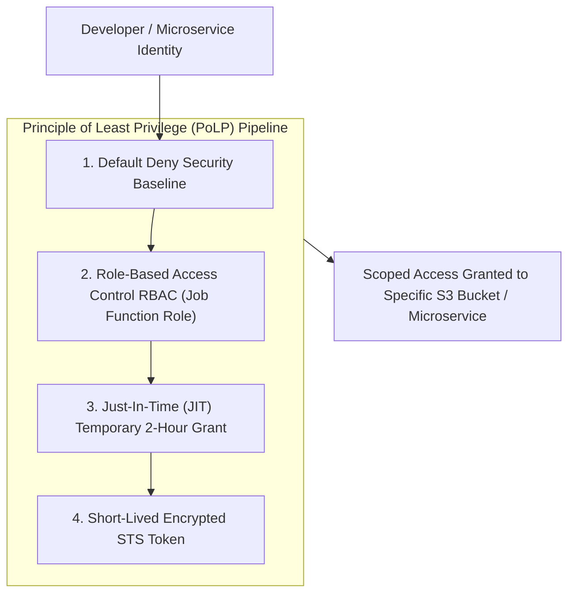
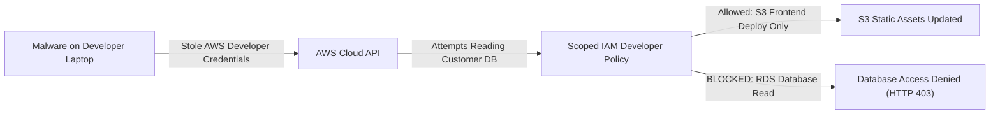

```ppt
# Slide 1: Least Privilege Access (PoLP) Strategy
- **The Core Security Discipline:** Granting users, microservices, and automated pipelines the absolute minimum access permissions necessary to perform their specific job duties.
- **Executive Security Rule:** Excess access is an invitation to disaster — default deny, authorize least privilege!
- **Author:** Pankaj Kumar | Associate Architect & Tech Leadership
<!-- slide -->
# Slide 2: The Office Janitor & Finance Safe Analogy
- **Careless Building Manager (Wildcard Administrator Access):** Hands a new night janitor a master skeleton keycard that unlocks every room in the building, including executive desks, finance safes, and secret HR files! A thief steals the janitor's keycard and loots the finance safe!
- **Master Security Warden (Least Privilege IAM Strategy):** Grants the janitor a restricted keycard (*Scoped IAM Policy*) that unlocks ONLY hallways and trash rooms between 9:00 PM and 5:00 AM (**Just-In-Time Scoped Access**). The finance safe remains 100% untouched!
<!-- slide -->
# Slide 3: The 3 Golden Rules of Least Privilege
- **1. Default Deny:** Zero access granted by default until explicitly authorized.
- **2. Role-Based Access Control (RBAC):** Grouping permissions by job roles rather than granting individual user policies.
- **3. Just-In-Time (JIT) Elevation:** Granting temporary 2-hour elevated admin privileges for emergency incident triage.
<!-- slide -->
# Slide 4: Real-World Case Study: Vikram's S3 Data Leak Avoided
- **The Vulnerability:** A junior frontend developer on Lead Architect **Vikram Patel's** team was granted wildcard `AdministratorAccess` on AWS for convenience.
- **The Incident:** The developer's laptop was infected with malware that attempted to dump customer payment databases from AWS S3.
- **The PoLP Defense:** Vikram had implemented strict IAM Roles. The developer's scoped role allowed frontend S3 deployment ONLY — database read attempts were blocked automatically!
<!-- slide -->
# Slide 5: Structuring AWS IAM Roles & Cloud Infrastructure
- **User Accounts vs IAM Roles:** Using IAM Roles with temporary STS tokens instead of long-lived access keys.
- **Microservice Isolation:** Assigning dedicated IAM roles to individual Kubernetes pods (IRSA / Workload Identity).
- **Quarterly IAM Access Audits:** Identifying and pruning unused "ghost" permissions using AWS IAM Access Analyzer.
<!-- slide -->
# Slide 6: Just-In-Time (JIT) & Break-Glass Access
- **No Permanent Root Admins:** Eliminating permanent admin credentials in production environments.
- **Approval Workflows:** Requiring Slack / PagerDuty manager approval before unlocking 2-hour production SSH access.
<!-- slide -->
# Slide 7: Common Misconception
- **Myth:** "Granting full admin access to developers speeds up sprint delivery and prevents permission friction."
- **Fact:** Wildcard admin permissions create catastrophic blast radiuses — a single compromised key destroys the company!
<!-- slide -->
# Slide 8: Summary for Beginners
- Enforce Principle of Least Privilege: default deny all access, map permissions to RBAC roles, use temporary IAM roles, and run quarterly permission pruning!
```

# Least Privilege Access in Engineering: IAM Roles Strategy

Imagine giving a newly hired office cleaning contractor a master skeleton key that unlocks every executive desk, finance vault, and employee HR file in your 50-story corporate headquarters.

If that contractor loses their keycard, or if a burglar steals it, **your entire enterprise is compromised!**

Yet, in many software engineering organizations, **this exact mistake happens every day:**
- Developers are granted wildcard `AdministratorAccess` on AWS or GCP for convenience.
- Microservices use shared database superuser credentials (`postgres` / `sa`).
- Former contractors retain full access to production cloud environments months after their contract ends.

This dangerous anti-pattern expands your **Attack Blast Radius.**

To secure cloud infrastructure, **CTOs enforce the Principle of Least Privilege (PoLP) using Scoped IAM Roles!**

Let's understand Least Privilege Access using **The Office Janitor & Finance Safe Analogy**!

---

## 🔑 The Office Janitor & Finance Safe Analogy

Imagine managing security at a commercial corporate tower:



- **The Careless Building Manager (Wildcard Administrator Access):**  
  Hands a new night janitor a master skeleton keycard that unlocks every room in the building, including executive desks, legal files, and the main finance vault. A thief steals the janitor's keycard and loots the vault overnight!

- **The Master Security Warden (Least Privilege IAM Strategy):**  
  Grants the janitor a restricted keycard (**Scoped IAM Policy**) that unlocks ONLY public hallways and trash rooms between 9:00 PM and 5:00 AM (**Time-Bound Scoped Access**). The finance vault door rejects the keycard completely!

---

## 📊 Real-World Case Study: Vikram's Cloud Blast Radius Containment

Consider a high-growth fintech startup where **Vikram Patel** serves as Lead Architect.



1. **The Context:** A junior frontend developer's laptop was infected with malware via a malicious browser extension. The malware scraped the developer's stored AWS access credentials.
2. **The Attack Attempt:** The malware tried to execute `aws rds describe-db-instances` and dump 500,000 customer payment records.
3. **The PoLP Defense:**  
   - Vikram had previously eliminated wildcard admin policies, enforcing strict **Role-Based IAM Policies**.
   - The frontend developer's IAM role strictly permitted `s3:PutObject` on the static website bucket ONLY.
   - When the malware attempted to access the production database, AWS IAM automatically blocked the request with an `AccessDenied` error.
   - The attack was contained in seconds with **zero data leak**!

---

## 📊 Wildcard Admin Access vs. Least Privilege IAM Architecture

| Security Dimension | Wildcard Admin Access (Vulnerable) | Least Privilege IAM Strategy (Resilient) |
| :--- | :--- | :--- |
| **Permission Scope** | `Resource: "*"` `Action: "*"` (Full wildcard access) | Scoped `Resource: "arn:aws:s3:::my-app-bucket/*"` `Action: "s3:GetObject"` |
| **Credential Type** | Long-lived permanent AWS Access Keys (`AKIA...`) | Short-lived temporary STS security tokens expiring in 1 hour |
| **Microservice Access** | Shared database root password across all pods | Dedicated IAM Roles for Service Accounts (IRSA / Workload Identity) |
| **Emergency Admin** | Permanent admin rights assigned to 15 developers | Just-In-Time (JIT) 2-hour temporary break-glass approval workflow |
| **Access Auditing** | Unused dormant permissions linger for years | Quarterly IAM Access Analyzer pruning dormant permissions |

---

## 💡 Summary for Beginners

- **Principle of Least Privilege (PoLP)** = Granting users and services only the minimum permissions necessary to complete their specific task.
- **Blast Radius** = The maximum damage a cyber attacker can inflict if a specific account or service is compromised.
- **Just-In-Time (JIT) Access** = Temporary elevation of permissions granted for a short duration (e.g., 2 hours) to resolve production incidents.
- **CTO Golden Rule** = **"Default deny all access — enforce role-based IAM policies, use short-lived STS tokens, and prune unused cloud permissions quarterly!"**

---

*Written by **Pankaj Kumar** | Associate Architect & Tech Leadership.*
