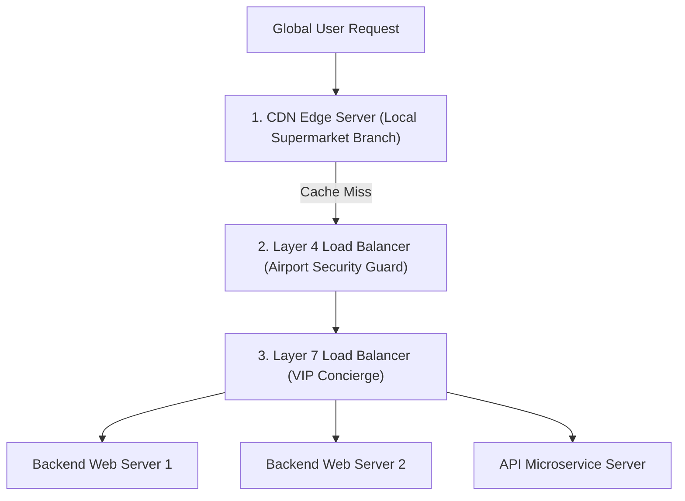

```ppt
# Slide 1: Load Balancing & Traffic Management
- **The Scalability Challenge:** Distributing millions of concurrent user requests evenly across hundreds of backend web servers.
- **Key Concepts:** L4 Network Load Balancers vs L7 Application Load Balancers & CDNs.
- **Author:** Pankaj Kumar | Associate Architect & Tech Leadership
<!-- slide -->
# Slide 2: The Airport Security Line & Local Warehouse Analogy
- **Layer 4 Load Balancer (Airport Security Guard):** Directs passengers to Line 1 or Line 2 based solely on line length without opening passport bags.
- **Layer 7 Load Balancer (VIP Concierge):** Reads ticket info (HTTP headers/URLs) to route VIP passengers to First-Class lounges.
- **CDN Caching (Local Supermarket Branch):** Keeping popular items stocked locally so customers don't drive 500 miles to the central factory!
<!-- slide -->
# Slide 3: Layer 4 (Transport Layer) Load Balancing
- **Protocol:** Operates on IP addresses and TCP/UDP ports.
- **Pros:** Ultra-fast packet forwarding (Millions of requests per second with microsecond latency).
- **Cons:** Cannot read HTTP cookies, URLs, or request body content.
<!-- slide -->
# Slide 4: Layer 7 (Application Layer) Load Balancing
- **Protocol:** Operates on HTTP/HTTPS application protocols (AWS ALB / NGINX / HAProxy).
- **Pros:** Smart routing based on URL paths (`/api` vs `/static`), SSL termination, and user cookies.
- **Cons:** Slower than L4 because it decrypts and inspects HTTP packet payloads.
<!-- slide -->
# Slide 5: Global Content Delivery Networks (CDNs)
- **Edge Caching:** Storing static images, CSS, JavaScript, and videos in 300+ edge locations worldwide (Cloudflare / CloudFront).
- **Latency Reduction:** Serving a user in Tokyo from a Tokyo edge server instead of fetching from US-East primary data centers!
<!-- slide -->
# Slide 6: Common Load Balancing Algorithms
- **Round Robin:** Distributes requests sequentially (Server 1 ➔ Server 2 ➔ Server 3).
- **Least Connections:** Sends traffic to the server currently handling the fewest active connections.
- **IP Hash:** Routes specific user IP addresses to the same server to maintain session state.
<!-- slide -->
# Slide 7: Common Beginner Misconception
- **Myth:** "Adding more backend web servers automatically speeds up a slow website."
- **Fact:** Without an L7 load balancer and CDN caching, all traffic will choke a single database or server!
<!-- slide -->
# Slide 8: Summary for Beginners
- Combine CDNs for static media caching with L4/L7 load balancers for resilient, high-speed global applications!
```

# Load Balancing & Traffic Management: L4 vs L7 Load Balancers & Global CDN Caching

What happens when 500,000 users visit your ecommerce website simultaneously during a flash sale?

If all 500,000 requests hit a single web server, that server's CPU usage spikes to 100%, its memory overflows, and the entire website crashes!

To handle massive global traffic, modern tech architectures distribute incoming traffic across hundreds of servers using **Load Balancers** and **Content Delivery Networks (CDNs)**.

Let's demystify Traffic Management using **The Airport Security & Local Supermarket Analogy**!

---

## ✈️ The Airport Security & Local Supermarket Analogy

Imagine managing traffic flow for millions of people:



- **CDN Caching (The Local Supermarket Branch):**  
  Instead of forcing 100,000 customers in Tokyo to drive 5,000 miles to a central factory in California to buy bread, the factory ships bread to local Tokyo supermarkets (*CDN Edge Nodes*). 95% of customer requests are fulfilled locally in **10 milliseconds**!

- **Layer 4 Load Balancer (The Airport Security Guard):**  
  Operates purely on IP addresses and TCP port numbers. The guard points passengers to Line A or Line B based solely on line length without checking ticket details. It is **ultra-fast**!

- **Layer 7 Load Balancer (The VIP Concierge):**  
  Operates on HTTP application data. The concierge inspects ticket details: *"Oh, you have a `/checkout` URL request? Go to the High-Security Payment Server. You have an `/images` request? Go to the Image Server!"*

---

## 📊 Layer 4 vs. Layer 7 Load Balancing Comparison

| Feature | Layer 4 (Transport Layer) | Layer 7 (Application Layer) |
| :--- | :--- | :--- |
| **Data Inspected** | IP Address & TCP/UDP Port | HTTP Headers, URL Paths, Cookies |
| **Speed & Performance** | Ultra-Fast (Microsecond latency) | Moderately Fast (Millisecond latency) |
| **Routing Capability** | Basic packet distribution | Smart URL path routing (`/api` vs `/static`) |
| **SSL Termination** | No (Pass-through) | Yes (Decrypts HTTPS traffic) |
| **Popular Tools** | AWS NLB, HAProxy (TCP mode), IPVS | AWS ALB, NGINX, HAProxy (HTTP mode) |

---

## 💡 Summary for Beginners

- **CDN (Content Delivery Network)** = Global edge servers caching static files close to users.
- **L4 Load Balancer** = High-speed network packet router operating on IP & Ports.
- **L7 Load Balancer** = Smart application router inspecting HTTP URLs and cookies.
- **CTO Golden Rule** = *"Offload 90% of static asset traffic to a CDN so your backend servers focus exclusively on dynamic business logic!"*

---

*Written by **Pankaj Kumar** | Associate Architect & Tech Leadership.*
