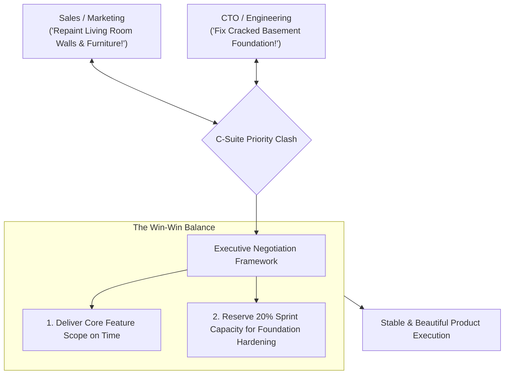

```ppt
# Slide 1: Managing C-Suite Conflicts
- **The Executive Challenge:** Resolving head-on clashes between short-term sales goals and long-term technical architecture stability.
- **Key Leadership Skill:** Negotiating win-win trade-offs between Sales, Product, Finance, and Engineering.
- **Author:** Pankaj Kumar | Associate Architect & Tech Leadership
<!-- slide -->
# Slide 2: House Foundation Stability vs Repainting Walls Analogy
- **Sales & Marketing (Repainting Living Room Walls):** Wants bright new wall paint and shiny furniture to impress guests coming over this weekend!
- **CTO & Engineering (Fixing Cracked Foundation Beams):** Warns that if the basement foundation beams collapse under load, the whole house falls down regardless of wall paint color!
<!-- slide -->
# Slide 3: Why C-Suite Conflicts Occur
- **Competing Metrics:** CMO measured by lead signups; CFO measured by cost margins; CTO measured by uptime & security.
- **Timeline Friction:** Commercial teams demand features in 2 weeks; dev teams need 6 weeks to build scalable microservices.
- **Resource Constraints:** Finite engineering budget and developer hours.
<!-- slide -->
# Slide 4: The 4 Steps to Resolving C-Suite Clashes
- **1. Depersonalize the Debate:** Frame discussions around business risk & revenue impact rather than personal opinions.
- **2. Quantify Technical Risk:** Show how legacy code bugs lead directly to lost sales revenue and customer churn.
- **3. Establish a Shared Ranking System:** Use RICE scoring (Reach, Impact, Confidence, Effort) across all departments.
- **4. Pre-Meeting Alignment:** Meet 1-on-1 with executive peers before formal board meetings.
<!-- slide -->
# Slide 5: The Escalation & Negotiation Spectrum
- **Avoid Passive-Aggressive Agreement:** Agreeing to impossible delivery dates in public, then failing in private.
- **Master Compromise:** Agreeing to launch a minimal feature scope on time while reserving 20% sprint capacity for technical hardening.
<!-- slide -->
# Slide 6: The Executive Steering Committee
- **Weekly Alignment Sync:** CEO, CTO, CPO, and CMO reviewing sprint backlogs together.
- **Single Priority Queue:** Maintaining 1 unified company priority list instead of separate conflicting department lists.
<!-- slide -->
# Slide 7: Common Misconception
- **Myth:** "A good CTO should fight for technical perfection against all commercial requests."
- **Fact:** A great CTO balances commercial urgency with technical stability to drive sustainable company growth!
<!-- slide -->
# Slide 8: Summary for Beginners
- Translate technical risks into business impact, negotiate fair capacity trade-offs, and maintain a unified executive priority list!
```

# Managing C-Suite Conflicts: Resolving Business vs Tech Priorities

In executive boardrooms, conflict is inevitable.

The Chief Revenue Officer (CRO) demands 10 custom enterprise features for a prospective client by Friday. The Chief Product Officer (CPO) wants to launch a new mobile user interface next week. 

Meanwhile, the Chief Technology Officer (CTO) warns: *"If we push more features without fixing our overloaded database server, the entire website will crash during peak trading hours!"*

When business priorities clash with technical debt, how does an executive leader resolve the impasse without destroying team trust or burning out developers?

Let's understand C-Suite Conflict Resolution using **The House Foundation vs. Living Room Paint Analogy**!

---

## 🏠 The House Foundation vs. Living Room Paint Analogy

Imagine preparing a residential home for a high-profile dinner party:



- **The Sales & Marketing Team (The Interior Decorators):**  
  Wants to spend all money repainting the living room walls and buying glamorous velvet sofas to impress guests arriving this weekend.

- **The CTO & Engineering Team (The Structural Engineers):**  
  Points to massive cracks in the basement concrete foundation and warns: *"If the foundation beams collapse under the weight of the party guests, the velvet sofas and fresh wall paint will fall straight into the cellar!"*  
  - *Resolution:* Allocate budget to reinforce the foundation beams while painting the main hallway entrance.

---

## 📊 Resolving Common C-Suite Conflicts

| Conflict Scenario | Sales / Product Demand | CTO Technical Counter-Proposal | Win-Win Executive Resolution |
| :--- | :--- | :--- | :--- |
| **Impossible Deadline** | *"We promised the client feature X in 10 days."* | *"Feature X requires 4 weeks of secure backend engineering."* | Launch a simplified MVP version in 10 days; release full automated integration in 4 weeks. |
| **Ignoring Tech Debt** | *"Stop refactoring code; only build new revenue features!"* | *"Unfixed tech debt is causing 2 hours of weekly customer outages."* | Agree on a fixed 80/20 capacity split: 80% commercial features, 20% debt refactoring. |
| **Vendor Selection** | *"Marketing bought an unvetted third-party AI SaaS tool."* | *"Unvetted SaaS tools violate user data privacy regulations."* | Conduct a 48-hour security audit to clear the tool for safe corporate integration. |

---

## 💡 Summary for Beginners

- **C-Suite Conflict** = Natural friction between short-term sales urgency and long-term technical sustainability.
- **Quantify Risk** = Express technical debt in terms of lost sales revenue, system outage costs, and customer churn rates.
- **CTO Golden Rule** = **"Never argue technical perfection against business needs — negotiate pragmatic trade-offs that protect system stability while enabling commercial growth!"**

---

*Written by **Pankaj Kumar** | Associate Architect & Tech Leadership.*
