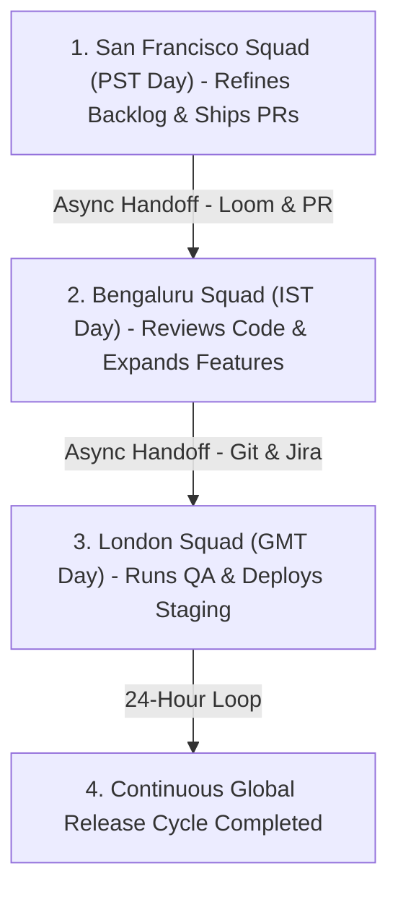
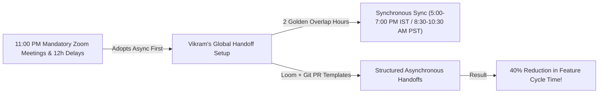

```ppt
# Slide 1: Managing Distributed Agile Teams
- **The Core Leadership Strategy:** Operating high-performing global engineering teams across distant timezones using asynchronous communication and clear baton handoffs.
- **Executive Rule:** Timezones are an asset, not an obstacle — master asynchronous handoffs to enable 24-hour continuous engineering!
- **Author:** Pankaj Kumar | Associate Architect & Tech Leadership
<!-- slide -->
# Slide 2: The Global Relay Race Baton Handoff Analogy
- **Uncoordinated Relay Team (Synchronous Dependency Trap):** Runner A (US West Coast) refuses to pass the baton until Runner B (India) stands right next to them on the track. Both runners waste 8 hours waiting around in the dark!
- **World-Class Olympic Team (Asynchronous Relay Handoff):** Runner A completes their lap in San Francisco, writes clear track notes (**Loom Video & PR Documentation**), places the baton in a secure handoff box (**Git PR & Jira Ticket**), and Runner B picks up the baton in Bengaluru 8 hours later (**24-Hour Continuous Development**)!
<!-- slide -->
# Slide 3: The 3 Core Pillars of Distributed Agile
- **1. Asynchronous First:** Relying on written documentation, Slack huddle recordings, and PR comments over live 10:00 PM Zoom meetings.
- **2. Golden Overlap Hours:** Establishing 2 shared "Golden Hours" per day for critical live alignment and unblocking.
- **3. Decoupled Squad Boundaries:** Giving global teams end-to-end domain ownership rather than splitting frontend/backend across oceans.
<!-- slide -->
# Slide 4: Real-World Case Study: Vikram's 24-Hour Engineering Loop
- **The Setup:** A fintech scaleup led by Lead Architect **Vikram Patel** had squads spread across San Francisco, London, and Bengaluru.
- **The Execution:** Vikram instituted daily asynchronous Loom video updates, standardized PR handoff templates, and a 2-hour daily golden overlap window.
- **The Result:** Cut feature release cycle times by 40% and eliminated midnight developer burnout!
<!-- slide -->
# Slide 5: The Distributed Agile Handoff Template
- **1. Completed Today:** Links to merged PRs and staging deployments.
- **2. Blockers & Risks:** Specific questions requiring answers during the next timezone window.
- **3. Tomorrow's Focus:** High-priority backlog items queued for the incoming team.
<!-- slide -->
# Slide 6: Eliminating Midnight Meeting Fatigue
- **No Mandatory Late-Night Calls:** Ending the practice of forcing offshore teams to join 11:00 PM status meetings.
- **Equal Voice Culture:** Ensuring global engineers contribute to retrospective discussions via virtual boards (Miro).
<!-- slide -->
# Slide 7: Common Misconception
- **Myth:** "Managing global teams requires developers to be online at the exact same hours for live communication."
- **Fact:** Forcing 100% synchronous overlap causes burnout — high-performing global engineering thrives on asynchronous documentation!
<!-- slide -->
# Slide 8: Summary for Beginners
- Master distributed Agile: adopt an async-first mindset, establish 2 golden overlap hours, standardize PR handoffs, and enable 24-hour continuous delivery!
```

# Managing Distributed Agile Teams Across Global Timezones

In today's global software economy, engineering teams are rarely located in a single office building.

A modern software squad might have:
- Product Managers and Designers in San Francisco (PST).
- Tech Leads and Architects in London (GMT).
- Software Engineers and QA Leads in Bengaluru (IST).

This global footprint creates a major management challenge: **The Timezone Dependency Trap.**

When distributed teams attempt to operate synchronously:
- Engineers in India are forced to join mandatory 11:00 PM status meetings.
- Developers in California wake up blocked, waiting 12 hours for an email response from Europe.
- Meeting fatigue explodes, developer burnout soars, and release velocity drops.

How do visionary CTOs transform global timezones from a painful obstacle into a competitive advantage?

They master **Asynchronous Distributed Agile Execution!**

Let's understand Distributed Agile using **The Global Relay Race Baton Handoff Analogy**!

---

## 🏃 The Global Relay Race Baton Handoff Analogy

Imagine a 4x400m Olympic relay race around the globe:



- **The Uncoordinated Relay (Synchronous Dependency Trap):**  
  Runner A (San Francisco) finishes their lap, but refuses to pass the baton until Runner B (Bengaluru) wakes up and stands next to them on the track. Both runners waste 8 hours sitting in the dark, shivering on the track!

- **The World-Class Olympic Team (Asynchronous Handoff):**  
  Runner A completes their lap in San Francisco, records a 2-minute video overview (**Loom Video**), places the baton in a secure handoff box (**Git Pull Request & Jira Ticket**), and goes to sleep. 8 hours later, Runner B picks up the baton in Bengaluru and runs the next lap (**24-Hour Continuous Engineering**)!

---

## 📊 Real-World Case Study: Vikram's 24-Hour Engineering Loop

Consider a fast-scaling fintech platform where **Vikram Patel** serves as Lead Architect.



1. **The Problem:** Vikram's engineering organization was struggling with 12-hour communication delays between US Product Managers and India Developers. Developers in India were burnt out from joining 11:00 PM Zoom meetings every night.
2. **The Distributed Transformation:**  
   - Vikram banned mandatory late-night status meetings and instituted an **Asynchronous-First Culture**.
   - Established **2 Golden Overlap Hours** per day for brief live alignment and blocker resolution.
   - Standardized a **Daily PR & Jira Handoff Template**: Every developer leaving for the day posted a 2-minute Loom video and updated ticket status (`Merged PRs`, `Open Blockers`, `Next Focus`).
3. **The Result:** Feature release cycle times dropped by **40%**, 24-hour continuous software development was achieved, and developer turnover dropped to zero!

---

## 📊 Synchronous Co-Located vs. Asynchronous Distributed Agile

| Execution Dimension | Synchronous Co-Located (Traditional) | Asynchronous Distributed (Modern) |
| :--- | :--- | :--- |
| **Communication Primary** | Live verbal conversations & whiteboards | Written documentation, Loom videos, & PR comments |
| **Meeting Cadence** | Heavy 60-minute daily status calls | 2 "Golden Overlap Hours" + Slack async standups |
| **Development Cycle** | 8 hours per day (Stops when office closes) | 24 hours per day (Continuous global handoffs) |
| **Team Autonomy** | High dependency on real-time manager answers | High self-direction using clear specs & DoR checklists |
| **Developer Health** | High risk of late-night meeting burnout | Respect for local working hours & psychological safety |

---

## 💡 Summary for Beginners

- **Asynchronous Communication** = Communication that does not require all participants to be online at the exact same moment (e.g. Git PR comments, recorded Loom videos, Slack threads).
- **Golden Overlap Hours** = A dedicated 1–2 hour daily window when global timezones overlap for live team sync and unblocking.
- **CTO Golden Rule** = **"Treat global timezones as a 24-hour competitive asset — build an async-first culture with structured handoffs and respect local working hours!"**

---

*Written by **Pankaj Kumar** | Associate Architect & Tech Leadership.*
