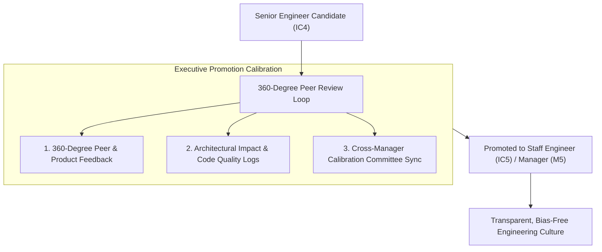

```ppt
# Slide 1: Engineering Promotions & Peer Review Loops
- **The Capstone Executive Discipline:** Designing transparent, objective, and bias-free promotion processes for software engineering organizations.
- **Series 4 Capstone:** Elevating technical talent, team topologies, and high-performance culture.
- **Author:** Pankaj Kumar | Associate Architect & Tech Leadership
<!-- slide -->
# Slide 2: Promoting Squad Leaders to Platoons Analogy
- **Arbitrary Field Promotion (Legacy Trap):** A battlefield general promotes a soldier to Platoon Commander based on a 5-minute personal impression or favoritism, bypassing squad feedback. The platoon suffers low morale and tactical breakdown!
- **Master Military Command (CTO Promotion Playbook):** Evaluates 360-degree peer feedback from fellow squad members, reviews tactical mission logs (*Code Quality & Architecture Impact*), and promotes soldiers based on proven leadership at the next level!
<!-- slide -->
# Slide 3: The 4 Principles of Objective Promotions
- **1. Proven Level Performance:** Promoting candidates after they demonstrate 6 months of consistent performance at the target level.
- **2. 360-Degree Peer Review Loops:** Gathering feedback from peers, product managers, and direct reports.
- **3. Calibration Committees:** Cross-manager calibration meetings to standardize promotion criteria across teams.
- **4. Clear Career Ladders:** Objective rubrics defining expectations for ICs and Managers.
<!-- slide -->
# Slide 4: Structuring 360-Degree Peer Reviews
- **Peer Feedback Questions:** *"How does this engineer impact team velocity, code quality, and technical mentorship?"*
- **Cross-Functional Input:** Feedback from Product Managers and QA leads.
- **Self-Assessment:** Candidates summarizing their top architectural contributions and business impact.
<!-- slide -->
# Slide 5: The Executive Calibration Committee
- **Cross-Manager Alignment:** Engineering Managers and Directors presenting promotion cases to executive peers.
- **Eliminating Bias:** Rating candidates against strict rubric benchmarks rather than manager advocacy strength.
<!-- slide -->
# Slide 6: Promoting ICs vs Managers
- **IC Track (Staff / Principal):** Evaluated on technical leverage, system architecture impact, and DevEx contributions.
- **Management Track (EM / Director):** Evaluated on team retention, 1-on-1 development, hiring, and delivery predictability.
<!-- slide -->
# Slide 7: Common Misconception
- **Myth:** "Promotions are annual rewards given for tenure and length of service."
- **Fact:** Promotions recognize expanded scope, technical leverage, and proven leadership impact at the next level!
<!-- slide -->
# Slide 8: Summary for Beginners
- Build transparent promotion loops: use 360-degree peer reviews, executive calibration committees, and objective career rubrics!
```

# Managing Engineering Promotions & Peer Review Loops

Welcome to the **Series 4 Capstone Guide: Engineering Culture, Hiring & Team Topologies!**

Across the past 16 articles, we have explored how Chief Technology Officers (CTOs) source top 1% talent, design practical interview loops, reduce Time-to-First-PR, structure parallel IC/Management career ladders, manage underperformance, cultivate psychological safety, slash DevEx friction, and manage remote global hires.

Now comes the final capstone discipline: **Managing Engineering Promotions & Peer Review Loops.**

In many software companies, promotions are an uncoordinated, political nightmare.
- Managers fight for their personal favorites during annual reviews.
- Engineers are promoted based on tenure or raw coding speed rather than leadership impact.
- High-performing quiet engineers are overlooked while loud self-promoters get advanced.

To build a high-trust engineering culture, **CTOs must establish transparent, objective 360-degree promotion calibration loops.**

Let's understand Promotion Management using **The Squad Leader Promotion Analogy**!

---

## 🎖️ The Squad Leader Promotion Analogy

Imagine managing promotions within a military unit:



- **The Arbitrary Field Promotion (Legacy Trap):**  
  A general promotes a soldier to Platoon Commander based on a 5-minute personal impression or favoritism, ignoring squad feedback. The platoon suffers low morale, lack of trust, and tactical failure during missions!

- **Master Military Command (CTO Promotion Playbook):**  
  Evaluates 360-degree feedback from squad peers (**Peer Review Loops**), analyzes mission logs (**Code Quality & Architecture Impact**), and convenes a board of commanders (**Calibration Committee**) to promote soldiers who have already demonstrated leadership at the next level!

---

## 📊 Traditional Tenure Promotions vs. CTO Calibration Loop

| Promotion Dimension | Traditional Tenure Approach | CTO Calibration Playbook |
| :--- | :--- | :--- |
| **Primary Criterion** | Length of service / tenure at company | Proven consistent performance at the next level for 6 months |
| **Review Feedback** | Manager's single subjective opinion | 360-degree peer reviews from engineers, PMs, and reports |
| **Decision Making** | Closed-door decision by direct manager | Cross-manager Calibration Committee evaluating rubrics |
| **Career Track** | Forcing engineers into Management to advance | Parallel IC and Management tracks with equal pay & prestige |

---

## 💡 Summary for Beginners

- **Series 4 Capstone** = Establishing transparent, bias-free promotion and peer review systems that recognize technical leverage and team leadership.
- **Calibration Committee** = A sync where managers present promotion cases to peer leaders to ensure company-wide grading consistency.
- **CTO Golden Rule** = **"Promote engineers based on proven technical leverage, psychological safety modeling, and 360-degree peer feedback — never promote based on politics or tenure alone!"**

---

*Written by **Pankaj Kumar** | Associate Architect & Tech Leadership.*
