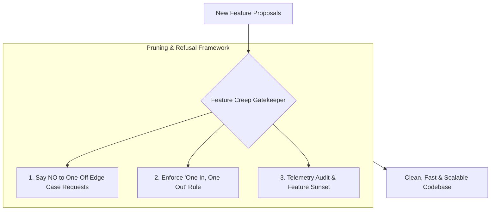

```ppt
# Slide 1: Managing Feature Creep in Codebases
- **The Operational Danger:** The subtle, continuous accumulation of unnecessary secondary features that bloat software codebases and slow down systems.
- **Executive Realization:** Saying "No" to bad features is just as important as saying "Yes" to good ones!
- **Author:** Pankaj Kumar | Associate Architect & Tech Leadership
<!-- slide -->
# Slide 2: The Mountain Hiker's Heavy Luggage Analogy
- **Amateur Hiker (Uncontrolled Feature Creep):** Packs 10 extra sweaters, 5 spare water boots, 3 frying pans, and folding chairs into their backpack before hiking up a steep 14,000-foot mountain peak. They collapse halfway up from exhaustion!
- **Master Mountain Guide (The Disciplined CTO):** Unzips the backpack, removes all non-essential gear, and packs ONLY lightweight essentials! The team hikes fast, efficiently, and reaches the summit safely!
<!-- slide -->
# Slide 3: What Causes Feature Creep?
- **1. One-Off Customer Requests:** Adding complex custom settings for a single enterprise client that 99% of users will never touch.
- **2. Scope Inflation During Sprints:** Adding "just one more small button" to an existing user story without re-estimating timelines.
- **3. Fear of Saying No:** Product teams trying to please every internal stakeholder.
<!-- slide -->
# Slide 4: The True Cost of Feature Creep
- **Cognitive Debt:** Engineering team spends 40% of sprint time maintaining unused legacy features.
- **Performance Bloat:** Giant JavaScript bundles, slow page load times, and cluttered user interfaces.
- **Increased Surface Area:** More code means more security vulnerabilities and edge-case bugs.
<!-- slide -->
# Slide 5: The Feature Sunsetting & Pruning Framework
- **Step 1 (Telemetry Audit):** Identify features used by less than 1% of monthly active users.
- **Step 2 (Deprecation Notice):** Notify affected users 60 days in advance with migration paths.
- **Step 3 (Code Pruning):** Safely delete legacy code branches and database tables!
<!-- slide -->
# Slide 6: The "One In, One Out" Product Rule
- **Rule:** Before adding a major new feature module to the application, identify 1 unused legacy feature to remove or consolidate!
<!-- slide -->
# Slide 7: Common Misconception
- **Myth:** "More features automatically equal a more valuable software product."
- **Fact:** Great software is defined by simplicity, speed, and focus — bloated products get replaced by simple competitors!
<!-- slide -->
# Slide 8: Summary for Beginners
- Protect codebase speed and simplicity: audit feature usage, enforce the "One In, One Out" rule, and prune legacy code ruthlessly!
```

# Managing Feature Creep: Keeping Codebases Clean & Fast

When a software product first launches, it is fast, clean, and focused on solving one primary user problem.

However, as years pass, Sales asks for custom enterprise settings, Marketing requests social sharing popups, and Product adds 15 secondary navigation tabs.

This gradual, uncontrolled expansion of software features is called **Feature Creep** (or *Scope Creep*).

Left unchecked, Feature Creep turns light, elegant applications into sluggish, bloated monsters where every simple bug fix takes 3 weeks of regression testing.

Let's understand how to manage Feature Creep using **The Mountain Hiker's Heavy Luggage Analogy**!

---

## 🎒 The Mountain Hiker's Heavy Luggage Analogy

Imagine preparing for a grueling 14,000-foot mountain climb:



- **The Amateur Hiker (Uncontrolled Feature Creep):**  
  Packs 10 extra sweaters, 4 spare boots, 3 heavy frying pans, and folding lawn chairs into their backpack *"just in case we need them"*. By kilometer 3, their backpack weighs 80 pounds, their knees ache, and they collapse from exhaustion halfway up the trail!

- **The Master Mountain Guide (The Disciplined CTO):**  
  Unzips the backpack, throws out every non-essential item, and keeps ONLY lightweight essential gear. The team hikes fast, conserves energy, and reaches the mountain peak hours ahead of schedule!

---

## 📊 The Cost of Feature Creep vs. Clean Code Discipline

| Dimension | Bloated Feature-Creep Product | Clean & Pruned Product |
| :--- | :--- | :--- |
| **Codebase Size** | Massive monolith, 500,000+ lines of code | Lean modular codebase, < 100,000 lines |
| **Page Load Speed** | Slow (> 4.5 seconds), heavy JS bundles | Lightning fast (< 300ms), lightweight bundles |
| **Developer Velocity** | Slow (3 weeks to add a simple button) | High (Daily deployments with high confidence) |
| **User Experience** | Cluttered UI, confusing menus, high friction | Intuitive UI, clean navigation, high retention |

---

## 💡 Summary for Beginners

- **Feature Creep** = The gradual accumulation of unnecessary software features that bloats codebases and slows down delivery.
- **The "One In, One Out" Rule** = Require product teams to retire or consolidate an old unused feature when adding a major new one.
- **CTO Golden Rule** = **"Perfection is achieved not when there is nothing more to add, but when there is nothing left to take away!"**

---

*Written by **Pankaj Kumar** | Associate Architect & Tech Leadership.*
