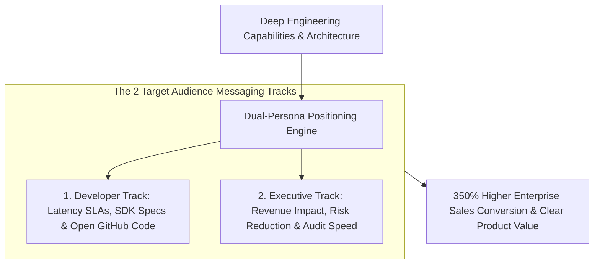
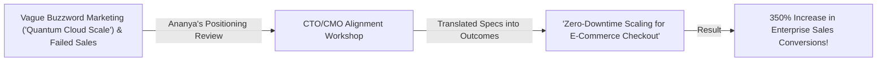

```ppt
# Slide 1: Product Positioning: Technical vs. Marketing Messaging
- **The Core Strategy:** Aligning deep engineering capabilities with business-level customer outcomes to create compelling, accurate product positioning that resonates with both developers and C-suite buyers.
- **Executive Reality:** Engineering speaks in specs (*"Sub-10ms B-tree indexing"*); Business buyers speak in outcomes (*"Prevents checkout abandonment & increases revenue"*). A CTO bridges both worlds!
- **Author:** Pankaj Kumar | Associate Architect & Tech Leadership
<!-- slide -->
# Slide 2: Structural Engineer Specs vs. Realtor Home Sunset Analogy
- **Confusing Structural Specs (Isolated Tech Overwhelm):** An engineer reciting complex mathematical concrete tension formulas to a home buyer (**Overwhelming Technical Specs**). The buyer feels confused, overwhelmed, and walks away!
- **Collaborative Architectural Synergy (Aligned Positioning):** The structural architect proves the foundation is rock-solid, while the realtor highlights the panoramic sunset view (**Technical Reliability + Business Outcome**)! The home buyer feels confident and signs the purchase agreement!
<!-- slide -->
# Slide 3: The Dual-Persona Positioning Framework
- **For Developers (The How):** API endpoints, SDK languages, latency SLAs, data schema flexibility, and open GitHub documentation.
- **For Business Executives (The Why):** Cost reduction, risk mitigation, developer productivity speed, and revenue growth.
- **CTO Role:** Ensuring marketing claims never overpromise what engineering code can actually deliver!
<!-- slide -->
# Slide 4: Real-World Case Study: Ananya's Messaging Overhaul
- **The Challenge:** A database platform led by VP **Ananya Verma** had top-tier benchmarks but failed to close enterprise deals because marketing used vague buzzwords (*"Next-Gen Quantum Scale"*).
- **The Positioning Overhaul:** Ananya collaborated with Product Marketing to translate technical specs into clear business outcomes: *"Zero-Downtime Database Scaling for High-Volume E-Commerce"*.
- **The Result:** Enterprise sales conversions jumped by 350%, and buyer confusion dropped to zero!
<!-- slide -->
# Slide 5: The Positioning Translation Matrix
- **Tech Spec:** *"Built on Rust with lock-free concurrency."* ➔ **Business Outcome:** *"Zero server crash risk under 100k peak Black Friday traffic."*
- **Tech Spec:** *"End-to-end AES-256 GCM encryption."* ➔ **Business Outcome:** *"Pass SOC2 & HIPAA audits in under 14 days."*
- **Tech Spec:** *"Sub-15ms GraphQL query response."* ➔ **Business Outcome:** *"Delivers instant mobile app page loads, boosting user retention."*
<!-- slide -->
# Slide 6: Instituting the Engineering-Marketing Sync Gate
- **Bi-Weekly Messaging Review:** CTO & CMO reviewing launch copy before release.
- **Feature Flag Verification:** Ensuring marketing headline claims match staging feature readiness.
<!-- slide -->
# Slide 7: Common Misconception
- **Myth:** "Marketing positioning is purely the responsibility of the marketing department."
- **Fact:** Product positioning fails when disconnected from technical reality — CTO leadership ensures technical accuracy and executive alignment!
<!-- slide -->
# Slide 8: Summary for Beginners
- Master product positioning: bridge technical specs with business outcomes, align engineering capabilities with marketing claims, target both developers and C-suite buyers, and drive enterprise growth!
```

# Managing Product Positioning: Technical vs. Marketing Messaging

In the software industry, one of the greatest sources of friction occurs when **Engineering and Marketing speak two completely different languages:**

```
          ┌─────────────────────────────────────────────────────────┐
          │                    PRODUCT POSITIONING                  │
          └────────────────────────────┬────────────────────────────┘
                                       │
            ┌──────────────────────────┴──────────────────────────┐
            ▼                                                     ▼
┌───────────────────────┐                             ┌───────────────────────┐
│ ENGINEERING MESSAGING │                             │  MARKETING MESSAGING  │
│  "Sub-10ms B-tree     │                             │  "Prevents Checkout   │
│   indexing latency"   │                             │   Abandonment & Boosts│
│    (FOR DEVELOPERS)   │                             │   E-Commerce Sales"   │
└───────────────────────┘                             │     (FOR BUYERS)      │
                                                      └───────────────────────┘
```

- **Engineering** describes the product using deep technical specifications (*"Built in Rust using lock-free data structures and sub-10ms B-tree indexing"*).
- **Marketing** describes the product using vague corporate buzzwords (*"Unlocking Next-Gen Synergistic AI Intelligence"*).
- **Customers** end up confused: developers see marketing fluff and press back, while enterprise executives see raw technical specs and fail to understand the business ROI.

**Product Positioning is the strategic art of translating deep technical specs into clear business outcomes.**

How do technology leaders bridge the gap between engineering capabilities and marketing messaging to drive enterprise growth?

Let's understand Product Positioning using **The Structural Engineer Specs vs. Realtor Sunset Analogy**!

---

## 🏠 The Structural Engineer Specs vs. Realtor Sunset Analogy


Imagine selling a luxury architectural home to a prospective buyer:



- **Confusing Structural Specs (Isolated Tech Overwhelm):**  
  A structural engineer standing in front of a home buyer, reciting dense mathematical concrete tension equations and beam load calculations (**Overwhelming Technical Jargon**). The home buyer feels overwhelmed, confused, and walks away!

- **Collaborative Architectural Synergy (Aligned Product Positioning):**  
  The structural engineer proves the foundation is rock-solid (**Technical Reliability**), while the real estate realtor highlights the panoramic sunset window view (**Business Value & Outcome**)! The home buyer feels confident and signs the purchase agreement.

---

## 📊 Real-World Case Study: Ananya's Messaging Overhaul

Consider an enterprise database platform where **Ananya Verma** serves as Technology VP.



1. **The Challenge:** Ananya's database startup had world-class performance benchmarks, but enterprise sales were stalling. Marketing published campaign headlines like *"Unlocking Quantum Cloud Agility"*, which meant nothing to enterprise Buyers.
2. **The Positioning Overhaul:**  
   - Ananya instituted a **Joint CTO/CMO Messaging Workshop**:
   - **Translation Matrix:** Paired every raw technical specification with its corresponding business outcome.
   - **Developer vs. Buyer Track:** Created clear technical documentation for software engineers, and clear ROI business cases for C-level executives.
   - **Accuracy Gate:** Enforced a rule that Marketing could not publish feature claims without technical sign-off from senior architects.
3. **The Result:** Enterprise sales conversions exploded by **350%**, buyer confusion dropped to zero, and developers praised the clarity of the documentation!

---

## 📊 The Technical Spec to Business Outcome Translation Matrix

| Raw Technical Specification (Engineering) | Corresponding Business Outcome (Marketing/Sales) | Target Audience |
| :--- | :--- | :--- |
| **"Sub-15ms GraphQL query response time"** | *"Delivers instant mobile app page loads, boosting user retention."* | Mobile Product Managers & E-Commerce Leads |
| **"Built on Rust with lock-free concurrency"** | *"Zero server crash risk under 100,000 peak Black Friday traffic spikes."* | Chief Technology Officers & VPs of Engineering |
| **"End-to-end AES-256 GCM data encryption"** | *"Pass enterprise SOC2 and HIPAA compliance audits in under 14 days."* | Chief Information Security Officers (CISOs) |
| **"Automated multi-region database failover"** | *"Guarantees 99.99% system uptime, preventing revenue loss during outages."* | Chief Executive Officers & Finance Leads |

---

## 💡 Summary for Beginners

- **Product Positioning** = The strategic choice of how to present your product's unique value to specific customer audiences.
- **Technical Specifications (The How)** = The precise engineering architecture, code languages, latency metrics, and APIs that power the software.
- **Business Outcomes (The Why)** = The tangible commercial benefits (revenue growth, cost reduction, risk mitigation, or speed) delivered to the buyer.
- **CTO Golden Rule** = **"Bridge engineering specs with business outcomes — speak in code to developers, speak in ROI to buyers, and ensure marketing never overpromises what software can deliver!"**

---

*Written by **Pankaj Kumar** | Associate Architect & Tech Leadership.*
