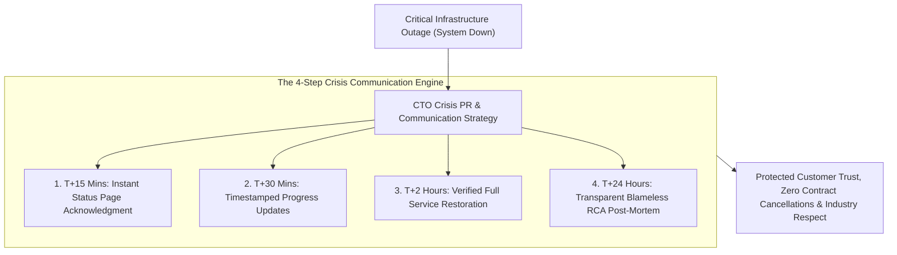

```ppt
# Slide 1: Public PR & Crisis Communication During Outages
- **The Core Strategy:** Maintaining customer trust, enterprise credibility, and brand reputation during system outages through radical communication transparency and timely public updates.
- **Executive Reality:** Outages are temporary — but lying, staying silent, or blaming third parties causes permanent, unrecoverable brand damage!
- **Author:** Pankaj Kumar | Associate Architect & Tech Leadership
<!-- slide -->
# Slide 2: Panicked Hiding vs. Professional Press Briefing Analogy
- **Panicked Silent Hiding (Legacy Crisis Mismanagement):** A corporate spokesperson hiding behind a dark curtain while angry news reporters shout questions at broken screens (**Radio Silence & Deleted Tweets**). Panic spreads, rumor mills explode, and customer trust collapses!
- **Professional Press Briefing (Transparent Crisis Leadership):** A calm technology leader stepping up to a podium, publishing a live timestamped status page timeline (**Radical Incident Transparency**)! Reporters receive factual updates every 30 minutes, and customers respect the honesty!
<!-- slide -->
# Slide 3: The 4 Golden Rules of Outage PR
- **1. Acknowledge Fast (T-Minus 15 Mins):** Confirm the issue publicly before social media rumors spread.
- **2. Share What You Know (And What You Don't):** Avoid guessing — share factual investigation status.
- **3. Establish a Regular Update Rhythm:** Update status pages every 30–60 minutes regardless of progress.
- **4. Publish a Comprehensive Post-Mortem (RCA):** Share root cause analysis & prevention steps within 48 hours.
<!-- slide -->
# Slide 4: Real-World Case Study: Rajesh's Outage Crisis Response
- **The Challenge:** A major payment gateway led by Lead Architect **Rajesh Sharma** suffered a 3-hour outage during peak Friday shopping hours.
- **The Crisis Response:** Rajesh published an immediate status page alert, established 30-minute public updates, and published a transparent RCA report 24 hours later.
- **The Result:** Zero enterprise contract cancellations, praising press coverage for transparency, and strengthened customer trust!
<!-- slide -->
# Slide 5: The Outage Communication Timeline
- **T-Minus 0:** Automated monitoring detects outage.
- **T + 15 Mins:** Initial public acknowledgment on Status Page & Social Media (*"We are investigating..."*).
- **T + 45 Mins:** Root Cause Identification Update (*"Database failover issue identified..."*).
- **T + 2 Hours:** Service Restoration Update (*"Systems recovering..."*).
- **T + 24 Hours:** Public Blameless Root Cause Analysis (RCA) Post.
<!-- slide -->
# Slide 6: What NEVER to Say During an Outage
- **Never Say:** *"Everything is fine"* when servers are burning.
- **Never Say:** *"It was AWS's fault"* (Blaming infrastructure providers looks amateur).
- **Never Say:** Silent deletion of angry customer tweets.
<!-- slide -->
# Slide 7: Common Misconception
- **Myth:** "Hiding system outages protects company reputation from competitors."
- **Fact:** Outages cannot be hidden in the cloud era — transparent communication turns an outage into a demonstration of executive integrity!
<!-- slide -->
# Slide 8: Summary for Beginners
- Master crisis PR: acknowledge outages within 15 minutes, post regular status updates, avoid shifting blame, and publish honest RCA post-mortems!
```

# Managing Public PR & Communication During System Outages

In cloud architecture, **No System Has 100% Uptime.**

Even global tech giants like AWS, Google, Cloudflare, and Microsoft experience unexpected infrastructure outages.

When a major production system goes down, the CTO faces an immediate high-stakes crisis:
- **Option A (The Panic Trap):** The company goes radio silent, deletes angry customer tweets, blames third-party cloud providers, and denies the outage until social media outrage explodes.
- **Option B (Radical Transparency):** The company acknowledges the incident within 15 minutes, posts timestamped status page updates every 30 minutes, and publishes a transparent **Root Cause Analysis (RCA) Post-Mortem** within 24 hours.

**Outages are temporary — but how a CTO communicates during a crisis determines permanent brand reputation!**

How do technology executives manage public PR, maintain customer trust, and lead through system outages?

Let's understand Outage PR using **The Panicked Hiding vs. Professional Press Briefing Analogy**!

---

## 📢 The Panicked Hiding vs. Professional Press Briefing Analogy


Imagine managing a major public incident at a city press center:



- **The Panicked Silent Hiding (Legacy Crisis Mismanagement):**  
  A corporate spokesperson hiding behind a dark curtain, sweating as angry news reporters yell questions at broken screens (**Radio Silence & Deleted Tweets**). Rumor mills explode, social media outrage spikes, and customer trust collapses permanently!

- **The Professional Press Briefing (Transparent Crisis Leadership):**  
  A calm technology leader stepping up to a press room podium, publishing a live timestamped status page timeline (**Radical Incident Transparency**)! Reporters receive factual updates every 30 minutes, panic evaporates, and customers respect the honesty!

---

## 📊 Real-World Case Study: Rajesh's Outage Crisis Response

Consider a high-volume payment gateway where **Rajesh Sharma** serves as Lead Architect.


1. **The Challenge:** On a busy Friday afternoon, Rajesh's payment gateway experienced a catastrophic database deadlock that blocked **$10 Million in merchant transactions** over 3 hours.
2. **The Crisis Communication Playbook:**  
   - Rajesh executed an immediate **Radical Transparency Protocol**:
   - **12 Minutes In:** Updated the public Status Page and Twitter handle confirming the incident (*"We are investigating degraded payment processing performance"*).
   - **Every 30 Minutes:** Published timestamped updates explaining the exact investigation steps taken by site reliability engineers.
   - **24 Hours Later:** Published a detailed, blameless **Root Cause Analysis (RCA)** blog post breaking down the deadlock bug, database migration patch, and 5 preventive measures implemented.
3. **The Result:** The company lost **zero enterprise merchant contracts**, tech media praised the company's executive transparency, and customer satisfaction scores actually *increased* post-incident!

---

## 📊 Panicked Mismanagement vs. Transparent Crisis PR

| Outage Dimension | Panicked Mismanagement (Destroys Brand) | Transparent Crisis PR (Protects Brand) |
| :--- | :--- | :--- |
| **Initial Acknowledgment** | Delayed by hours while executives debate PR wording | Published within 15 minutes (*"We are investigating..."*) |
| **Status Page Updates** | Outdated or manually set to "All Systems Operational" | Timestamped updates published every 30–60 minutes |
| **Social Media Strategy** | Deleting negative customer comments & blocking users | Directing users to status page with empathetic responses |
| **Vendor Blame Shift** | Blaming AWS, Cloudflare, or third-party APIs publicly | Owning the outage (*"Our architecture failed to handle fallback"*)|
| **Post-Incident Action** | Sweeping the outage under the rug hoping people forget | Publishing a transparent, blameless Root Cause Analysis |

---

## 💡 Summary for Beginners

- **Status Page** = A public website (e.g. `status.company.com`) displaying real-time operational health and incident history for platform services.
- **Blameless Root Cause Analysis (RCA)** = An engineering report explaining why a system failed without assigning personal blame, focusing instead on system improvements.
- **Outage Communication Rhythm** = The commitment to publish status updates at fixed intervals (e.g. every 30 mins) during an ongoing incident.
- **CTO Golden Rule** = **"Outages test your software, but crisis PR tests your executive integrity — acknowledge incidents within 15 minutes, post regular updates, and publish transparent post-mortems!"**

---

*Written by **Pankaj Kumar** | Associate Architect & Tech Leadership.*
