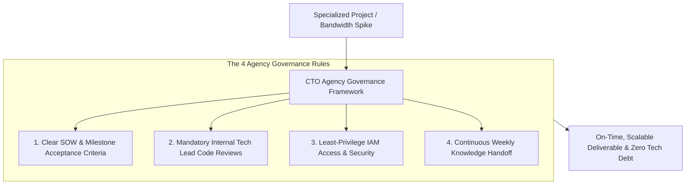

```ppt
# Slide 1: Managing Tech Consultants & Remote Agencies
- **The Core Leadership Strategy:** Effectively leveraging external software agencies and consultants without losing architectural control or overspending.
- **Executive Purpose:** Augmenting internal engineering velocity for specialized projects while maintaining strict code quality and security standards.
- **Author:** Pankaj Kumar | Associate Architect & Tech Leadership
<!-- slide -->
# Slide 2: The Specialized Plumbers Analogy
- **Unmanaged Contractor (Bloated Costs):** Hiring an external plumbing contractor without a clear blueprint. The contractor bills hourly, tore up bathroom tiles, replaced random pipes, and left behind a leaking valve when their contract expired!
- **Managed Agency Execution (CTO Governance):** Handing the specialized plumbers a detailed architectural schematic (*API Spec & Acceptance Criteria*), assigning an internal Master Plumber (*Tech Lead*) to inspect daily progress, and releasing milestone payments only after passing pressure tests!
<!-- slide -->
# Slide 3: When to Hire Agencies vs. Internal Developers
- **Hire External Agency:** Short-term specialized projects (e.g. SOC2 audit, mobile app MVP, legacy data migration).
- **Hire Internal Team:** Core IP, long-term system architecture, and proprietary algorithms.
<!-- slide -->
# Slide 4: The 4 Rules of Agency Management
- **1. Clear SOW & Acceptance Criteria:** Define explicit milestone deliverables rather than open-ended time & material contracts.
- **2. Internal Architecture Oversight:** Every pull request submitted by contractors must be code-reviewed by an internal Tech Lead.
- **3. Dual Documentation:** Requiring agencies to document API schemas and architecture deployment steps.
- **4. Access Control & Security:** Enforcing least-privilege IAM permissions and revoking access upon contract end.
<!-- slide -->
# Slide 5: Contract Structure: Fixed Price vs Time & Materials
- **Fixed Price (Milestone-Based):** Best for well-defined, static feature projects with strict budgets.
- **Time & Materials (T&M):** Best for flexible squad augmentation where scope evolves dynamically.
<!-- slide -->
# Slide 6: Knowledge Handoff & Offboarding
- **Continuous Handoff:** Mandating weekly pairing sessions between agency developers and internal engineers.
- **Offboarding Checklist:** Revoking GitHub, AWS, and Slack access immediately upon project completion.
<!-- slide -->
# Slide 7: Common Misconception
- **Myth:** "Outsourcing development to a cheap remote agency eliminates the need for internal CTO leadership."
- **Fact:** Unmanaged agency code creates massive technical debt — strong internal architectural governance is essential!
<!-- slide -->
# Slide 8: Summary for Beginners
- Govern external agencies tightly: define clear SOW milestones, require internal code reviews, and protect core IP!
```

# Managing Tech Consultants and Remote Agencies Effectively

How do fast-scaling startups and enterprise companies ship software features rapidly when their internal engineering team is already at 100% capacity?

They turn to **External Tech Consultants, Freelancers, and Remote Development Agencies.**

When used correctly, external agencies allow companies to scale velocity overnight, tap into specialized expertise (*like AI modeling or mobile app development*), and accelerate product launches.

However, when managed poorly, **agency projects become expensive disasters!**
- Contractors submit unmaintainable, low-quality code.
- Projects exceed budgets by 200%.
- When the agency contract ends, internal developers spend months rewriting the messy contractor code.

How does a Chief Technology Officer govern external agencies effectively?

Let's understand Agency Management using **The Specialized Plumbers Analogy**!

---

## 🚰 The Specialized Plumbers Analogy

Imagine renovating a luxury hotel:



- **The Unmanaged Contractor (Bloated Costs & Leaks):**  
  Hiring an external plumbing contractor without giving them a blueprint. The plumbers bill $150/hour, tear open bathroom walls, install cheap plastic pipes, and leave behind hidden leaks when their contract ends. You spend $40,000 fixing their mess!

- **Managed Agency Execution (CTO Governance):**  
  Handing the specialized plumbers a precise architectural schematic (**API Specification**), assigning an internal Master Plumber (**Tech Lead**) to inspect code quality daily, and releasing milestone payments ONLY after passing pressure tests!

---

## 📊 Internal Engineering Team vs. External Agency Contract

| Dimension | Internal Engineering Team | External Remote Agency |
| :--- | :--- | :--- |
| **Primary Focus** | Core proprietary IP, long-term architecture | Specialized short-term projects & capacity spikes |
| **Commitment** | Long-term employee retention & culture | Project-based milestone deliverables |
| **Code Review Governance** | Peer code reviews across squads | Mandatory internal Tech Lead code reviews before merge |
| **Cost Model** | Annual base salary + equity + benefits | Fixed-price milestone or hourly T&M contract |

---

## 💡 Summary for Beginners

- **Statement of Work (SOW)** = A legal contract defining project milestones, technical deliverables, and acceptance criteria.
- **Internal Governance** = Requiring an internal Staff Engineer or Tech Lead to review and approve all contractor pull requests.
- **CTO Golden Rule** = **"Never outsource core IP without internal oversight — define clear SOW milestones and require internal code reviews for every contractor commit!"**

---

*Written by **Pankaj Kumar** | Associate Architect & Tech Leadership.*
