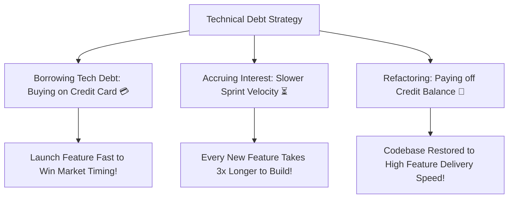

```ppt
# Slide 1: Managing Technical Debt & Refactoring
- **The Core Conflict:** Product managers want new features; engineers want to clean up old, brittle code.
- **The Executive Solution:** Translating technical debt into financial risk & feature velocity metrics.
- **Author:** Pankaj Kumar | Associate Architect & Tech Leadership
<!-- slide -->
# Slide 2: The Credit Card Interest Analogy
- **Taking on Tech Debt (Credit Card Purchase):** Buying something quickly today on credit to launch a feature fast.
- **Accruing Tech Debt Interest:** Every new feature takes twice as long to build because you must work around dirty code!
- **Refactoring (Paying Off Credit Principal):** Cleaning the codebase to lower monthly interest payments!
<!-- slide -->
# Slide 3: The 4 Types of Technical Debt
- **1. Deliberate (Prudent):** "We must ship by Friday; we'll fix this temporary hack next sprint."
- **2. Inadvertent (Reckless):** Junior developers copy-pasting buggy code without code reviews.
- **3. Architectural Obsolescence:** Outdated libraries and deprecated cloud database versions.
- **4. Environmental Debt:** Slow build tools and fragile manual deployment scripts.
<!-- slide -->
# Slide 4: How NOT to Pitch Refactoring
- **Wrong Pitch (Too Technical):** "We need 3 weeks to refactor our JavaScript modules from CommonJS to ES6 imports."
- **Result:** Product Manager rejects the request because they don't understand the business value!
<!-- slide -->
# Slide 5: The Winning Executive Pitch
- **Right Pitch (Business Value):** "If we spend 1 week cleaning up this checkout module, future checkout feature releases will drop from 4 weeks to 3 days!"
- **Result:** Product Manager approves the refactoring sprint immediately!
<!-- slide -->
# Slide 6: The 20% Technical Debt Allocation Rule
- **Standard Budget Rule:** Dedicate 20% of every sprint's engineering capacity strictly to refactoring and technical debt reduction.
- **Benefit:** Keeps the codebase clean continuously without needing massive 6-month rewrites!
<!-- slide -->
# Slide 7: Common Beginner Misconception
- **Myth:** "All technical debt is bad and must be eliminated immediately."
- **Fact:** Prudent tech debt is a strategic tool to win market timing, provided you pay off the interest systematically!
<!-- slide -->
# Slide 8: Summary for Beginners
- Treat technical debt like financial debt: Pay off high-interest code continuously to maintain fast feature velocity!
```

# Managing Technical Debt & Refactoring: Pitching Refactoring to Product Managers

In software development, there is a constant tug-of-war between **Product Managers** and **Software Engineers**:

- **Product Managers ask:** *"Why can't we launch 5 new features next month?"*
- **Engineers respond:** *"Because the codebase is messy, fragile, and full of technical debt! We need to stop building features for 2 months to refactor!"*

This conflict creates friction, missed deadlines, and mutual frustration. 

The underlying problem? Engineers talk about technical debt in terms of *code aesthetics*, while Product Managers evaluate work in terms of *customer value*.

Modern engineering leaders manage technical debt using **The Credit Card Interest Analogy**.

---

## 💳 The Credit Card Interest Analogy

Imagine managing a company's financial budget:



- **Taking on Tech Debt (Credit Card Purchase):**  
  Swiping a credit card allows you to buy a laptop today without waiting 6 months to save cash.  
  - *Tech Equivalent:* Taking a shortcut in code to launch a product before a major competitor on Friday. This is a smart business move!

- **Accruing Tech Debt Interest:**  
  If you never pay off your credit card balance, monthly interest charges stack up. Soon, all your income goes toward paying interest rather than buying new items!  
  - *Tech Equivalent:* Building on top of dirty code. A simple feature that should take 2 days takes 3 weeks because engineers must work around bugs.

- **Refactoring (Paying Principal Balance):**  
  Cleaning up messy code is simply paying off the credit card principal balance so monthly interest payments drop back to zero!

---

## 🗣️ How to Pitch Refactoring to Product Managers

Never pitch refactoring using abstract technical jargon:

| ❌ The Weak Pitch (Rejected) | ✅ The Executive Pitch (Approved) |
| :--- | :--- |
| *"We need 2 sprints to rewrite our legacy SQL queries and update ORM libraries."* | *"Refactoring this database layer will reduce user page load time from 4 seconds to 300ms and cut cloud server costs by 35%!"* |
| *"Our frontend codebase is ugly and hard to read."* | *"Investing 1 week to refactor the payment module will accelerate all future payment feature launches from 4 weeks down to 3 days!"* |

---

## 💡 Summary for Beginners

- **Technical Debt** = The implied cost of future rework caused by choosing an easy short-term code solution over a better long-term architecture.
- **Refactoring** = Restructuring existing code without changing its external behavior to improve maintainability.
- **The 20% Rule** = Allocating 20% of every engineering sprint to technical debt cleanup.

---

*Written by **Pankaj Kumar** | Associate Architect & Tech Leadership.*
