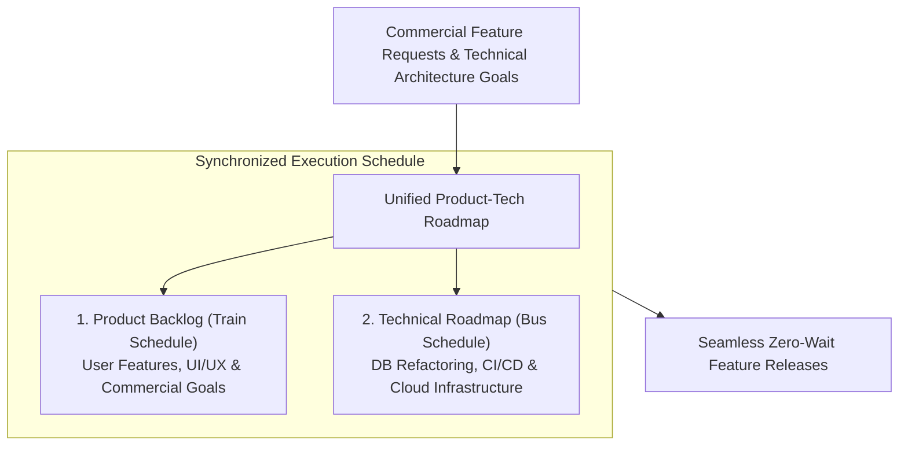

```ppt
# Slide 1: Technical Roadmaps & Product Backlogs
- **The Strategic Alignment:** Synchronizing long-term technical architecture roadmaps alongside commercial product feature backlogs.
- **Executive Objective:** Preventing technical debt bottlenecks while delivering commercial value predictably.
- **Author:** Pankaj Kumar | Associate Architect & Tech Leadership
<!-- slide -->
# Slide 2: Train & Bus Transit Schedule Analogy
- **Uncoordinated Transit:** A high-speed commuter train arrives at the central station at 8:00 AM, but the connecting city buses left at 7:55 AM! Passengers are stranded, frustrated, and miss their meetings.
- **Synchronized Mobility (Unified Roadmap):** The transit authority aligns train arrival times with bus departure schedules, creating a smooth, zero-wait commute for passengers!
<!-- slide -->
# Slide 3: The Dual Roadmap Challenge
- **Product Backlog (Customer-Facing):** New feature requests, UI enhancements, user stories, and commercial integrations.
- **Technical Roadmap (Under the Hood):** Microservice refactoring, database migration, CI/CD pipeline automation, and security compliance.
<!-- slide -->
# Slide 4: Structuring a Unified Product-Tech Roadmap
- **Step 1 (Theme Mapping):** Group technical tasks under commercial product themes (*e.g., "International Expansion" ➔ "GDPR & Multi-Region Database"*).
- **Step 2 (Capacity Reservation):** Dedicate a fixed 20% capacity in every sprint for technical roadmap items.
- **Step 3 (Joint Milestone Reviews):** Review roadmap progress bi-weekly with CTO and CPO.
<!-- slide -->
# Slide 5: The Technical Debt Horizon
- **Short-Term Debt (P0):** Critical security patches & database query optimization.
- **Medium-Term Debt (P1):** Upgrading legacy framework versions & API refactoring.
- **Long-Term Debt (P2):** Modularizing monolith into domain-driven microservices.
<!-- slide -->
# Slide 6: Visualizing the Unified Roadmap
- **Unified Gantt Chart:** Displaying commercial feature milestones right alongside technical infrastructure milestones in Jira / Linear.
- **Clear Dependencies:** Showing product managers how technical prerequisites unlock future commercial features.
<!-- slide -->
# Slide 7: Common Misconception
- **Myth:** "Technical roadmaps should be kept secret from product managers and business leaders."
- **Fact:** Full transparency builds trust — when PMs understand technical prerequisites, roadmap conflicts disappear!
<!-- slide -->
# Slide 8: Summary for Beginners
- Sync train arrivals with bus schedules: combine technical architecture milestones and commercial feature backlogs into 1 unified roadmap!
```

# Managing Technical Roadmaps Alongside Product Backlogs

How do high-performing engineering teams build long-term scalable architecture while simultaneously shipping commercial features every two weeks?

In many software organizations, Product Managers maintain a **Product Backlog** full of user feature requests, while Software Architects maintain a secret **Technical Roadmap** full of database migrations, framework upgrades, and refactoring tasks.

When these two plans operate in isolation, chaos occurs:
- Product releases get delayed because an unannounced database migration blocks a feature.
- Technical architecture degrades because developers are forced to hack together quick fixes to meet arbitrary marketing deadlines.

Let's understand how to align these roadmaps using **The Train & Bus Transit Schedule Analogy**!

---

## 🚆 The Train & Bus Transit Schedule Analogy

Imagine managing a city's public transportation network:



- **Uncoordinated Transit Systems:**  
  A high-speed express train carrying 500 commuters arrives at the central terminal at 8:00 AM. However, the connecting city buses left the station at 7:55 AM! Passengers are stranded, angry, and miss their work meetings.

- **Synchronized Mobility (Unified Roadmap Alignment):**  
  The transit authority synchronizes train arrival times with bus departure schedules! Passengers step off the train and onto the bus in 2 minutes, arriving at their destination on time and delighted!

---

## 📊 Dual Roadmap Alignment Matrix

| Roadmap Category | Primary Owner | Target Audience | Core Focus | Unified Integration Strategy |
| :--- | :--- | :--- | :--- | :--- |
| **Product Backlog** | Chief Product Officer (CPO) | End Users & Customers | User Stories, UI Features, Conversion Funnels | Explicitly link technical prerequisites to feature stories |
| **Technical Roadmap** | Chief Technology Officer (CTO) | Developers & System Architecture | DB Indexing, Microservices, CI/CD, FinOps | Reserve 20% capacity in every sprint for tech tasks |

---

## 💡 Summary for Beginners

- **Unified Roadmap** = Combining technical architecture milestones and commercial feature backlogs into one synchronized plan.
- **Dependency Mapping** = Demonstrating how backend technical improvements directly enable future commercial product features.
- **CTO Golden Rule** = **"Never run a secret technical roadmap — publish technical prerequisites openly so product managers understand how code refactoring unlocks future feature velocity!"**

---

*Written by **Pankaj Kumar** | Associate Architect & Tech Leadership.*
