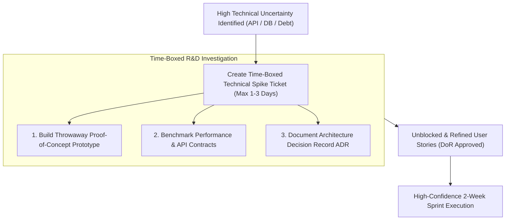
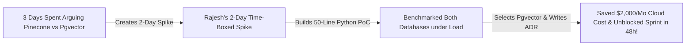

```ppt
# Slide 1: Technical Spikes in Agile Development
- **The Core Discipline:** Allocating strict time-boxed research & development (R&D) investigations to eliminate technical uncertainty before committing to feature estimations.
- **Executive Rule:** Never estimate an uncertain architecture in hours — run a time-boxed technical spike first!
- **Author:** Pankaj Kumar | Associate Architect & Tech Leadership
<!-- slide -->
# Slide 2: The 2-Hour Trail Scouting Timer Analogy
- **Blind Hiking Expedition (Estimating Without Spikes):** A hiking guide promises a group they will hike a dense, unmapped jungle mountain in 3 hours. Halfway up, they hit an impassable 200-foot ravine (**Unexpected Architectural Blocker**), trapping the group overnight!
- **Master Scout Leader (Time-Boxed Technical Spike):** Sets a strict 2-hour timer (**Time-Boxed Spike**) to send a scout ahead to map the trail, verify bridge safety (**Proof of Concept**), and return with a precise route plan (**Architecture Decision Record ADR**)!
<!-- slide -->
# Slide 3: When to Conduct a Technical Spike
- **1. Novel Technology Evaluation:** Evaluating a new database (e.g. MongoDB vs PostgreSQL) or AI API.
- **2. Complex Third-Party Integration:** Testing payment gateway SDKs or legacy mainframe APIs.
- **3. Performance & Scale Bottlenecks:** Benchmarking query speeds under 100k concurrent requests.
<!-- slide -->
# Slide 4: Real-World Case Study: Rajesh's AI Vector DB Spike
- **The Problem:** An engineering squad led by Lead Architect **Rajesh Sharma** was asked to add AI semantic search. The team spent 3 days arguing over whether to use Pinecone or Pgvector without writing a single line of code.
- **The Spike Fix:** Rajesh created a 2-day time-boxed spike ticket (8 story points capacity). The team built a minimal 50-line Python prototype benchmarking both databases.
- **The Result:** Selected Pgvector, saved $2,000/month in cloud costs, and unblocked sprint estimation in 48 hours!
<!-- slide -->
# Slide 5: The 4 Deliverables of a Successful Spike
- **1. Working Proof-of-Concept (PoC):** Throwaway prototype code proving technical feasibility.
- **2. Architecture Decision Record (ADR):** Documenting trade-offs, decision rationale, and cost impact.
- **3. Refined User Stories:** Splitting the feature into clear INVEST stories with Fibonacci estimates.
- **4. Updated Definition of Ready (DoR):** API specs and technical contracts ready for sprint execution.
<!-- slide -->
# Slide 6: Time-Boxed Spike Governance Rules
- **Strict Time-Box Cap:** Maximum 1 to 3 days (Never allow spikes to turn into open-ended R&D black holes!).
- **Throwaway Prototype Code:** Spike code is designed for learning — never deploy raw spike prototypes directly to production!
<!-- slide -->
# Slide 7: Common Misconception
- **Myth:** "Technical spikes are an excuse for developers to play with new technologies without delivering business value."
- **Fact:** Spikes eliminate high-risk technical unknowns early, preventing massive project delays and budget overruns!
<!-- slide -->
# Slide 8: Summary for Beginners
- Leverage technical spikes: time-box R&D investigations to max 3 days, build throwaway prototypes, write Architecture Decision Records (ADRs), and unblock sprint estimation!
```

# Managing Technical Spikes: Time-boxed R&D Exploration

When engineering teams estimate user stories during Sprint Planning, they occasionally hit a wall of **High Technical Uncertainty:**
- *"How does this new third-party payment API handle webhook failures?"*
- *"Will PostgreSQL handle 50,000 vector embeddings per second, or do we need a dedicated Vector Database like Pinecone?"*
- *"How hard will it be to refactor this 8-year-old legacy authentication module?"*

When developers attempt to estimate uncertain features without research, **they make wild guesses:**
- They estimate a ticket at 5 points, but get blocked for 3 weeks discovering unexpected architectural bugs.
- They spend 5 days arguing in meetings without testing code assumptions.
- Sprint commitments fail, and engineering morale drops.

How do technology leaders resolve high technical uncertainty fast without derailing sprint commitments?

They deploy **Time-boxed Technical Spikes!**

Let's understand Technical Spikes using **The 2-Hour Trail Scouting Timer Analogy**!

---

## 🏔️ The 2-Hour Trail Scouting Timer Analogy

Imagine leading a wilderness hiking expedition through unmapped mountains:



- **The Blind Expedition (Estimating Without Spikes):**  
  A hiking guide promises a group they will reach the mountain summit in 3 hours. Halfway up, the group hits an impassable 200-foot granite ravine (**Unexpected Architectural Blocker**). The guide has no backup route, trapping the entire group overnight!

- **The Master Scout Leader (Time-Boxed Technical Spike):**  
  Sets a strict 2-hour timer (**Time-Boxed Spike**) to send a lightweight scout ahead to explore the terrain, verify rope bridge safety (**Proof of Concept**), and return with a precise route map (**Architecture Decision Record ADR**)! The group hikes with 100% confidence.

---

## 📊 Real-World Case Study: Rajesh's AI Vector DB Spike

Consider a cloud software squad led by Lead Architect **Rajesh Sharma**.



1. **The Technical Uncertainty:** Rajesh's engineering squad was tasked with building an AI-powered semantic document search feature. The team spent 3 days debating whether to purchase a costly Pinecone vector database subscription or use PostgreSQL's `pgvector` extension.
2. **The Time-Boxed Spike Execution:**  
   - Rajesh created a **2-Day Technical Spike Ticket** (capped at 8 story points capacity).
   - A Senior Engineer wrote a 50-line throwaway Python script benchmarking query latency and memory usage on both systems.
   - The engineer documented the findings in an **Architecture Decision Record (ADR)**.
3. **The Result:** The team selected `pgvector`, saving **$2,000 per month** in cloud subscription costs, and unblocked story point estimation in 48 hours!

---

## 📊 Feature User Story vs. Technical Spike Ticket

| Dimension | Feature User Story | Technical Spike Ticket |
| :--- | :--- | :--- |
| **Primary Goal** | Deliver working production feature software to users | Research and eliminate technical uncertainty / risk |
| **Deliverable** | Production-ready, tested code shipped to customers | Throwaway PoC code + Architecture Decision Record (ADR) |
| **Estimation Unit** | Estimated in Fibonacci Story Points (1, 2, 3, 5, 8) | Fixed Time-Boxed duration (e.g. Max 1, 2, or 3 Days) |
| **Exit Criteria** | Passes Definition of Done (DoD) & unit tests | Answers specific technical questions & updates DoR |
| **Code Lifetime** | Permanent production codebase | Throwaway research prototype (Never deployed to production!) |

---

## 💡 Summary for Beginners

- **Technical Spike** = A time-boxed research task in Agile used to investigate an architectural approach, test APIs, or reduce technical uncertainty.
- **Time-Box** = A fixed maximum period of time (e.g., 2 days) allocated to achieve a specific goal, after which work stops regardless of completion.
- **Architecture Decision Record (ADR)** = A short text document capturing a key architectural choice, its context, and its trade-offs.
- **CTO Golden Rule** = **"Never guess uncertain architectures — allocate 2-day time-boxed spikes to build throwaway prototypes, write ADRs, and enter sprint planning with total confidence!"**

---

*Written by **Pankaj Kumar** | Associate Architect & Tech Leadership.*
