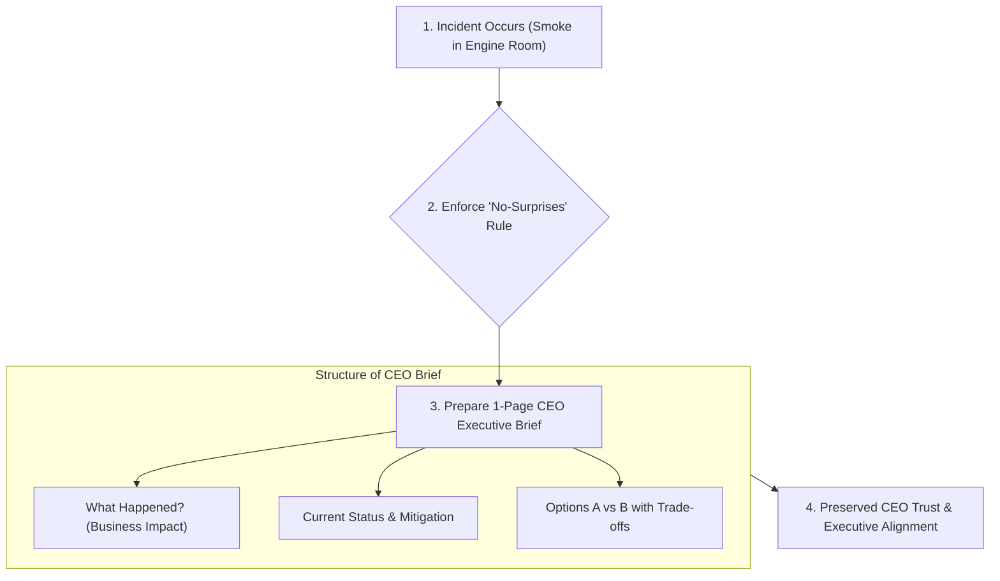

```ppt
# Slide 1: Managing Upward as a CTO
- **The Core Challenge:** Communicating technical updates, outage risks, and engineering progress to the CEO without drowning them in technical jargon.
- **Golden Rule:** The "No-Surprises Rule" — Never let your CEO hear about a major outage or project delay from a board member or customer first!
- **Author:** Pankaj Kumar | Associate Architect & Tech Leadership
<!-- slide -->
# Slide 2: The Ship Captain & Engine Smoke Analogy
- **Engine Smoke Alert:** If a chief engineer spots small smoke in the lower engine room, they don't hide it hoping it goes away. They immediately inform the captain: *"Captain, we have a minor oil leak in Engine #2. We are switching to Backup Engine #1 now. No impact to passenger speed!"*
- **CTO Parallel:** Give your CEO early warnings accompanied by targeted solution options!
<!-- slide -->
# Slide 3: The 3 Golden Rules of Managing Upward
- **1. No Surprises:** Escalate critical bugs or timeline risks immediately.
- **2. Translate Code to Business Impact:** Speak in terms of revenue, customer experience, and risk rather than Kubernetes clusters.
- **3. Bring Solutions, Not Just Problems:** When reporting a blocker, present 2 viable options with trade-offs.
<!-- slide -->
# Slide 4: Structuring the Weekly CEO Sync (The 1-Page Brief)
- **Section 1 (Wins):** Top 3 features shipped this week that drive business value.
- **Section 2 (Risks & Red Flags):** Any upcoming delivery delays or security vulnerabilities.
- **Section 3 (Key Decisions Needed):** Budget approvals or strategic trade-offs requiring CEO input.
<!-- slide -->
# Slide 5: The Executive Communication Spectrum
- **Too Technical (Bad):** *"Our Redis cluster experienced high memory fragmentation causing 500 internal server errors."*
- **Executive Ready (Good):** *"Our login database experienced a 10-minute traffic spike. We switched to our backup server with zero data loss, and implemented permanent auto-scaling to handle future spikes."*
<!-- slide -->
# Slide 6: Managing Bad News Gracefully
- **Acknowledge Immediately:** State the facts clearly without defensive excuses.
- **Outline the Root Cause:** Briefly explain why it happened.
- **Detail Remediation Steps:** Show how you will prevent it from ever happening again.
<!-- slide -->
# Slide 7: Common Misconception
- **Myth:** "CEOs want to hear every minor technical detail about coding frameworks."
- **Fact:** CEOs care about predictability, commercial growth, risk management, and customer satisfaction!
<!-- slide -->
# Slide 8: Summary for Beginners
- Build trust through transparency, use business-translated metrics, and enforce the No-Surprises Rule!
```

# Managing Upward: Keeping the CEO Informed Without Overwhelming

One of the most delicate skills a Chief Technology Officer must master is **Managing Upward** — effectively communicating technical realities to a non-technical CEO.

If you swamp your CEO with daily technical details about Docker containers, database indexing, or CSS refactoring, they will zone out and wonder if you understand the business.

Conversely, if you hide engineering struggles and delay bad news until the night before a major product launch, **you destroy executive trust instantly!**

Let's understand Managing Upward using **The Engine Smoke Alert Analogy**!

---

## 🚢 The Engine Smoke Alert Analogy

Imagine an ocean liner sailing across international waters:



- **The Irresponsible Chief Engineer:**  
  Notices smoke pouring out of Engine #2, but stays quiet for 3 hours hoping it fixes itself. Eventually, the engine bursts into flames, forcing the captain to cancel the cruise mid-voyage!

- **The Master Executive Chief Engineer:**  
  Walks up to the bridge immediately and says: *"Captain, Engine #2 is showing early heat friction. I have throttled it back 10% and switched secondary power to Engine #1. We remain 100% on schedule for our destination!"*  
  - *The Captain is calm, informed, and completely confident in their engineer.*

---

## 📊 Executive Communication: Technical vs. Business Language

| Communication Scenario | Technical Jargon (Avoid) | Executive Translation (Use) |
| :--- | :--- | :--- |
| **Database Outage** | *"Redis cache node crashed due to OOM memory allocation errors."* | *"Users experienced a 5-minute login delay. We automatically failed over to our backup server with zero data loss."* |
| **Sprint Delay** | *"Refactoring the backend API schema took 2 extra sprints."* | *"We invested 2 extra weeks in security hardening to ensure our platform can safely handle 50,000 new EU customers next month."* |
| **Cloud Budget** | *"AWS EC2 r5b.xlarge instances are overprovisioned."* | *"We optimized our cloud infrastructure settings to save $4,000 per month without reducing system performance."* |

---

## 💡 Summary for Beginners

- **Managing Upward** = Keeping your CEO informed, confident, and empowered to make business decisions without overwhelming them with code jargon.
- **The 1-Page Brief** = Send a bulleted summary every Friday: Wins, Red Flags, and Key Decisions Needed.
- **CTO Golden Rule** = **"Enforce the No-Surprises Rule — bring your CEO bad news early, accompanied by two clear solution options and their commercial trade-offs!"**

---

*Written by **Pankaj Kumar** | Associate Architect & Tech Leadership.*
