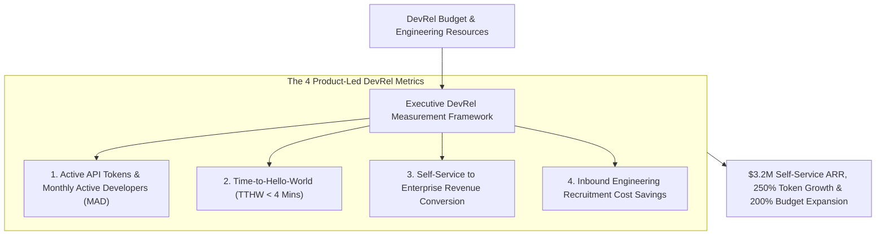

```ppt
# Slide 1: Measuring Developer Relations (DevRel) ROI
- **The Core Strategy:** Aligning Developer Relations (DevRel) activities with concrete business outcomes, engineering metrics, and self-service revenue growth.
- **Executive Reality:** Evaluating DevRel using traditional sales quota metrics fails — true DevRel ROI is measured through Developer Experience (DX), active API tokens, and product-led adoption!
- **Author:** Pankaj Kumar | Associate Architect & Tech Leadership
<!-- slide -->
# Slide 2: Counting Business Cards vs. Modern Executive Dashboard Analogy
- **Confused Corporate Manager (Flawed Vanity Metrics):** A traditional manager trying to measure developer happiness by collecting thick paper business cards in a glass jar (**Vanity Event Metrics & Booth Badges**). The CFO sees zero financial return and cuts the budget!
- **Modern Technology Leader (Product-Led DevRel ROI):** An insightful technology leader tracking real developer engagement on an executive dashboard (**Active API Tokens, SDK Download Velocity, & TTHW under 4 Mins**)! The CFO clearly sees how developer adoption drives $4M in self-service SaaS revenue!
<!-- slide -->
# Slide 3: The 4 Pillars of DevRel Business ROI
- **1. Product Adoption:** Active API keys, monthly active developers (MAD), & SDK package downloads.
- **2. Friction Reduction (TTHW):** Cutting Time-to-Hello-World from 45 minutes down to < 4 minutes.
- **3. Self-Service Revenue Attribution:** Tracking developer accounts that convert into paid enterprise tiers.
- **4. Engineering Recruitment Savings:** Attracting inbound senior developer talent with zero recruiter fees.
<!-- slide -->
# Slide 4: Real-World Case Study: Priya's DevRel ROI Framework
- **The Challenge:** A cloud API scale-up led by Lead Architect **Priya Nair** faced budget cuts because the CFO viewed DevRel as an unmeasurable expense.
- **The ROI Overhaul:** Priya instituted a product-linked DevRel scorecard: tracked monthly active API tokens, SDK download velocity, and self-service expansion revenue.
- **The Result:** Proved that DevRel-influenced developer accounts generated $3.2M in annual recurring revenue (ARR), securing a 200% DevRel budget increase!
<!-- slide -->
# Slide 5: The DevRel Metric Matrix
- **Tier 1 (Business Outcomes):** Self-service ARR, API token retention, & recruiter cost savings.
- **Tier 2 (Product Adoption):** Monthly Active Developers (MAD), SDK downloads (`npm`/`PyPI`), & GitHub stars.
- **Tier 3 (Vanity Anti-Metrics):** Booth badges, paper business cards, & generic Twitter impressions.
<!-- slide -->
# Slide 6: Time-to-Hello-World (TTHW) as a Core Metric
- **Definition:** The exact time in minutes from a developer landing on your docs to receiving their first successful HTTP 200 OK API response.
- **Direct Business Impact:** Reducing TTHW by 50% increases API registration conversions by 3x!
<!-- slide -->
# Slide 7: Common Misconception
- **Myth:** "Developer Relations is an unmeasurable art that cannot be held accountable to business metrics."
- **Fact:** DevRel ROI is highly measurable when focused on product adoption, API usage velocity, and developer retention!
<!-- slide -->
# Slide 8: Summary for Beginners
- Master DevRel ROI: ditch vanity business card metrics, measure active API tokens & SDK downloads, optimize Time-to-Hello-World, and connect developer experience directly to self-service business revenue!
```

# Measuring Developer Relations (DevRel) ROI for the Business

In technology companies, **Developer Relations (DevRel) is Often the Most Misunderstood Function.**

When Chief Financial Officers (CFOs) look at DevRel budgets, they often ask tough executive questions:
- *"We spent $150,000 on conference booths and developer swag this quarter — how much recurring revenue did that generate?"*
- If DevRel leaders answer with **vanity metrics** like *"We handed out 500 T-shirts and collected 300 business cards"*, the CFO views DevRel as an unnecessary cost center and cuts the budget!
- If DevRel leaders present **product-led adoption metrics** like *"Our SDK tutorial campaign reduced Time-to-Hello-World to 3 minutes, growing Monthly Active API Tokens by 250% and driving $3.2M in self-service ARR"*, the executive team doubles the DevRel budget!

**DevRel ROI is about connecting Developer Experience (DX) directly to Product Adoption and Self-Service Business Revenue.**

How do CTOs build a clear DevRel ROI measurement framework that satisfies the CFO while empowering developers?

Let's understand DevRel ROI using **The Counting Business Cards vs. Modern Executive Dashboard Analogy**!

---

## 📊 The Counting Business Cards vs. Modern Executive Dashboard Analogy


Imagine evaluating community impact for a city innovation hub:



- **The Confused Corporate Manager (Flawed Vanity Metrics):**  
  A traditional manager trying to measure developer happiness by collecting thick paper business cards in a glass jar (**Vanity Booth Badges & T-Shirt Counts**). The CFO sees zero financial return and cuts the department budget!

- **The Modern Technology Leader (Product-Led DevRel ROI):**  
  An insightful technology leader tracking real developer engagement on a digital dashboard (**Active API Tokens, SDK Download Velocity, & TTHW under 4 Mins**)! The CFO clearly sees how developer adoption drives $3.2M in self-service SaaS revenue.

---

## 📊 Real-World Case Study: Priya's DevRel ROI Framework

Consider a cloud API scale-up where **Priya Nair** serves as Lead Architect.


1. **The Challenge:** Priya's company was facing budget cuts. The CFO proposed cutting the DevRel team by 50% because the team was reporting generic metrics like Twitter impressions and conference booth badge scans.
2. **The DevRel ROI Overhaul:**  
   - Priya stepped in and redesigned the **DevRel Metrics Scorecard**:
   - **Active Token Growth:** Shifted primary focus to tracking **Monthly Active Developers (MAD)** making at least 1,000 successful API calls per month.
   - **TTHW Optimization:** Benchmarked Time-to-Hello-World (TTHW), rewriting SDK quickstart guides to reduce onboarding time from 35 minutes down to **3.5 minutes**.
   - **Revenue Attribution:** Multiplied self-service accounts that originated from developer documentation and upgraded to paid enterprise tiers.
3. **The Result:** Priya proved that DevRel-influenced developer accounts generated **$3.2 Million in annual recurring revenue (ARR)**, securing a **200% budget expansion** from the CFO!

---

## 📊 Vanity Anti-Metrics vs. Business-Impact DevRel Metrics

| Metric Category | Vanity Anti-Metrics (Avoid Using) | Business-Impact DevRel Metrics (Adopt) |
| :--- | :--- | :--- |
| **Conference & Events** | Booth badge scans & swag T-shirts handed out | Active API signups & GitHub repo clones post-event |
| **Developer Onboarding** | Total page views on documentation landing page | **Time-to-Hello-World (TTHW < 4 Mins)** & 200 OK completions |
| **Product Usage** | Total registered user email addresses | **Monthly Active Developers (MAD) & Active API Tokens** |
| **Open Source** | Total raw GitHub star count | Weekly `npm`/`PyPI` package downloads & open pull requests |
| **Financial Impact** | *"Brand awareness and developer goodwill"* | **Self-service ARR conversion & recruiter fee savings ($200k)** |

---

## 💡 Summary for Beginners

- **Monthly Active Developers (MAD)** = The count of unique developer accounts actively executing API calls or code scripts in a given month.
- **Time-to-Hello-World (TTHW)** = The time in minutes required for a developer to complete registration, obtain API keys, and execute their first successful 200 OK request.
- **Self-Service Expansion** = The process where developers start on a free tier and organically upgrade to paid enterprise plans as their API traffic grows.
- **CTO Golden Rule** = **"Ditch vanity business card metrics — measure active API tokens, SDK download velocity, and Time-to-Hello-World to prove DevRel business ROI!"**

---

*Written by **Pankaj Kumar** | Associate Architect & Tech Leadership.*
