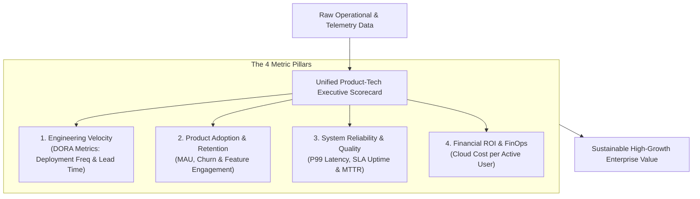

```ppt
# Slide 1: Measuring Product-Tech Success
- **The Capstone Executive Summary:** Defining the core business, technical, and product metrics that measure true value creation.
- **Series 3 Capstone:** Unifying CTO & CPO performance indicators under one executive dashboard.
- **Author:** Pankaj Kumar | Associate Architect & Tech Leadership
<!-- slide -->
# Slide 2: The Athlete's Annual Health Diagnostic Analogy
- **Vanity Health Metrics:** Checking if an athlete wears trendy gym clothes or has 1,000 social media followers.
- **True Physical Diagnostics (Product-Tech Metrics):** Measuring resting heart rate, VO2 max oxygen capacity, blood pressure, muscle recovery rates, and marathon finish times!
<!-- slide -->
# Slide 3: The 4 Metric Categories of Product-Tech Synergy
- **1. Velocity Metrics (DORA):** Deployment frequency, lead time for changes, MTTR.
- **2. Product Retention Metrics:** Monthly Active Users (MAU), customer churn, feature adoption rate.
- **3. Quality & Reliability Metrics:** P99 API latency, SLA uptime percentage, zero critical security flaws.
- **4. Financial ROI Metrics:** Cloud FinOps cost per active user, engineering cost per feature delivered.
<!-- slide -->
# Slide 4: DORA Metrics (Engineering Velocity)
- **Deployment Frequency:** How often code is successfully deployed to production.
- **Lead Time for Changes:** Time elapsed from git commit to live production release.
- **Mean Time to Recovery (MTTR):** Time required to recover from a production outage.
- **Change Failure Rate:** Percentage of deployments that cause production incidents.
<!-- slide -->
# Slide 5: Product & Commercial ROI Metrics
- **Feature Adoption Rate:** Percentage of active users engaging with a newly launched feature.
- **Latency-to-Conversion Ratio:** Measuring how millisecond latency reductions boost cart checkout conversions.
- **Customer Churn Reduction:** Tracking user retention after fixing key UX friction points.
<!-- slide -->
# Slide 6: The Executive Dashboard (CTO & CPO)
- **Unified Scorecard:** Presenting a 1-page combined Product-Tech Scorecard to the CEO and Board of Directors.
- **Single Source of Truth:** Integrating Datadog, Mixpanel, and Jira data into centralized executive reporting.
<!-- slide -->
# Slide 7: Common Misconception
- **Myth:** "Engineering metrics and Product metrics should be kept in separate departmental silos."
- **Fact:** High-performing tech companies align engineering velocity directly with product engagement and business revenue!
<!-- slide -->
# Slide 8: Summary for Beginners
- Measure what matters: combine DORA velocity, system SLA uptime, product retention, and cloud FinOps into 1 unified dashboard!
```

# Measuring Product-Tech Success: Metrics That Drive Value

Welcome to the **Series 3 Capstone Guide: Product Management & CTO-CPO Synergy!**

Across the past 16 articles, we have explored how Chief Technology Officers (CTOs) and Chief Product Officers (CPOs) partner to build Minimum Loveable Products (MLPs), manage feature creep, run A/B experiments, establish steering committees, and safely release software.

Now comes the ultimate capstone question:  
*"How do executives measure whether their Product-Engineering partnership is actually succeeding?"*

If you measure the wrong metrics (*like lines of code written or total Jira tickets closed*), you encourage bad developer behavior.

To drive real commercial value, **CTOs and CPOs must track a unified set of velocity, quality, retention, and financial metrics.**

Let's understand how to measure success using **The Athlete's Health Diagnostic Analogy**!

---

## 🏋️ The Athlete's Health Diagnostic Analogy

Imagine evaluating an elite Olympic athlete:



- **The Superficial Assessment (Vanity Metrics):**  
  Judging an athlete's fitness by checking if they wear expensive designer sneakers, have a stylish haircut, or post daily gym selfies on Instagram.

- **The Master Physician (Executive Metric Diagnostics):**  
  Attaches heart-rate monitors, measures VO2 max oxygen intake, tracks blood lactate thresholds, and records exact 42km marathon finish times! These empirical diagnostics reveal the athlete's true physical endurance and performance capacity.

---

## 📊 The 4 Pillars of Product-Tech Executive Metrics

| Metric Category | Key Indicator | Target Benchmark | Business Value |
| :--- | :--- | :--- | :--- |
| **1. Engineering Velocity** | DORA Deployment Frequency & Lead Time | Multiple deploys/day; Lead time < 2 hours | Faster time-to-market for commercial features |
| **2. Product Retention** | Monthly Active Users (MAU) & Churn Rate | Churn < 2% / month; Feature adoption > 35% | Direct user retention and recurring revenue growth |
| **3. Reliability & Quality** | P99 API Latency & SLA Uptime | Latency < 200ms; Uptime 99.95%+ | Prevents user frustration and abandoned sessions |
| **4. Cloud FinOps** | Infrastructure Cost per Active User | Decreasing cost per active user at scale | Higher profit margins and cloud cost efficiency |

---

## 💡 Summary for Beginners

- **Series 3 Capstone** = Unifying Product and Technology management under one empirical, data-driven framework.
- **Unified Scorecard** = Tracking DORA velocity, product retention, system reliability, and FinOps costs together.
- **CTO Golden Rule** = **"Measure what drives true business value — align engineering velocity with customer retention and revenue growth!"**

---

*Written by **Pankaj Kumar** | Associate Architect & Tech Leadership.*
