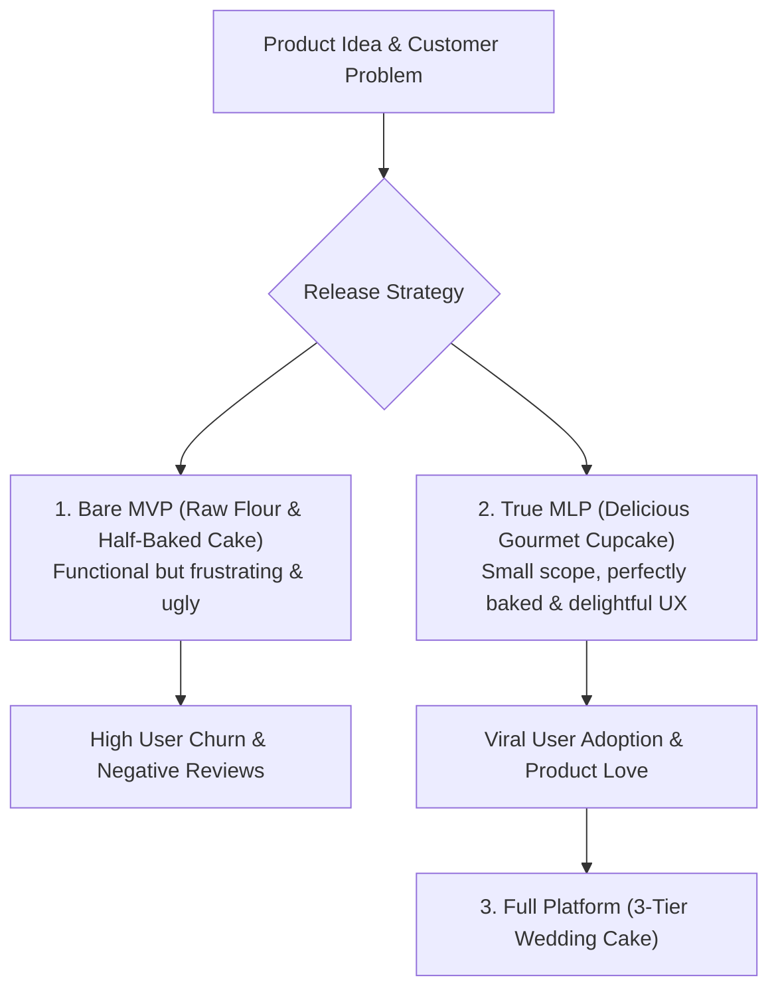

```ppt
# Slide 1: MVP vs MLP (Product Strategy)
- **The Core Debate:** Shifting from basic feature functionality to emotional customer delight.
- **Key Definitions:** Minimum Viable Product (MVP) vs Minimum Loveable Product (MLP).
- **Author:** Pankaj Kumar | Associate Architect & Tech Leadership
<!-- slide -->
# Slide 2: The Cupcake vs 3-Tier Wedding Cake Analogy
- **The Misunderstood MVP (Raw Flour & Eggs):** Shipping an ugly, barely functional prototype that technically works but frustrates early users.
- **The True MLP (The Delicious Cupcake):** A small, perfectly baked cupcake with delicious frosting! It delivers complete delight in a compact size before investing in a 3-tier wedding cake.
<!-- slide -->
# Slide 3: What is a Minimum Viable Product (MVP)?
- **Objective:** Validating business hypotheses with the minimum amount of engineering effort.
- **Risk:** If built too cheaply without UX care, early users abandon the product and leave bad reviews.
<!-- slide -->
# Slide 4: What is a Minimum Loveable Product (MLP)?
- **Objective:** Creating an initial product release that customers don't just tolerate — they fall in love with it!
- **Core Pillars:** High performance, beautiful intuitive UI, zero critical bugs, and delight.
<!-- slide -->
# Slide 5: The MVP to MLP Evolution Matrix
- **MVP Focus:** "Does it function technically?" (Functional, Reliable).
- **MLP Focus:** "Does it solve the user's problem with joy and ease?" (Usable, Delightful, Fast).
<!-- slide -->
# Slide 6: The Engineering Trade-off (CTO & CPO)
- **Build Scope:** Cut 70% of planned secondary features, but make the core 30% feature set flawless!
- **Quality Standard:** Fast API load times (< 200ms), zero crash rates, polished mobile UX.
<!-- slide -->
# Slide 7: Common Misconception
- **Myth:** "MLP means taking 12 months to build every possible feature before launching."
- **Fact:** MLP means shrinking the feature scope down to 1 core problem, but polishing that core feature to perfection!
<!-- slide -->
# Slide 8: Summary for Beginners
- Don't ship raw flour — bake a delicious cupcake! Build a tight feature scope that users love from Day 1.
```

# Minimum Viable Product (MVP) vs Minimum Loveable Product (MLP)

For over a decade, Eric Ries' *Lean Startup* philosophy made the term **MVP (Minimum Viable Product)** the sacred gospel of software development.

The goal of an MVP was simple: build a bare-bones version of your software with the least amount of effort to test if customers would pay for it.

However, in today's crowded SaaS market, customers have zero patience for buggy, ugly software. If your initial release is barely functional, users will abandon it within 30 seconds and switch to a competitor.

This shift gave birth to **The MLP (Minimum Loveable Product)**.

Let's understand MVP vs MLP using **The Cupcake vs. 3-Tier Wedding Cake Analogy**!

---

## 🧁 The Cupcake vs. 3-Tier Wedding Cake Analogy

Imagine opening a new bakery:



- **The Bad MVP (Raw Flour & Half-Baked Cake):**  
  You want to bake a 3-tier wedding cake, but you rush out a bowl of unflavored flour, raw eggs, and warm water. You tell customers: *"Technically, this contains all the ingredients of a cake!"* Customers gag and leave negative reviews!

- **The True MLP (The Delicious Cupcake):**  
  Instead of half-baking a giant cake, you bake **one perfect, delicious gourmet cupcake** with rich chocolate frosting. It contains all the love, taste, and quality of a full cake, but in a compact, manageable size!

---

## 📊 MVP vs. MLP Strategic Comparison

| Dimension | Minimum Viable Product (MVP) | Minimum Loveable Product (MLP) |
| :--- | :--- | :--- |
| **Core Goal** | Validate technical feasibility | Win customer affection & retention |
| **User Emotion** | *"It works, but it's clunky."* | *"I love using this product every day!"* |
| **Feature Scope** | Wide and shallow (10 half-finished features) | Narrow and deep (2 flawless features) |
| **Design & UX** | Browser defaults & basic wireframes | Custom typography, micro-animations, clean UX |
| **System Quality** | Frequent bugs tolerated | Fast API latency (< 200ms), 99.9% reliability |

---

## 💡 Summary for Beginners

- **MVP** = Minimum Viable Product (Focuses on function and technical feasibility).
- **MLP** = Minimum Loveable Product (Focuses on customer delight, high performance, and polished UX).
- **CTO Golden Rule** = **"Don't ship a half-baked 10-feature MVP — shrink your scope to 2 core features and polish them into a delicious MLP!"**

---

*Written by **Pankaj Kumar** | Associate Architect & Tech Leadership.*
