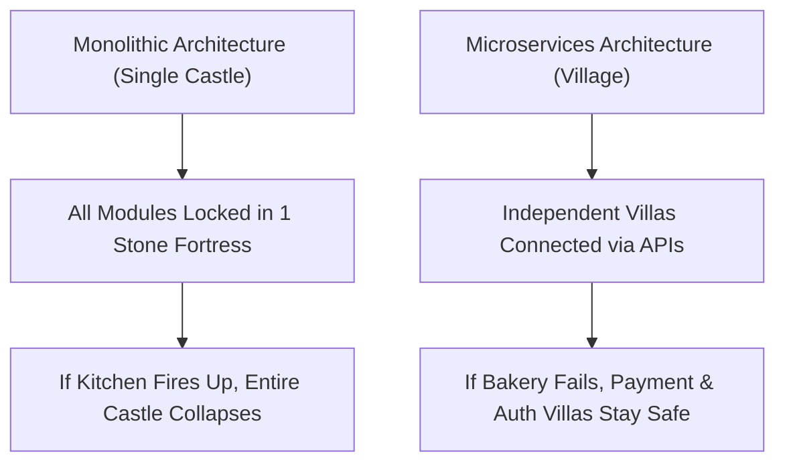

```ppt
# Slide 1: Monolith vs Microservices
- **Core Dilemma:** Should you build 1 giant single app or 20 small independent micro-apps?
- **Why CTOs Care:** Determines how fast teams can scale software without breaking existing code.
- **Author:** Pankaj Kumar | Associate Architect & Tech Leadership
<!-- slide -->
# Slide 2: The Castle vs Village Analogy
- **Monolith (Single Castle):** One massive stone fortress housing the King, Army, Bakery, and Treasury under one roof.
- **Microservices (Village of Villas):** Independent cottages connected by paved roads (APIs).
<!-- slide -->
# Slide 3: The Pros & Cons of a Monolith
- **Pros:** Easy for 3 developers to build quickly in early startup days.
- **Cons:** If the Bakery catches fire, the entire Castle burns down (single point of failure)!
<!-- slide -->
# Slide 4: The Pros & Cons of Microservices
- **Pros:** If the Bakery villa catches fire, the King's Treasury remains 100% unaffected.
- **Cons:** High communication complexity between 20 independent villas.
<!-- slide -->
# Slide 5: Real-World Case Study: Uber & Amazon
- **Monolithic Roots:** Both Uber and Amazon started as single monolithic codebases.
- **Microservices Shift:** As engineering teams grew to 2,000 developers, they split into 500+ independent microservices.
<!-- slide -->
# Slide 6: The Golden Rule for CTOs
- "Don't build microservices until you have monolith problems!"
- Start monolithic for speed, decouple into microservices when scaling.
<!-- slide -->
# Slide 7: Common Beginner Misconception
- **Myth:** "Microservices are always better than Monoliths."
- **Fact:** Microservices add massive network operational overhead; pick based on team size!
<!-- slide -->
# Slide 8: Summary for Beginners
- Monolith = One giant fortress; Microservices = A network of specialized smart houses!
```

# Monolith vs Microservices: Single Castle vs Village of Houses

One of the most fierce architectural debates in technical leadership is **Monolith vs. Microservices**.

- Should a company build its software as **one giant single application**?
- Or should it split the software into **dozens of tiny, independent micro-apps** working together?

For non-technical leaders and beginners, these sound like buzzwords. Let's break down the real difference using the simple analogy of a **Single Medieval Castle vs. a Modern Village of Houses**!

---

## 🏰 The Castle vs Village Analogy

Imagine building a kingdom to protect your citizens:



- **Monolithic Architecture (The Single Stone Castle):**  
  You build one giant fortress. The King's throne room, royal kitchen, army barracks, and treasury are all inside the same stone building. 
  - *Advantage:* Easy to build initially, and everyone communicates under one roof.
  - *Disaster:* If a small fire breaks out in the kitchen, smoke fills the entire castle, taking down the royal throne!

- **Microservices Architecture (The Village of Houses):**  
  You build 10 separate cottages across a town: a Bakery cottage, a Bank cottage, and a Guard cottage, connected by paved roads (APIs).
  - *Advantage:* If the Bakery cottage catches fire, the Bank cottage continues operating without noticing! You can also upgrade the Bakery roof without touching the Bank.
  - *Disaster:* You now need road guards, messengers, and traffic lights to manage communication between 10 cottages.

---

## ⚖️ Direct Comparison: When to Use Which?

| Feature | Monolithic Architecture | Microservices Architecture |
| :--- | :--- | :--- |
| **Structure** | All code inside 1 project repository | Code split across 20+ small services |
| **Team Size Best For** | 1 to 15 Developers | 50 to 500+ Developers |
| **Deployment** | Deploy whole application at once | Deploy individual services independently |
| **System Reliability** | High blast radius if bugs occur | Low blast radius (Fault Isolation) |
| **Initial Complexity** | Simple & Low Cost | High Infrastructure Complexity |

---

## 🚗 Real-World Example: Uber's Evolution

1. **2010 (Startup Phase):** Uber started as a single monolithic app built in San Francisco to connect drivers with riders. It was fast to build and cheap to run.
2. **2016 (Global Scale):** As Uber expanded to 400 cities with thousands of engineers, modifying the single codebase caused bugs. 
3. **The Migration:** Uber split the monolith into **over 4,000 independent microservices** (e.g. Passenger Service, Driver Matching Service, Pricing Engine, Billing Service).

---

## 💡 Summary for Beginners

- **Monolith** = Simple, single codebase (Best for early startups).
- **Microservices** = Decoupled, independent apps (Best for large enterprises).
- **The CTO's Rule** = Start simple with a monolith, then split into microservices only when team scale demands it!

---

*Written by **Pankaj Kumar** | Associate Architect & Tech Leadership.*
