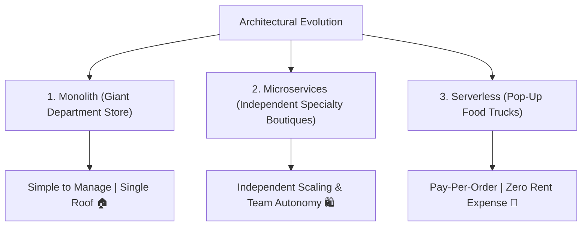

```ppt
# Slide 1: System Architecture Evolution
- **The Core Decision:** How to structure application code as your user base scales from 100 users to 10 million users.
- **Architectural Styles:** Monolith vs Microservices vs Serverless Functions.
- **Author:** Pankaj Kumar | Associate Architect & Tech Leadership
<!-- slide -->
# Slide 2: The Department Store vs Specialty Shops Analogy
- **Monolithic Architecture (Department Store):** Everything (clothing, electronics, groceries, checkout) under 1 giant roof.
- **Microservices Architecture (Specialty Boutiques):** Separate standalone shops for shoes, tech, and bakery connected by streets (APIs).
- **Serverless Architecture (Food Trucks):** Temporary pop-up trucks that appear only when a customer orders tacos, then vanish!
<!-- slide -->
# Slide 3: 1. Monolithic Architecture
- **Structure:** All frontend UI, backend logic, and database access bundled into a single codebase and deployment unit.
- **Pros:** Super simple to build, test, and deploy for early-stage startups!
- **Cons:** A single bug in the payment code can crash the entire website!
<!-- slide -->
# Slide 4: 2. Microservices Architecture
- **Structure:** Breaking the monolith into independent, decoupled services (e.g. Auth Service, Payment Service, Inventory Service).
- **Pros:** Independent scaling, autonomous team ownership, and fault isolation.
- **Cons:** High network complexity, distributed logging challenges, and API latency.
<!-- slide -->
# Slide 5: 3. Serverless Architecture (FaaS)
- **Structure:** Cloud provider manages server infrastructure (AWS Lambda / Cloud Functions); code runs only on event triggers.
- **Pros:** Zero server maintenance, instant auto-scaling, and pay-per-execution billing.
- **Cons:** Cold start latency delays and vendor lock-in risk.
<!-- slide -->
# Slide 6: The Golden CTO Architecture Rule
- **Rule:** *"Start with a clean Monolith, modularize boundaries, and decompose into Microservices or Serverless only when scale requires it!"*
- **Mistake:** Prematurely building microservices on Day 1 leads to distributed chaos!
<!-- slide -->
# Slide 7: Common Beginner Misconception
- **Myth:** "Monoliths are obsolete legacy code that all tech companies should destroy."
- **Fact:** Well-structured Modular Monoliths power multi-billion dollar companies like Shopify and Basecamp!
<!-- slide -->
# Slide 8: Summary for Beginners
- Choose architectural patterns based on team size, traffic scale, and organizational maturity!
```

# Monolith vs Microservices vs Serverless: Architectural Evolution Framework

When non-technical founders hire an engineering team to build a new software application, they often ask: *"Should we build a Monolith, Microservices, or Serverless architecture?"*

Choosing the wrong architecture early on can kill a startup:
- Building complex **Microservices** on Day 1 causes engineering speed to grind to a halt under network maintenance overhead.
- Keeping a massive **Monolith** when scaling to 10 million active users can cause catastrophic site-wide outages!

Modern technology leaders evaluate architecture using **The Department Store Analogy**.

---

## 🏬 The Department Store Analogy

Imagine building a retail shopping business:



- **Monolithic Architecture (The Giant Department Store):**  
  Clothing, electronics, groceries, and cash registers are all located inside one big building under a single roof.  
  - *Pros:* Easy to clean, open, and manage for a small staff.  
  - *Cons:* If the main power generator trips, the entire store goes dark!

- **Microservices Architecture (Specialty Boutiques):**  
  The department store splits into 10 separate specialty shops on a high street: a shoe boutique, an electronics shop, and a bakery. Each shop has its own manager, front door, and electrical meter, connected by pedestrian streets (*APIs*).  
  - *Pros:* If the shoe shop's power fails, the bakery remains open!  
  - *Cons:* Customers must walk outside between shops to buy multiple items.

- **Serverless Architecture (Pop-Up Food Trucks):**  
  No permanent building at all! A food truck arrives only when a customer places an online taco order, cooks the taco in 30 seconds, collects payment, and vanishes until the next order.  
  - *Pros:* You pay zero rent when no customers are ordering!

---

## 📊 Architectural Decision Comparison Matrix

| Architectural Style | Deployment Unit | Best Used For | Primary Trade-Off |
| :--- | :--- | :--- | :--- |
| **Monolith** | Single application binary | Early-stage startups & small teams (< 15 devs) | Single point of failure |
| **Microservices** | Decoupled containerized services | Large scaling engineering teams (50+ devs) | High network complexity |
| **Serverless (FaaS)** | Event-triggered functions | Variable event workloads & background jobs | Cold start latency |

---

## 💡 Summary for Beginners

- **Monolith** = All-in-one software application codebase.
- **Microservices** = Decoupled, independent services connected via APIs.
- **Serverless** = Code that executes on-demand without managing server instances.
- **CTO Golden Rule** = *"Don't build microservices until your monolith's team communication or database scaling breaks down!"*

---

*Written by **Pankaj Kumar** | Associate Architect & Tech Leadership.*
