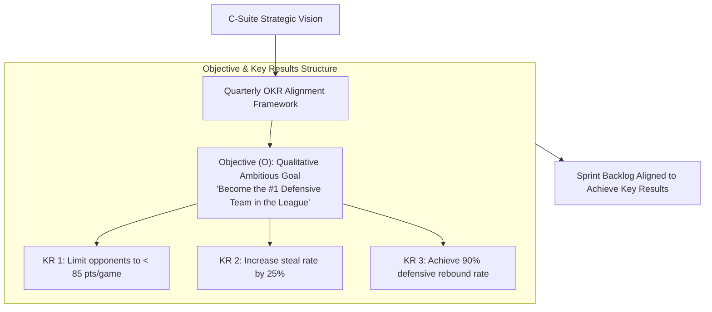
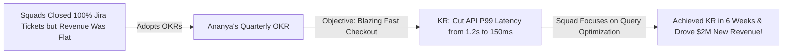

```ppt
# Slide 1: OKRs in Engineering Teams
- **The Core Alignment Strategy:** Connecting high-level business vision with day-to-day engineering execution using inspiring Objectives and measurable Key Results.
- **Executive Rule:** OKRs state *WHAT* inspiring value to achieve — engineering squads decide *HOW* to build it!
- **Author:** Pankaj Kumar | Associate Architect & Tech Leadership
<!-- slide -->
# Slide 2: Winning the Championship Analogy
- **Uncoordinated Team (Activity Without Purpose):** A basketball team practices 60 hours a week running random drills, lifting weights, and shooting 1,000 hoops (**Closing Jira Tickets**), but has zero strategy to win games. They play hard but finish last in the league!
- **Championship Franchise (OKR Alignment):** Sets an inspiring Objective: *"Become the #1 Defensive Team in the League"* (**Objective**), measured by 3 Key Results: Limit opponents to < 85 pts/game, increase steals by 25%, and achieve a 90% defensive rebound rate (**Measurable Key Results**)!
<!-- slide -->
# Slide 3: The Structure of a Great Engineering OKR
- **Objective (O):** Qualitative, ambitious, inspiring goal (e.g. *"Deliver a Lightning-Fast Checkout Experience"*).
- **Key Results (KR):** 3 to 5 quantitative, measurable outcomes (e.g. *"Reduce P99 API latency from 1.2s to 200ms"*).
<!-- slide -->
# Slide 4: Real-World Case Study: Ananya's Latency OKR
- **The Problem:** An engineering department led by VP **Ananya Verma** was shipping dozens of minor Jira tasks, but customer checkout abandonment remained high due to slow database queries.
- **The OKR Reset:** Ananya set a quarterly OKR: **Objective:** *"Make Mobile Checkout Blazing Fast"*, **KR1:** Reduce API P99 latency to < 150ms, **KR2:** Increase checkout conversion rate by 15%.
- **The Result:** Squads aligned sprint backlogs around query optimization, achieving the KR in 6 weeks and driving $2M in new revenue!
<!-- slide -->
# Slide 5: OKRs vs. KPIs vs. Jira Backlogs
- **OKRs (Strategy):** Ambitious 90-day targets driving strategic change and business growth.
- **KPIs (Health Metrics):** Continuous operational baselines (e.g. 99.9% Uptime SLA).
- **Jira Backlog (Tactics):** Daily 2-week sprint tasks executed to achieve Key Results.
<!-- slide -->
# Slide 6: The 70% Target Success Rate (Stretch Goals)
- **Ambitious Scoring:** Hitting 70% of an aggressive OKR is considered a major success.
- **Decoupling from Performance Reviews:** Never linking OKR completion percentages directly to annual individual developer bonuses (Prevents sandbagging!).
<!-- slide -->
# Slide 7: Common Misconception
- **Myth:** "OKRs are top-down micromanagement mandates listing exact feature requirements."
- **Fact:** OKRs set the strategic intent — autonomous squads design the technical solutions!
<!-- slide -->
# Slide 8: Summary for Beginners
- Master engineering OKRs: set ambitious qualitative Objectives, define 3 quantitative Key Results, align sprint backlogs around KRs, and celebrate 70%+ achievement!
```

# OKRs (Objectives & Key Results) in Engineering Teams

Why do software engineering teams close 100% of their Jira sprint tickets, work 50 hours a week, and yet **fail to move the needle on business growth?**

In many tech companies, engineering squads operate in a **Feature Factory Trap:**
- Product Managers dump 50 random feature requests into the backlog.
- Developers write code, close tickets, and ship features continuously.
- Six months later, customer satisfaction is stagnant, app load time is slow, and business revenue is flat!

The root cause of this disconnect is **Lack of Strategic Alignment.**

When engineering squads execute daily tasks without understanding the high-level business goal, they waste energy on low-impact work.

To align engineering execution with executive business strategy, **CTOs enforce Objectives & Key Results (OKRs)!**

Let's understand OKRs using **The Winning the Championship Analogy**!

---

## 🏆 The Winning the Championship Analogy

Imagine managing a professional basketball franchise:



- **The Uncoordinated Team (Feature Factory Trap):**  
  A team practices 60 hours a week running random shooting drills and lifting weights (**Closing Random Jira Tickets**), but has zero cohesive strategy to win games. They work hard every day, but finish last in the league!

- **The Championship Franchise (OKR Alignment):**  
  Sets a clear, inspiring goal: *"Become the #1 Defensive Team in the League"* (**Objective**), measured by 3 precise targets: Limit opponent scoring to < 85 points, increase steals by 25%, and hit a 90% defensive rebound rate (**Measurable Key Results**)! Every practice drill is designed to hit those 3 KRs.

---

## 📊 Real-World Case Study: Ananya's Latency OKR Transformation

Consider a cloud software department overseen by Technology VP **Ananya Verma**.



1. **The Problem:** Ananya's 4 engineering squads were closing 100% of their sprint tickets, but customer checkout abandonment remained dangerously high. Developers were busy building minor UI tweaks while database query latency hovered at a sluggish 1.2 seconds.
2. **The OKR Alignment:**  
   - Ananya instituted a clear quarterly engineering OKR:  
     - **Objective:** *"Deliver a Blazing-Fast Mobile Checkout Experience."*  
     - **Key Result 1:** Reduce checkout API P99 latency from 1.2s to < 150ms.  
     - **Key Result 2:** Reduce mobile checkout page load time from 4s to 1s.  
     - **Key Result 3:** Increase mobile checkout conversion rate by 15%.
   - Engineering squads immediately stopped building low-impact UI tweaks and aligned their sprint backlogs around database query indexing, Redis caching, and payload optimization.
3. **The Result:** The team achieved the KR in **6 weeks**, cut API latency to 120ms, and generated **$2 Million in new annual revenue**!

---

## 📊 Objectives vs. Key Results vs. Jira Sprint Backlogs

| Alignment Level | Component | Purpose & Example |
| :--- | :--- | :--- |
| **Strategic Goal (What & Why)** | **Objective (O)** | Ambitious, qualitative, inspiring directional goal.<br/>*Example: "Make Our Cloud Platform Unhackable"* |
| **Measurable Success (How Much)** | **Key Results (KRs)** | 3 to 5 quantitative, measurable outcome targets.<br/>*Example: "Achieve 0 critical CVEs, enforce 100% YubiKey MFA, reduce MTTR to < 15 mins"* |
| **Tactical Execution (How)** | **Jira Sprint Backlog** | Daily 2-week sprint tasks & technical user stories executed to hit the KRs.<br/>*Example: "Implement mTLS on payment microservice"* |

---

## 💡 Summary for Beginners

- **Objectives & Key Results (OKRs)** = A strategic goal-setting framework connecting organizational vision with measurable team targets.
- **Stretch Goals** = Ambitious OKR targets where achieving **70%** is considered an outstanding success.
- **CTO Golden Rule** = **"Set inspiring qualitative Objectives, measure success with quantitative Key Results, and empower autonomous squads to decide how to hit the numbers!"**

---

*Written by **Pankaj Kumar** | Associate Architect & Tech Leadership.*
