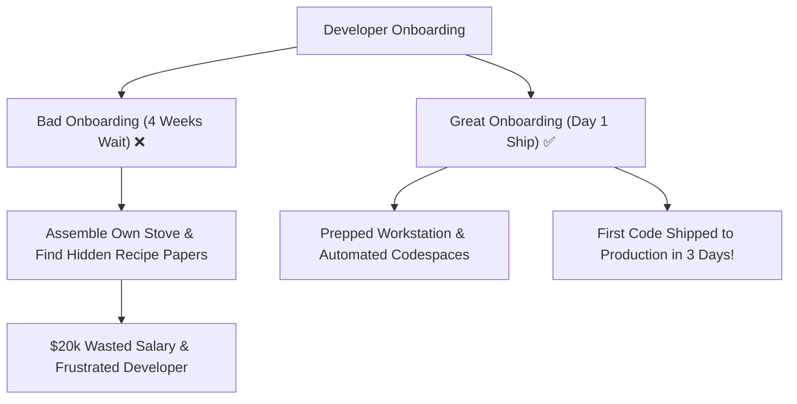

```ppt
# Slide 1: Onboarding Engineers in 30 Days
- **The Core Metric:** "Time to First Pull Request (PR)" — How many days until a new engineer ships their first working code fix?
- **Goal:** Reducing onboarding time from 6 weeks to 3 days using automated developer environments.
- **Author:** Pankaj Kumar | Associate Architect & Tech Leadership
<!-- slide -->
# Slide 2: The New Restaurant Line Cook Analogy
- **Bad Onboarding (4 Weeks):** Giving a new chef an empty kitchen and telling them to install gas stoves, forge pans, and find recipe books from scratch.
- **Great Onboarding (Day 1):** Handing the chef a fully prepped workstation, sharp knives, pre-measured ingredients, and an automated recipe guide!
<!-- slide -->
# Slide 3: The 3 Onboarding Pillars (30-60-90 Day Plan)
- **Day 1 to 3 (First PR):** Ship a tiny bug fix or documentation update to production.
- **Day 30 (First Feature):** Deliver an end-to-end feature independently with team guidance.
- **Day 60 & 90 (Autonomy):** Participate in on-call rotation and mentor newer hires.
<!-- slide -->
# Slide 4: Automated Cloud Developer Environments (CDEs)
- **Containerized Dev Setup:** Using GitHub Codespaces / Gitpod to launch a full working development environment in 60 seconds.
- **Zero Local Config Frustration:** Eliminating "It works on my machine!" errors.
<!-- slide -->
# Slide 5: The Onboarding Buddy System
- **Dedicated Peer Buddy:** Assigning an experienced peer engineer (not their direct manager) for daily pair programming.
- **Psychological Safety:** Encouraging new hires to ask "dumb questions" without fear of performance judgment.
<!-- slide -->
# Slide 6: Living Onboarding Documentation
- **Self-Healing Docs:** If a setup command fails during onboarding, the new hire's first task is updating the documentation repo!
- **Interactive Architecture Diagrams:** Visual maps showing API data flows and service ownership.
<!-- slide -->
# Slide 7: Common Beginner Misconception
- **Myth:** "Taking 6 weeks to onboard a senior engineer is normal because our codebase is complex."
- **Fact:** Long onboarding indicates poor documentation, manual environment setup, and high friction!
<!-- slide -->
# Slide 8: Summary for Beginners
- Automate developer setup and pair new hires with buddies to ship code in their very first week!
```

# Onboarding Engineers in 30 Days: Reducing Time-to-First-PR

When a company hires a senior developer, they pay recruiters $20,000 and offer a competitive salary.

Yet, in many engineering organizations, that new hire spends their first **3 to 4 weeks** stuck in administrative limbo:
- Waiting for IT to grant access to database repositories.
- Trying to resolve cryptic environment configuration errors on their laptop.
- Reading outdated 3-year-old documentation that no longer works.

This slow ramp-up period wastes tens of thousands of dollars in lost engineering productivity.

Modern engineering teams evaluate onboarding using a single key metric: **Time to First Pull Request (Time-to-First-PR)**.

Let's break down **Engineer Onboarding** using **The New Line Cook Analogy**!

---

## 👨‍🍳 The New Line Cook Analogy

Imagine hiring a skilled line cook at a busy restaurant:



- **Bad Onboarding (Empty Kitchen):**  
  You welcome the new chef, point to an empty room, and say: *"Assemble your own gas stove, buy your own pots, and try to find recipe books hidden in the basement."* It takes 4 weeks before they cook their first meal!

- **Great Onboarding (Prepped Station):**  
  The chef arrives on Day 1. Their workstation is prepped with sharp knives, fresh ingredients, gas burners lit, and clear recipe guides. By lunch, they cook their first customer dish!  
  - *Tech Equivalent:* **Automated Cloud Dev Environments (Codespaces)** where a developer clicks one button and gets a full working code environment in 60 seconds!

---

## 📅 The 30-60-90 Day Success Roadmap

1. **🚀 Days 1 to 3 (Time-to-First-PR):** Ship a tiny bug fix or documentation fix to live production. This tests their permissions, CI/CD deployment pipeline, and code review process!
2. **🎯 Day 30 (Feature Ownership):** Deliver a complete user feature independently with guidance from their onboarding buddy.
3. **🛡️ Days 60 to 90 (Autonomy & On-Call):** Join the team's incident on-call rotation and begin onboarding newer engineers.

---

## 💡 Summary for Beginners

- **Time-to-First-PR** = The number of days until a new engineer ships their first working code contribution.
- **Onboarding Buddy** = A peer developer assigned to guide new hires through daily pair programming.
- **The CTO's Onboarding Goal** = Automating developer environment setup so new hires ship code in 72 hours!

---

*Written by **Pankaj Kumar** | Associate Architect & Tech Leadership.*
