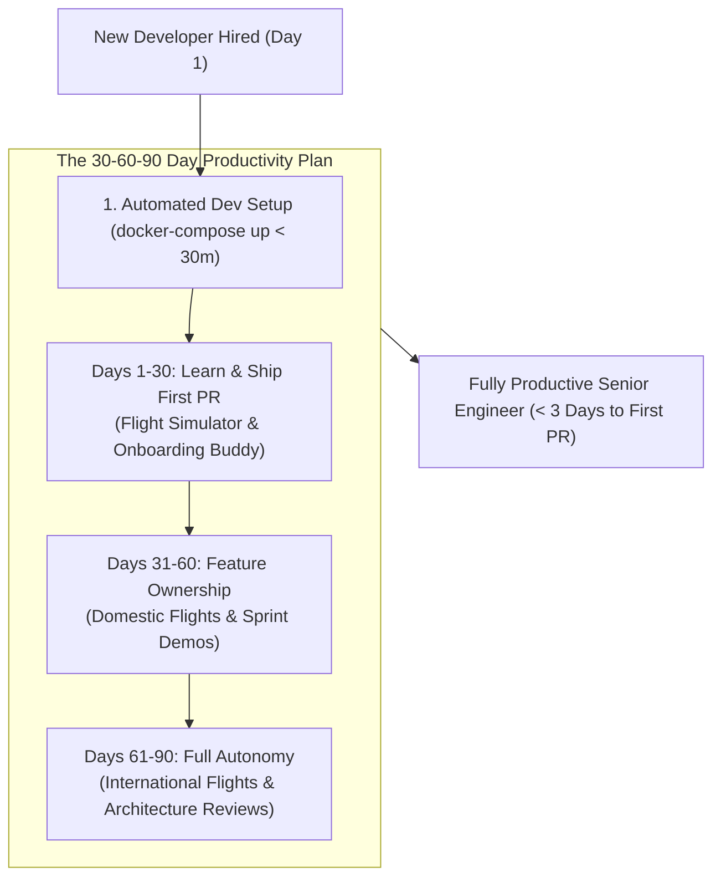

```ppt
# Slide 1: Developer Onboarding (30-60-90 Day Plan)
- **The Core Metric:** Accelerating Time-to-First-PR and ramping up new engineering hires to full productivity smoothly.
- **Golden Rule:** Great developer onboarding is a structured engineering pipeline, not a "sink-or-swim" survival test!
- **Author:** Pankaj Kumar | Associate Architect & Tech Leadership
<!-- slide -->
# Slide 2: The Flight Simulator Training Analogy
- **Reckless Airline:** Hands a new commercial pilot the keys to a Boeing 747 with 300 passengers onboard and says: *"Figure out the cockpit controls as you fly through a thunderstorm!"*
- **Master Aviation Academy (CTO Onboarding Pipeline):** Guides the pilot through a high-tech flight simulator (*Local Dev Environment*), pairs them with a veteran Captain (*Onboarding Buddy*), and lets them execute small domestic flights first!
<!-- slide -->
# Slide 3: The 3 Goals of Developer Onboarding
- **1. Fast Time-to-First-PR:** Shipping a small code change to production within their first 3 days.
- **2. Self-Service Tooling:** Automated setup (`docker-compose up`) setting up local dev environments in under 30 minutes.
- **3. Psychological Safety:** Encouraging questions without fear of judgment.
<!-- slide -->
# Slide 4: The 30-60-90 Day Developer Roadmap
- **Days 1–30 (Learn & Ship First PR):** Local environment setup, pairing with buddy, shipping first bug fix.
- **Days 31–60 (Own Small Features):** Taking full ownership of a squad user story and presenting at sprint demos.
- **Days 61–90 (Full Autonomy & Architecture):** Participating in architecture reviews, code reviews, and on-call rotation.
<!-- slide -->
# Slide 5: The "Onboarding Buddy" Program
- **Peer Mentorship:** Assigning a peer engineer (not their manager) to answer daily Slack questions and guide code reviews.
- **Documentation Feedback:** New hires update outdated README setup docs during their first week!
<!-- slide -->
# Slide 6: Measuring Onboarding Success
- **Time-to-First-PR:** Target < 3 business days.
- **Time-to-First-Feature:** Target < 14 business days.
- **New Hire DevEx Net Promoter Score (NPS):** 30-day survey feedback.
<!-- slide -->
# Slide 7: Common Misconception
- **Myth:** "Senior developers don't need structured onboarding — they should figure out the codebase on their own."
- **Fact:** Poor onboarding wastes 3 months of senior engineer productivity; structured onboarding creates high velocity on Week 1!
<!-- slide -->
# Slide 8: Summary for Beginners
- Build a flight simulator onboarding pipeline: automate local dev setup, assign an onboarding buddy, and target Time-to-First-PR under 3 days!
```

# Onboarding New Developers: 30-60-90 Day Productivity Plan

When a company hires a brilliant senior software engineer, executives expect them to start delivering value immediately.

However, in many engineering organizations, **developer onboarding is a nightmare!**
- The new engineer spends 2 weeks wrestling with broken README setup instructions and missing local database environment variables.
- They don't know who owns which microservice or where documentation is stored.
- It takes 30 days before they ship their first Pull Request (PR) to production!

This delay is called **High Time-to-First-PR**, and it costs tech companies millions of dollars in wasted developer salary.

How does a CTO build a world-class 30-60-90 day developer onboarding pipeline?

Let's understand Developer Onboarding using **The Flight Simulator Training Analogy**!

---

## ✈️ The Flight Simulator Training Analogy

Imagine training a new commercial airline pilot:



- **The Reckless Airline (Sink-or-Swim Onboarding):**  
  Hands a new pilot the keys to a Boeing 747 packed with 300 passengers and says: *"The cockpit buttons are mostly self-explanatory — figure it out while flying through this thunderstorm!"* The pilot panics and the plane stalls!

- **The Master Aviation Academy (CTO Onboarding Pipeline):**  
  Puts the pilot in a state-of-the-art **Flight Simulator** (*Local Containerized Dev Environment*), pairs them with a senior Captain (*Onboarding Buddy*), and lets them practice small domestic flights first! Within days, the pilot flies smoothly with 100% confidence!

---

## 📊 The 30-60-90 Day Developer Onboarding Milestone Framework

| Onboarding Phase | Target Milestone | Key Deliverables & Activities | Success Metric |
| :--- | :--- | :--- | :--- |
| **Days 1–30 (Learn & Ship)** | **Time-to-First-PR** | Local environment setup (`docker-compose up`), 1-on-1 pairing with Onboarding Buddy, shipping 1st bug fix | **First PR merged in < 3 days** |
| **Days 31–60 (Own Features)** | **Squad Contribution** | Taking full ownership of a sprint user story, contributing to code reviews, presenting at sprint demo | **1st complete feature shipped** |
| **Days 61–90 (Full Autonomy)** | **System Leadership** | Participating in system design architecture reviews, joining on-call rotation, updating documentation | **Full squad velocity reached** |

---

## 💡 Summary for Beginners

- **Time-to-First-PR** = The number of days required for a new engineer to merge their first code change into production.
- **Onboarding Buddy** = A peer developer assigned to mentor the new hire and answer daily questions.
- **CTO Golden Rule** = **"Automate your developer onboarding environment so every new engineer merges their first PR within 3 days of joining!"**

---

*Written by **Pankaj Kumar** | Associate Architect & Tech Leadership.*
