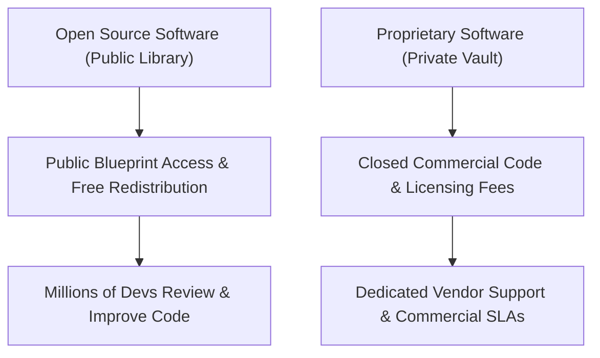

```ppt
# Slide 1: Open Source vs Proprietary Software
- **Core Question:** Should businesses use free community-built code or pay for closed commercial software?
- **Why It Matters:** Impacts software costs, security, customization, and vendor lock-in risk.
- **Author:** Pankaj Kumar | Associate Architect & Tech Leadership
<!-- slide -->
# Slide 2: Public Library vs Private Gated Vault
- **Open Source (Linux, React):** A public town library — anyone can inspect blueprints, borrow books, and suggest improvements.
- **Proprietary (Windows, iOS):** A private secret recipe vault — locked key access, only the owner can modify ingredients.
<!-- slide -->
# Slide 3: Famous Open Source Giants
- **Operating Systems:** Linux (powers 90% of global cloud servers & Android phones).
- **Databases & Frameworks:** PostgreSQL, MySQL, React, Python, Kubernetes, PyTorch.
<!-- slide -->
# Slide 4: The Security Paradox: Open Eyes vs Hidden Code
- **Linus's Law:** "Given enough eyes, all bugs are shallow."
- **Open Source Security:** Millions of global security researchers review public code daily.
- **Proprietary Security:** Relies on internal company teams to discover hidden flaws.
<!-- slide -->
# Slide 5: The Business & Cost Comparison
- **License Fees:** $0 for Open Source vs Heavy monthly per-user licensing for Proprietary.
- **Support & Upkeep:** Community support or paid enterprise support vs Dedicated vendor SLA.
- **Vendor Lock-in:** Total freedom to switch vs Dependent on vendor roadmap.
<!-- slide -->
# Slide 6: What Has Changed in the AI Era?
- **Open-Source AI:** Meta's Llama 3 vs Closed-Source OpenAI GPT-4.
- **CTO Role:** Balancing open-source AI data privacy against commercial AI convenience.
<!-- slide -->
# Slide 7: Common Beginner Misconception
- **Myth:** "Open source software is free, so it has no commercial value."
- **Fact:** Red Hat, Databricks, and MongoDB generated billions selling enterprise support for open source!
<!-- slide -->
# Slide 8: Summary for Beginners
- Open source is collaborative innovation; proprietary software is tailored commercial convenience!
```

# Open Source vs Proprietary Software: Public Libraries vs Private Vaults

In software engineering, every CTO must answer a fundamental strategic question:  
*"Should we build our product using free, open-community software or buy locked commercial licenses?"*

- **Linux vs. Windows**
- **Android vs. iOS**
- **PostgreSQL vs. Oracle**
- **Meta Llama 3 AI vs. OpenAI GPT-4**

Let's break down the difference between **Open Source** and **Proprietary Software** using the simple analogy of a **Public Town Library vs. a Private Gated Vault**!

---

## 📚 Public Library vs. Private Gated Vault

Imagine two ways to get secret cooking recipes:



- **Open Source Software (The Public Town Library):**  
  The architectural blueprints and code recipe are open for the entire world to read, modify, and improve for free. 
  - *Example:* Linux, Python, React, PostgreSQL.
  - *Analogy:* A master chef publishes her famous recipe on a public library wall. Chefs worldwide inspect it, fix minor errors, add spice improvements, and share better versions back with the town!

- **Proprietary / Closed-Source Software (The Private Gated Vault):**  
  The code recipe is locked inside a secure vault. Customers buy a ticket to use the finished meal, but are legally forbidden from inspecting the secret ingredients or modifying the recipe.
  - *Example:* Microsoft Windows, Apple iOS, Adobe Photoshop.
  - *Analogy:* Coca-Cola's secret formula locked in an Atlanta vault. You can drink Coke, but you cannot change how it is manufactured.

---

## ⚖️ Direct Comparison for Executives

| Dimension | Open Source Software | Proprietary Software |
| :--- | :--- | :--- |
| **Source Code Access** | 100% Public & Modifiable | 100% Private & Locked |
| **Licensing Cost** | Free ($0 License Fee) | Recurring Monthly / Annual Fee |
| **Vendor Lock-in** | Low (You own your deployment) | High (Tied to vendor ecosystem) |
| **Security Audit** | Reviewed by global community | Audited by internal vendor engineers |
| **Support** | Community forums or paid enterprise vendors | Guaranteed Commercial SLA |

---

## 🤖 The New Frontier: Open-Source AI vs Closed AI

The battle between open and closed software has shifted to Artificial Intelligence:

- **Closed-Source AI (OpenAI, Anthropic):** Powerful AI models accessible only via paid API calls. Your prompt data travels to vendor servers.
- **Open-Source AI (Meta Llama 3, Mistral):** Open AI model weights downloaded directly into your private company cloud, ensuring 100% data privacy and zero vendor API fees!

---

## 💡 Summary for Beginners

- **Open Source** = Free, public, collaborative software.
- **Proprietary** = Paid, closed, vendor-managed software.
- **The CTO's Job** = Mixing open-source foundations with strategic proprietary tools to optimize security and budget!

---

*Written by **Pankaj Kumar** | Associate Architect & Tech Leadership.*
