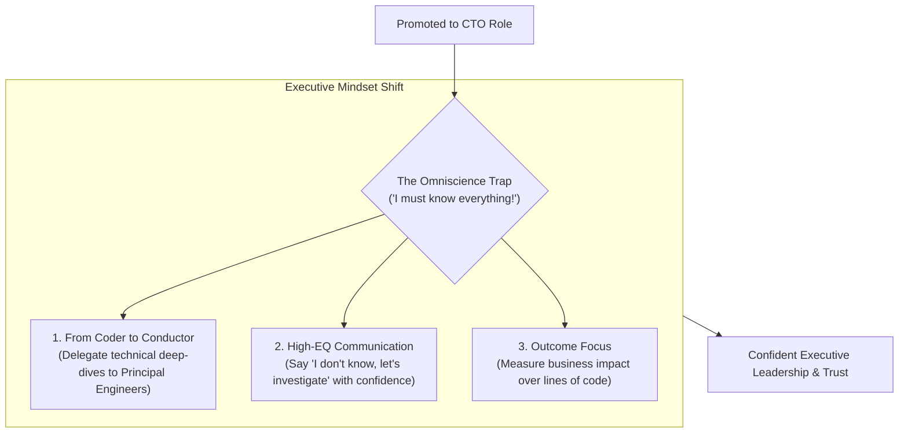

```ppt
# Slide 1: Overcoming Imposter Syndrome in CTO Roles
- **The Psychological Challenge:** Feeling unqualified or terrified that someone will "discover" you don't know every technical answer.
- **Reality Check:** Over 75% of first-time CTOs suffer from Imposter Syndrome during their first year in the executive chair!
- **Author:** Pankaj Kumar | Associate Architect & Tech Leadership
<!-- slide -->
# Slide 2: The Rookie NFL Quarterback Analogy
- **Super Bowl Debut:** A rookie NFL quarterback steps onto the field in a stadium filled with 80,000 cheering fans.
- **The Fear:** *"What if I misread the defense or throw an interception on the very first play?"*
- **The Mindset Shift:** You were promoted to Quarterback not because you know every play in history, but because you have great instincts, leadership, and decision-making under pressure!
<!-- slide -->
# Slide 3: Why First-Time CTOs Suffer Imposter Syndrome
- **1. Shifting from Coder to Executive:** Moving from writing line-by-line code to managing budgets, legal compliance, and board presentations.
- **2. The Omniscience Trap:** Assuming a CTO must know every programming language, cloud service, and AI framework.
- **3. High Stakes:** Fear of making an architectural mistake that causes a major outage or security breach.
<!-- slide -->
# Slide 4: The 4 Actionable Strategies to Overcome It
- **1. Embrace "I Don't Know, But I Will Find Out":** Executive strength is shown by asking smart questions, not faking answers.
- **2. Build an Executive Support Network:** Connect with peer CTOs and executive mentors outside your company.
- **3. Delegate Technical Deep Dives:** Trust your Staff Engineers and Tech Leads to handle granular code decisions.
- **4. Focus on Outcomes, Not Inputs:** Measure your success by engineering velocity and business impact.
<!-- slide -->
# Slide 5: The Omniscience Myth vs Executive Reality
- **Myth:** "A great CTO must be able to answer any deep technical question instantly."
- **Reality:** A great CTO builds a culture of experts and synthesizes their input to make confident business decisions!
<!-- slide -->
# Slide 6: The CTO Peer Mentorship Model
- **Join Peer Groups:** Communities like CTO Craft, LeadDev, and executive peer circles.
- **Share Experiences:** Realizing that every CTO faces technical debt, board friction, and hiring challenges.
<!-- slide -->
# Slide 7: Common Misconception
- **Myth:** "Imposter Syndrome disappears once you become a senior executive."
- **Fact:** Imposter Syndrome never completely vanishes — top leaders reframe it as a signal to stay humble and keep learning!
<!-- slide -->
# Slide 8: Summary for Beginners
- You don't need to know every line of code — lead with curiosity, delegate to experts, and focus on business outcomes!
```

# Overcoming Imposter Syndrome in First-Time CTO Roles

Stepping into the C-suite for the first time is a pivotal moment in any technical career.

One day you are a Senior Architect or Engineering Manager writing code; the next day, your email signature says **Chief Technology Officer (CTO)**.

Suddenly, you are sitting in boardroom meetings discussing CapEx vs OpEx budgets, legal compliance, M&A due diligence, and enterprise sales contracts. 

A quiet voice inside your head starts whispering:  
*"What if I make the wrong cloud provider choice? What if the board realizes I don't know the deep details of Quantum Computing? Am I really qualified to lead this entire engineering department?"*

This internal self-doubt is called **Imposter Syndrome**, and over 75% of technology leaders experience it!

Let's understand how to overcome Imposter Syndrome using **The Rookie NFL Quarterback Analogy**!

---

## 🏈 The Rookie NFL Quarterback Analogy

Imagine a rookie quarterback stepping onto the field for their first professional game:



- **The Rookie's Fear:**  
  Looking up at 80,000 cheering fans and panicking: *"What if I misread the defense? What if I throw an interception on national television?"*

- **The Master Coach's Advice:**  
  *"You weren't drafted to memorize every stat in football history. You were drafted because you make quick decisions under pressure, inspire your teammates, and lead the offense to the endzone!"*

---

## 📊 Imposter Syndrome Trap vs. Executive Reality

| Imposter Syndrome Trap | Executive Reality & Action |
| :--- | :--- |
| **"I must be the smartest technical person in every meeting."** | Hire engineers who are smarter than you in specific domains and empower them to lead! |
| **"If I don't know an answer instantly, I am failing as CTO."** | Confidently say: *"That's a critical question — let me review with our principal architects and report back by 3 PM."* |
| **"I haven't written code in 2 weeks; I'm losing my edge."** | Your primary job is no longer writing code — it's removing friction so 50 developers can write code faster! |

---

## 💡 Summary for Beginners

- **Imposter Syndrome** = A normal psychological reaction when stepping into high-stakes executive leadership.
- **The Conductor Role** = A symphony conductor doesn't play every instrument; they ensure all instruments play in harmony!
- **CTO Golden Rule** = **"Your job as CTO is not to have all the answers — your job is to ask the right questions and build an empowered team of experts who do!"**

---

*Written by **Pankaj Kumar** | Associate Architect & Tech Leadership.*
