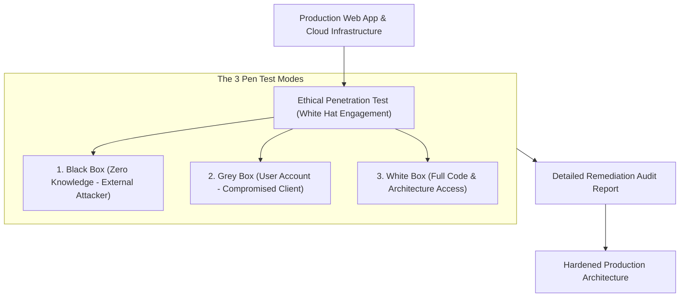
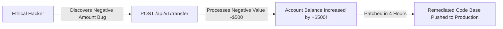

```ppt
# Slide 1: Penetration Testing & Ethical Hacking
- **The Core Practice:** Hiring certified ethical hackers (White Hat Testers) to simulate real-world cyberattacks and find hidden system vulnerabilities before criminals exploit them.
- **Executive Motto:** Find your system flaws before malicious hackers find them for you!
- **Author:** Pankaj Kumar | Associate Architect & Tech Leadership
<!-- slide -->
# Slide 2: The Simulated Bank Heist Drill Analogy
- **Careless Bank (No Pen Testing):** Assumes their vault is unhackable because the architect built 12-inch steel walls. Two months after opening, real thieves discover a hidden air vent bypass and rob the bank clean!
- **Master Security Warden (CTO Pen Testing):** Hires a master locksmith (*Ethical White Hat Hacker*) to conduct a controlled, simulated bank heist! The locksmith picks the locks, tests the thermal motion alarms, and hands the warden a complete report listing every weak hinge (**Vulnerability Audit Report**)!
<!-- slide -->
# Slide 3: Vulnerability Scanning vs. Penetration Testing
- **Vulnerability Scanner (Automated Tool):** Automated software (Nessus / Qualys) scanning for known software version bugs. High false positives!
- **Penetration Test (Human Ethical Hacker):** Skilled security engineers manually chaining exploits, manipulating business logic, and attempting real system compromise.
<!-- slide -->
# Slide 4: Real-World Case Study: Vikram's Fintech Pen Test
- **The Finding:** A fintech startup led by Engineering Lead **Vikram Patel** hired an ethical hacking firm for a pre-launch audit.
- **The Exploit:** Testers found a subtle business logic flaw in the reward points API allowing negative transfers, generating unlimited free cash balances!
- **The Remediation:** Vikram's team patched the API logic in 4 hours before launching to 500,000 customers.
<!-- slide -->
# Slide 5: The 3 Types of Penetration Tests
- **1. Black Box Testing:** Hacker receives zero internal knowledge (Simulates external blind attacker).
- **2. White Box Testing:** Hacker receives full source code, API specs, and architecture diagrams.
- **3. Grey Box Testing:** Hacker receives standard user credentials (Simulates malicious insider or compromised customer).
<!-- slide -->
# Slide 6: Managing Bug Bounty Programs
- **Crowdsourced Security:** Partnering with platforms like HackerOne / Bugcrowd.
- **Rules of Engagement (ROE):** Defining clear scope, legal safe harbor, and bounty payout tiers ($500 for low severity to $25,000+ for critical RCE).
<!-- slide -->
# Slide 7: Common Misconception
- **Myth:** "If our automated security scanner passes with zero errors, we don't need a penetration test."
- **Fact:** Scanners miss complex business logic flaws, authorization bypasses (BOLA), and social engineering vulnerabilities!
<!-- slide -->
# Slide 8: Summary for Beginners
- Audit code with ethical hackers: conduct annual pen tests, chain vulnerability findings into remediation tickets, and run bug bounty programs!
```

# Penetration Testing: Hiring Ethical Hackers to Audit Code

Why do companies with certified security firewalls, automated vulnerability scanners, and encrypted cloud databases still get hacked?

The reason is simple: **Automated security scanners only look for known software bugs — they do NOT have human intuition!**

Automated tools cannot understand complex business logic, authorization flaws, or creative attack chains that a real human hacker uses.

If you want to know how secure your software truly is, you cannot rely on automated software alone. **You must hire skilled Ethical Hackers to attempt breaking into your systems!**

This practice is called **Penetration Testing (Pen Testing).**

Let's understand Penetration Testing using **The Simulated Bank Heist Drill Analogy**!

---

## 🏦 The Simulated Bank Heist Drill Analogy

Imagine testing security at a new commercial bank:



- **The Careless Bank Manager (No Pen Testing):**  
  Assumes the vault is 100% unhackable because the construction company built 12-inch steel walls. Two months after opening, real thieves discover an un-monitored air conditioning duct bypass, crawl into the vault, and steal all the cash!

- **The Master Security Warden (CTO Pen Testing Playbook):**  
  Hires a certified master locksmith (**Ethical White Hat Hacker**) to execute a controlled, simulated bank heist! The locksmith attempts to pick the safe locks, tests the thermal motion sensors, and hands the warden a complete report listing every weak hinge (**Penetration Audit Report**)!

---

## 📊 Real-World Case Study: Vikram's Fintech Business Logic Exploit

Consider a fast-scaling fintech app led by Lead Engineer **Vikram Patel**.



1. **The Context:** Before launching a new peer-to-peer payment app to 500,000 users, Vikram hired an external penetration testing firm.
2. **The Discovery:** Automated security tools marked the API as 100% secure. However, a human ethical hacker tested a creative business logic exploit:  
   - The hacker sent a money transfer API request with a **negative integer value**: `POST /api/v1/transfer { "amount": -500 }`.
   - The backend code subtracted -$500, which mathematically *increased* the sender's account balance by +$500!
3. **The Remediation:** Vikram's team patched the input validation logic within 4 hours, preventing a catastrophic multi-million dollar exploit before going live to the public!

---

## 📊 Automated Scanners vs. Human Penetration Testing

| Feature Dimension | Automated Vulnerability Scanner | Human Penetration Testing |
| :--- | :--- | :--- |
| **Tool / Agent** | Software scanners (Nessus, Snyk, Qualys) | Certified Ethical Hackers (OSCP, CEH) |
| **Testing Scope** | Known CVE vulnerability database checks | Business logic flaws, BOLA, multi-step exploit chains |
| **Execution Speed** | Fast (Runs in 15 minutes inside CI/CD) | Thorough (Takes 1–2 weeks of active manual testing) |
| **False Positives** | High (Flagging harmless code warnings) | Very Low (Every reported flaw is demonstrated with proof) |
| **Best Used For** | Continuous daily automated build checks | Annual compliance audits (SOC2 / PCI-DSS) & pre-launch checks |

---

## 💡 Summary for Beginners

- **Penetration Testing (Pen Test)** = A authorized, simulated cyberattack against a computer system to evaluate its security.
- **Bug Bounty Program** = A crowdsourced initiative (via HackerOne or Bugcrowd) paying cash rewards to ethical hackers who discover security bugs.
- **CTO Golden Rule** = **"Hire ethical hackers to break your systems before real criminals do — run annual penetration tests and fix business logic vulnerabilities!"**

---

*Written by **Pankaj Kumar** | Associate Architect & Tech Leadership.*
