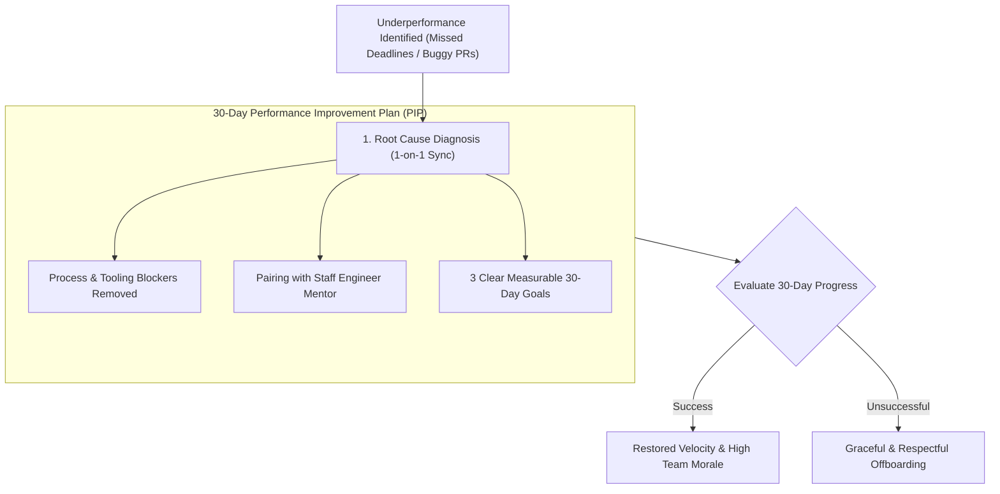

```ppt
# Slide 1: Performance Management in Engineering
- **The Leadership Responsibility:** Managing underperforming software developers empathetically while maintaining high team standards.
- **Golden Rule:** Address performance issues early with clear expectations, support, and objective feedback!
- **Author:** Pankaj Kumar | Associate Architect & Tech Leadership
<!-- slide -->
# Slide 2: The Personal Athletic Trainer Analogy
- **Discouraging Coach (Bad Management):** Yells at an athlete for missing a lift, offers zero technical guidance, and threatens to kick them off the team in front of everyone!
- **Master Personal Trainer (Empathetic CTO Leadership):** Breaks down the athlete's squat form on video (*Code Review Analysis*), identifies a weak knee angle (*Lack of Training / Process Blocker*), and builds a 30-day corrective strength plan (*PIP*)!
<!-- slide -->
# Slide 3: Root Causes of Technical Underperformance
- **1. System & Process Blockers:** Unclear requirements, complex legacy codebase, or lack of documentation.
- **2. Skill & Knowledge Gaps:** Unfamiliarity with modern framework architecture or cloud tools.
- **3. Burnout & Personal Stress:** Exhaustion from constant production outages or personal life stress.
- **4. Misaligned Expectations:** Mismatch between developer skill level and assigned role.
<!-- slide -->
# Slide 4: The 4-Step Performance Management Framework
- **Step 1 (Early 1-on-1 Feedback):** Discuss specific code/ticket examples non-defensively.
- **Step 2 (Root Cause Diagnosis):** Ask *"What tools or support do you need to succeed?"*
- **Step 3 (30-Day Support Plan):** Set 3 clear, measurable performance goals with weekly check-ins.
- **Step 4 (Formal PIP / Transition):** Formalizing progress or executing a respectful departure.
<!-- slide -->
# Slide 5: Structuring a Performance Improvement Plan (PIP)
- **Objective Criteria:** e.g., *"Ship 2 peer-reviewed user stories per sprint with zero regression bugs."*
- **Dedicated Mentorship:** Pairing the developer with a Staff Engineer for 30 days.
- **Clear Consequences:** Transparent outcome expectations from Day 1.
<!-- slide -->
# Slide 6: Graceful & Respectful Offboarding
- **Dignified Departure:** If a PIP fails, executing a compassionate transition that preserves candidate dignity.
- **Team Transparency:** Reassuring the remaining team that performance standards are maintained fairly.
<!-- slide -->
# Slide 7: Common Misconception
- **Myth:** "Firing underperformers immediately creates a high-performance engineering culture."
- **Fact:** Instant firing creates fear and paranoia; empathetic coaching and clear standards build high trust!
<!-- slide -->
# Slide 8: Summary for Beginners
- Diagnose root causes early, provide structured 30-day support plans, and manage underperformance with empathy and clarity!
```

# Performance Management: Handling Underperforming Developers

One of the most difficult responsibilities a Chief Technology Officer or Engineering Manager faces is **managing underperforming developers.**

When a developer consistently misses sprint deadlines, submits buggy code, or disengages from team discussions, managers often make two extreme mistakes:

1. **The Avoidance Trap:** Ignoring the underperformance for months, hoping it magically fixes itself, which demoralizes the rest of the team who must pick up the extra workload.
2. **The Harsh Reaction Trap:** Blaming the developer publicly, setting impossible traps, and firing them abruptly, which creates a culture of fear and anxiety across the entire engineering department.

How does an executive leader handle underperformance with empathy, fairness, and structural clarity?

Let's understand Performance Management using **The Personal Athletic Trainer Analogy**!

---

## 🏋️ The Personal Athletic Trainer Analogy

Imagine a personal athletic trainer coaching an athlete who is struggling to hit their weightlifting goals:



- **The Discouraging Coach (Bad Management):**  
  Yells at an athlete for missing a heavy deadlift, offers zero technical feedback, and threatens to kick them off the team in front of everyone. The athlete gets injured and quits!

- **The Master Personal Trainer (Empathetic CTO Leadership):**  
  Reviews video footage of the lift (*Code Reviews & Sprint Analysis*), identifies a weak knee angle (*Process Blocker or Skill Gap*), and designs a 30-day targeted strength program (*PIP*). The athlete rebuilds their form and achieves a personal best record!

---

## 📊 Root Cause Analysis: System Problem vs. Individual Skill Gap

| Category | Typical Symptom | Management Solution |
| :--- | :--- | :--- |
| **System / Process Blocker** | Developer spends 3 days setting up local env or waiting for code reviews | Automate CI/CD pipelines, enforce 24-hour PR review SLAs |
| **Unclear Scope / Specs** | Developer builds the wrong feature or misinterprets edge cases | Improve Product Requirement Documents (PRDs) & sprint refinement |
| **Skill & Architecture Gap** | Developer struggles with complex React or microservice patterns | Assign a Staff Engineer mentor & provide dedicated learning hours |
| **Burnout / Personal Stress** | Sudden drop in output from a previously high-performing engineer | Offer PTO, reduce on-call load, and provide mental health support |

---

## 💡 Summary for Beginners

- **Empathetic Performance Management** = Identifying performance issues early, diagnosing root causes, and providing structured 30-day support plans.
- **Dignified Transitions** = If a developer cannot meet expectations after support, execute a respectful departure that preserves their dignity.
- **CTO Golden Rule** = **"Diagnose before you discipline — address underperformance early with clear expectations, dedicated mentorship, and empathy!"**

---

*Written by **Pankaj Kumar** | Associate Architect & Tech Leadership.*
