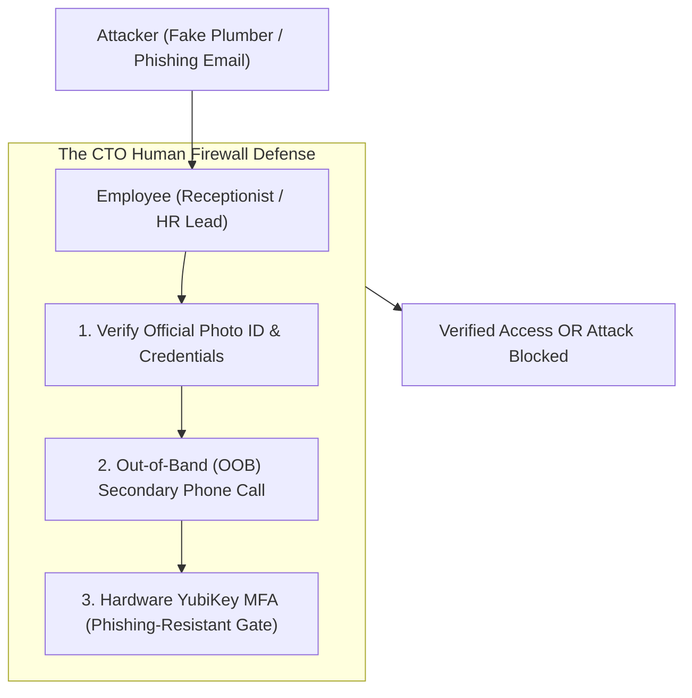
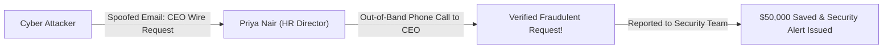

```ppt
# Slide 1: Phishing & Social Engineering Defense
- **The Core Human Security Challenge:** Training employees to recognize, report, and block social engineering manipulation tactics before cyber attackers breach internal networks.
- **Executive Reality:** Over 90% of enterprise cyber breaches start with a single phishing email or social engineering phone call!
- **Author:** Pankaj Kumar | Associate Architect & Tech Leadership
<!-- slide -->
# Slide 2: The Fake Plumber at the Office Gate Analogy
- **Careless Receptionist (Unconscious Human Security):** A person wearing blue overalls knocks on the office door claiming to be a "plumber sent by executive management to fix a leak." The receptionist lets them in without checking ID. The fake plumber steals server hardware!
- **Trained Security Guard (CTO Human Firewalls):** Demands official photo ID, checks the maintenance log, calls the building manager to confirm, and refuses entry until identity is verified (**Verification SLA**)!
<!-- slide -->
# Slide 3: 4 Major Social Engineering Attack Vectors
- **1. Phishing (Email Spoofing):** Fake emails mimicking Microsoft 365 / Google Workspace login pages to steal passwords.
- **2. Spear Phishing (Targeted Attack):** Customized emails targeting CFOs or HR leads containing fake invoices or wire requests.
- **3. Vishing (Voice Phishing):** AI voice cloning or phone calls impersonating IT helpdesk support.
- **4. Smishing (SMS Phishing):** Text messages urging employees to click malicious urgent links.
<!-- slide -->
# Slide 4: Real-World Case Study: Priya's HR Spear Phishing Trap
- **The Incident:** An HR lead named **Priya Nair** received an urgent email appearing to come from the CEO: *"Priya, wire $50,000 to this vendor immediately for a confidential merger."*
- **The Human Defense:** Priya followed the CTO's Out-of-Band (OOB) Verification protocol. She called the CEO on their verified phone number to confirm.
- **The Result:** The request was identified as a fake spear-phishing attack, saving the company $50,000!
<!-- slide -->
# Slide 5: The 4 Pillars of Human Security Defense
- **1. Simulated Phishing Drills:** Sending monthly mock phishing emails to test employee awareness.
- **2. Hardware Multi-Factor Authentication (MFA):** Replacing SMS/Push MFA with phishing-resistant YubiKeys (FIDO2).
- **3. Out-of-Band (OOB) Verification:** Requiring secondary phone confirmation for wire transfers or password resets.
- **4. Blameless Security Culture:** Encouraging employees to report clicked links immediately without fear of punishment.
<!-- slide -->
# Slide 6: Phishing-Resistant FIDO2 Hardware Keys
- **Why SMS & Push MFA Fail:** Attackers use SIM swapping or MFA Fatigue bombing to trick users.
- **YubiKey Hardware Protection:** FIDO2 WebAuthn keys bind authentication directly to the exact domain URL, neutralizing phishing sites automatically!
<!-- slide -->
# Slide 7: Common Misconception
- **Myth:** "Cybersecurity is 100% solved by installing antivirus software and firewalls."
- **Fact:** Firewalls cannot stop an employee from voluntarily handing over their password to a convincing fake website!
<!-- slide -->
# Slide 8: Summary for Beginners
- Train your human firewalls: conduct monthly simulated phishing drills, deploy YubiKey hardware MFA, enforce out-of-band verification, and foster a blameless security culture!
```

# Phishing & Social Engineering: Training Employee Defense

Why spend millions of dollars building state-of-the-art firewalls, cloud encryption, and zero trust proxies if a cyber attacker can simply **trick an employee into handing over their master password over the phone?**

This is **Social Engineering** — the psychological manipulation of human beings to trick them into revealing confidential information or granting access to secure systems.

Cybersecurity experts estimate that **over 90% of all successful enterprise cyberattacks begin with a single phishing email or social engineering phone call.**

You can have the most expensive security technology in the world, but if your employees are not trained to spot manipulation, your company is vulnerable.

To protect the organization, **CTOs build Human Firewalls through continuous training and phishing-resistant MFA!**

Let's understand Social Engineering Defense using **The Fake Plumber at the Door Analogy**!

---

## 🚪 The Fake Plumber at the Door Analogy


Imagine managing security at a corporate headquarters:



- **The Careless Receptionist (Unconscious Security):**  
  A stranger wearing blue overalls knocks on the front door claiming to be a *"plumber sent by executive management to fix an urgent pipe leak."* The receptionist lets them in without checking ID. The fake plumber walks into the server room and steals company hard drives!

- **The Trained Security Guard (CTO Human Firewall Culture):**  
  Demands official photo ID (**Identity Verification**), checks the central maintenance log (**System Authorization**), calls the building manager on a secondary phone line to confirm (**Out-of-Band Verification**), and refuses entry until verified!

---

## 📊 Real-World Case Study: Priya's HR Spear Phishing Trap

Consider a mid-sized software firm where **Priya Nair** works as Senior HR Director.



1. **The Attack:** An attacker sent an urgent, highly customized email appearing to come directly from the company CEO's email address: *"Priya, I am in a confidential board meeting. Wire $50,000 to this legal vendor immediately for an urgent acquisition."*
2. **The Manipulation:** The email used urgency, authority, and confidentiality to pressure Priya into bypassing standard finance controls.
3. **The Human Defense:** Because the CTO had established a strict **Out-of-Band (OOB) Verification Policy**, Priya did not hit "Reply". Instead, she placed a direct phone call to the CEO's verified mobile number. The CEO confirmed they never sent the email, saving the company $50,000 and exposing a spear-phishing campaign!

---

## 📊 Traditional Security vs. CTO Human Firewall Culture

| Security Dimension | Unconscious Security Culture (Vulnerable) | CTO Human Firewall Culture (Resilient) |
| :--- | :--- | :--- |
| **Phishing Training** | Annual 15-minute boring video lecture | Monthly simulated phishing drills with real-time feedback |
| **Authentication Strategy** | SMS text messages or Push Notifications (Vulnerable to MFA fatigue) | Hardware FIDO2 YubiKeys (Completely phishing-resistant) |
| **Wire / Reset Requests** | Processed based on email requests alone | Mandatory Out-of-Band (OOB) secondary phone/in-person verification |
| **Incident Reporting** | Employees hide clicked links due to fear of punishment | Blameless culture: Employees rewarded for reporting suspicious emails fast |

---

## 💡 Summary for Beginners

- **Phishing** = Fraudulent emails or messages designed to trick users into revealing sensitive credentials or downloading malware.
- **Out-of-Band (OOB) Verification** = Confirming a request using a separate communication channel (e.g., calling a verified phone number instead of replying to an email).
- **CTO Golden Rule** = **"Technology alone cannot save you from human trickery — deploy YubiKey hardware MFA, run monthly phishing simulations, and cultivate a blameless reporting culture!"**

---

*Written by **Pankaj Kumar** | Associate Architect & Tech Leadership.*
