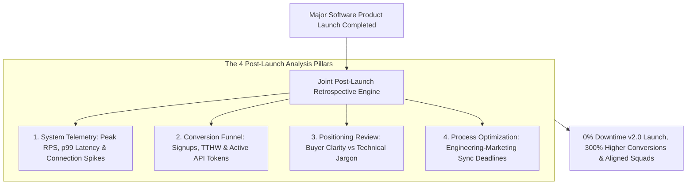
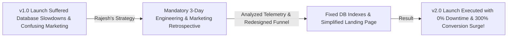

```ppt
# Slide 1: Post-Launch Marketing Retrospectives (Series 6 Capstone)
- **The Core Capstone Strategy:** Conducting structured cross-functional post-launch retrospectives between Engineering, Product, and Marketing to analyze launch telemetry, capture lessons learned, and continuously improve future technical product releases.
- **Series 6 Grand Capstone:** Marketing, Developer Relations & Technical Brand Strategy.
- **Author:** Pankaj Kumar | Associate Architect & Tech Leadership
<!-- slide -->
# Slide 2: Unexamined Celebration vs. Space Mission Debrief Analogy
- **Unexamined Celebration (Ineffective Launch):** An engineering team popping champagne after a rocket launch and walking away while control room screens flash unexamined telemetry errors (**Ignoring Post-Launch Telemetry**). The team repeats identical infrastructure mistakes on the next release!
- **Dedicated Space Mission Debrief (Effective Launch Retrospective):** A dedicated joint mission room where the CTO, Lead Architect, and Marketing Director analyze post-flight telemetry data on glowing screens, documenting lessons on a whiteboard (**Continuous Launch Optimization**)! Future launches execute flawlessly!
<!-- slide -->
# Slide 3: The 4 Pillars of a Joint Post-Launch Retrospective
- **1. Infrastructure & System Telemetry:** Analyzing CPU utilization spikes, database connection pools, & API latency SLAs during launch traffic.
- **2. Developer Conversion Funnel:** Evaluating signup conversion rates from Product Hunt, Hacker News, & technical blogs.
- **3. Messaging & Positioning Feedback:** Identifying which product messaging points resonated and which confused buyers.
- **4. Cross-Functional Team Process:** Documenting friction between engineering release schedules and marketing campaign timelines.
<!-- slide -->
# Slide 4: Real-World Case Study: Rajesh's Retrospective Transformation
- **The Challenge:** A cloud developer platform led by Lead Architect **Rajesh Sharma** suffered from database slowdowns and marketing confusion during their v1.0 public launch.
- **The Retrospective Strategy:** Rajesh instituted a mandatory joint 3-day post-launch retrospective between Engineering, Product, and Marketing.
- **The Result:** Identified database indexing flaws, simplified marketing landing page messaging, and executed their v2.0 launch with 0% downtime and 300% higher conversions!
<!-- slide -->
# Slide 5: The Blameless Retrospective Framework
- **What Went Well:** Celebrating engineering uptime achievements & viral marketing hits.
- **What Didn't Go as Planned:** Analyzing unexpected server bottlenecks & messaging drop-offs without assigning personal blame.
- **Actionable Commitments:** Assigning clear owners and deadlines for 5 critical launch improvements before the next cycle.
<!-- slide -->
# Slide 6: Launch Telemetry Dashboard Components
- **System Metrics:** Peak Requests Per Second (RPS), Error Rate %, and 99th Percentile Latency (p99).
- **Marketing Metrics:** Time-to-Hello-World (TTHW), API key creation conversion %, and active Discord community growth.
<!-- slide -->
# Slide 7: Common Misconception
- **Myth:** "Once a product launch is completed, the team should immediately move to the next feature sprint without looking back."
- **Fact:** Skipping post-launch retrospectives forces engineering and marketing teams to repeatedly make the same costly deployment and messaging errors!
<!-- slide -->
# Slide 8: Summary for Beginners
- Master post-launch retrospectives: analyze system telemetry, evaluate developer conversion funnels, conduct blameless debriefs across Engineering and Marketing, and continuously optimize technical product launches!
```

# Post-Launch Marketing Retrospectives: Learning from Launches

Welcome to the **Grand Capstone Guide for Series 6: Marketing, Developer Relations & Technical Brand Strategy!**

Across all 16 comprehensive articles in Series 6, we have covered the complete spectrum of technical marketing and brand strategy for engineering leaders:
1. Winning developer mindshare (`post-081`)
2. Aligning release timelines with marketing campaigns (`post-082`)
3. Technical content marketing (`post-083`)
4. Building defensible engineering blogs (`post-084`)
5. Executive public speaking & keynotes (`post-085`)
6. Managing public PR during system outages (`post-086`)
7. Developer advocacy & API communities (`post-087`)
8. Executive LinkedIn personal branding (`post-088`)
9. Co-marketing with cloud hyperscalers (`post-089`)
10. Product Hunt & Hacker News launches (`post-090`)
11. Building open-source inbound tools (`post-091`)
12. Customer Advisory Boards (`post-092`)
13. Product positioning & messaging translation (`post-093`)
14. Measuring DevRel ROI (`post-094`)
15. Sponsoring tech conferences for talent (`post-095`)
16. **Post-launch marketing retrospectives (`post-096`)**

---

Now comes the ultimate feedback loop that seals the entire Series 6 framework:  
*"Once a major software launch is complete, how do CTOs conduct a **Joint Post-Launch Retrospective** to learn from data and continuously improve future campaigns?"*

In many software organizations, teams make a critical mistake immediately after launch day:
- **The Unexamined Celebration Trap:** Engineering pops champagne, celebrates shipping the code, and immediately moves to the next feature sprint without analyzing system logs or conversion metrics.
- **The Result:** The team repeats identical infrastructure bottlenecks, messaging confusion, and release delays on their next major product launch!

**Post-Launch Retrospectives are the blameless engineering and marketing debriefs that turn launch data into continuous organizational mastery.**

How do CTOs lead post-launch retrospectives that bridge Engineering, Product, and Marketing?

Let's understand Post-Launch Retrospectives using **The Unexamined Celebration vs. Space Mission Debrief Analogy**!

---

## 🚀 The Unexamined Celebration vs. Space Mission Debrief Analogy


Imagine completing a major space exploration launch mission:



- **The Unexamined Celebration (Ineffective Launch):**  
  An engineering team popping champagne after a rocket launch and walking away while control room screens flash unexamined telemetry error warnings (**Ignoring Post-Launch Telemetry**). The team repeats identical infrastructure mistakes on the next release!

- **The Dedicated Space Mission Debrief (Effective Launch Retrospective):**  
  A dedicated joint mission control room where the CTO, Lead Architect, and Marketing Director analyze post-flight telemetry data on glowing screens, documenting lessons on a whiteboard (**Continuous Launch Optimization**)! Future launches execute flawlessly.

---

## 📊 Real-World Case Study: Rajesh's Retrospective Transformation

Consider a cloud developer platform where **Rajesh Sharma** serves as Lead Architect.



1. **The Challenge:** During their v1.0 public launch, Rajesh's developer platform suffered database connection pool exhaustion, while marketing's landing page generated a high 80% bounce rate because developers found the setup instructions confusing.
2. **The Retrospective Strategy:**  
   - Instead of ignoring the flaws, Rajesh instituted a **Mandatory Joint 3-Day Post-Launch Retrospective**:
   - **Infrastructure Telemetry Analysis:** Analyzed database connection pool exhaustion logs, identifying un-indexed SQL queries that triggered during traffic spikes.
   - **User Experience Audit:** Analyzed developer drop-off recordings, realizing developers failed to locate their API keys on the dashboard.
   - **Blameless Action Items:** Created 5 concrete engineering and marketing action items, assigning clear owners and completion deadlines.
3. **The Result:** The team fixed database indexing, redesigned the API key dashboard, and executed their v2.0 product launch with **0% downtime** and a **300% surge in developer conversion rates**!

---

## 📊 Unexamined Sprint Move vs. Joint Post-Launch Retrospective

| Retrospective Dimension | Unexamined Sprint Move (Ineffective) | Joint Post-Launch Retrospective (Effective) |
| :--- | :--- | :--- |
| **Post-Launch Action** | Instantly move to next sprint without reviewing launch | Hold structured joint debrief between Engineering & Marketing |
| **Infrastructure Telemetry** | Server errors ignored unless total outage occurs | Detailed analysis of peak RPS, p99 latency, & database metrics |
| **Marketing Analysis** | Vanity traffic views celebrated; bounce rates ignored | In-depth review of Time-to-Hello-World (TTHW) & activation rates |
| **Culture Model** | Blame assigned when launch targets are missed | **Blameless culture focused on root causes & system fixes** |
| **Future Launch Outcome** | Repeated infrastructure bugs & deployment delays | **Continuous launch optimization, faster execution, & higher ROI** |

---

## 💡 Summary for Beginners

- **Post-Launch Retrospective** = A structured debrief meeting held after a major product release to evaluate what went well, what failed, and how to improve future launches.
- **Blameless Culture** = A psychological safety principle where team members analyze mistakes without fear of personal blame, focusing on system improvements.
- **Launch Telemetry** = Empirical data metrics captured during launch (server response times, error rates, user signup conversions, and active API tokens).
- **CTO Golden Rule** = **"Never let a launch end without learning — conduct blameless joint retrospectives, analyze system telemetry, and continuously elevate your engineering and marketing execution!"**

---

*Written by **Pankaj Kumar** | Associate Architect & Tech Leadership.*
