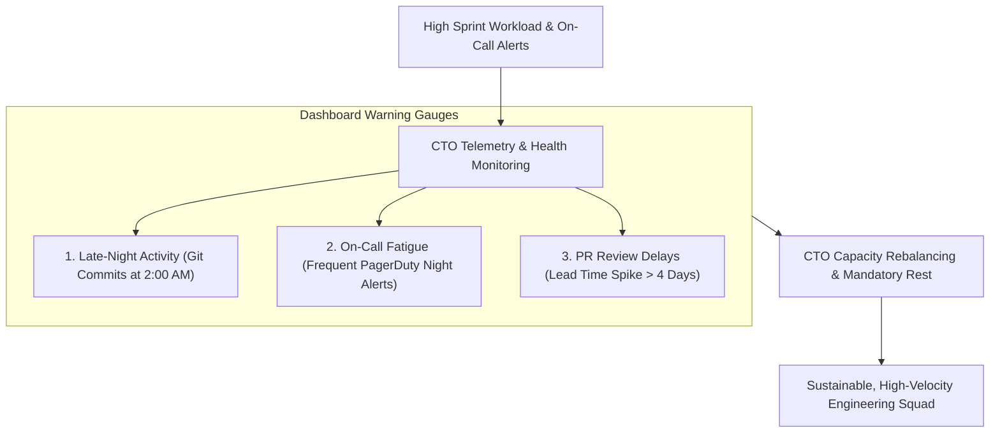

```ppt
# Slide 1: Preventing Developer Burnout
- **The Core Discipline:** Spotting early warning signs of cognitive exhaustion and workload fatigue before engineers crash or resign.
- **Executive Rule:** Burnout is a system architecture and management flaw — not an individual developer weakness!
- **Author:** Pankaj Kumar | Associate Architect & Tech Leadership
<!-- slide -->
# Slide 2: The Engine Temperature Gauge Analogy
- **Negligent Driver (Ignored Signals):** Ignores a flashing red engine temperature light on the car dashboard, drives up a steep mountain at 90 mph, and seizes the engine block in a cloud of white smoke!
- **Master Mechanic (CTO Burnout Prevention):** Monitors radiator temperature gauges (*Sprint Velocity Trends & On-Call Alerts*), notices early heat friction (*Weekend Slack Messages & High PR Lead Time*), and pulls over to top off coolant and adjust engine load (*Capacity Rebalancing*)!
<!-- slide -->
# Slide 3: The 4 Major Causes of Developer Burnout
- **1. Continuous On-Call Interruptions:** PagerDuty alerts firing 5 times a night during production incidents.
- **2. Unrealistic Sprint Scope & Scope Creep:** Product management adding mid-sprint tasks without shifting deadlines.
- **3. Friction & Hero Culture:** Chronic technical debt making every simple bug fix take 3 agonizing days.
- **4. Lack of Psychological Safety:** Fear of making mistakes or asking for help.
<!-- slide -->
# Slide 4: Early Telemetry Warning Signals of Burnout
- **Signal 1 (After-Hours Activity):** Frequent git commits or Slack messages pushed between 1:00 AM and 5:00 AM.
- **Signal 2 (PR Lead Time Spike):** Pull requests sitting in review for 5+ days due to cognitive exhaustion.
- **Signal 3 (Cynicism & Withdrawal):** Previously active developers going silent during sprint retrospectives.
<!-- slide -->
# Slide 5: The CTO Burnout Prevention Framework
- **1. Tiered Incident Escalation:** Secondary on-call rotations so no developer is on-call 2 weeks in a row.
- **2. Mandatory Post-On-Call Rest (Comp Days):** 1 day off immediately following an intense on-call rotation.
- **3. Strict Scope Protection:** Protecting sprint backlogs from mid-sprint scope inflation.
- **4. Fixed 20% Tech Debt Budget:** Refactoring legacy code to reduce developer frustration.
<!-- slide -->
# Slide 6: Promoting Work-Life Boundaries
- **No-Meeting Wednesdays:** Dedicated 8-hour blocks for uninterrupted deep work.
- **Scheduled Slack Messages:** Setting delayed sends so late-night ideas don't ping colleagues after hours.
<!-- slide -->
# Slide 7: Common Misconception
- **Myth:** "Burnout is caused by developers working too hard on exciting, high-impact projects."
- **Fact:** Burnout is caused by feeling helpless while fighting dull, repetitive technical friction and endless bureaucracy!
<!-- slide -->
# Slide 8: Summary for Beginners
- Monitor team temperature gauges: eliminate midnight alert noise, protect sprint boundaries, and invest in DevEx!
```

# Preventing Developer Burnout: Spotting Overworked Squads

In high-growth technology companies, **Developer Burnout is an invisible, silent killer of engineering momentum.**

Burnout does not happen overnight. It is a slow, cumulative process where high-performing software engineers gradually experience physical, mental, and emotional exhaustion.

When engineering squads burn out:
- Code quality plummets, and critical bugs slip into production releases.
- Developer turnover spikes, triggering a domino effect of resignations.
- Team morale degrades into cynicism and apathy.

Most managers fail to spot burnout until a key engineer abruptly hands in their 2-week resignation letter.

How does an executive CTO monitor team health and prevent developer burnout?

Let's understand Burnout Prevention using **The Engine Temperature Gauge Analogy**!

---

## 🚗 The Engine Temperature Gauge Analogy

Imagine driving a high-performance sports car up a steep mountain pass:



- **The Negligent Driver (Ignored Warning Signals):**  
  Ignores the flashing red engine temperature light on the dashboard, steps on the gas pedal at 90 mph, and completely seizes the engine block in a cloud of white smoke! The car is wrecked and stranded on the highway.

- **The Master Mechanic (CTO Burnout Prevention Leader):**  
  Monitors temperature gauges continuously (**Sprint Velocity & On-Call Telemetry**), notices early heat friction, pulls over to top off engine coolant (**Mandatory Post-On-Call Rest**), and rebalances engine load (**Sprint Capacity Protection**)!

---

## 📊 Burnout Drivers vs. CTO Prevention Solutions

| Burnout Driver | Root System Cause | CTO Prevention Solution |
| :--- | :--- | :--- |
| **On-Call Exhaustion** | PagerDuty alerting developer 4 times a night for non-critical alerts | Implement alert routing severity: P0 wakes engineer; P2 waits until 9:00 AM |
| **Mid-Sprint Scope Creep** | Product Managers adding urgent features after sprint planning | Enforce strict sprint scope protection — adding a task requires dropping one |
| **Cognitive Friction** | Brittle legacy code making simple bug fixes take 3 days | Allocate 20% of every sprint to refactoring and DevEx improvements |
| **After-Hours Ping Noise** | Team members messaging Slack at 11:00 PM | Mandate Slack "Do Not Disturb" hours & delayed message scheduling |

---

## 💡 Summary for Beginners

- **Developer Burnout** = A state of chronic physical and mental exhaustion caused by prolonged workplace friction, poor boundaries, and on-call noise.
- **Comp Days** = Mandatory time off given to engineers immediately following an intense incident response or on-call shift.
- **CTO Golden Rule** = **"Burnout is a system architecture flaw — monitor team health gauges, protect sprint scope, and eliminate midnight alert noise!"**

---

*Written by **Pankaj Kumar** | Associate Architect & Tech Leadership.*
