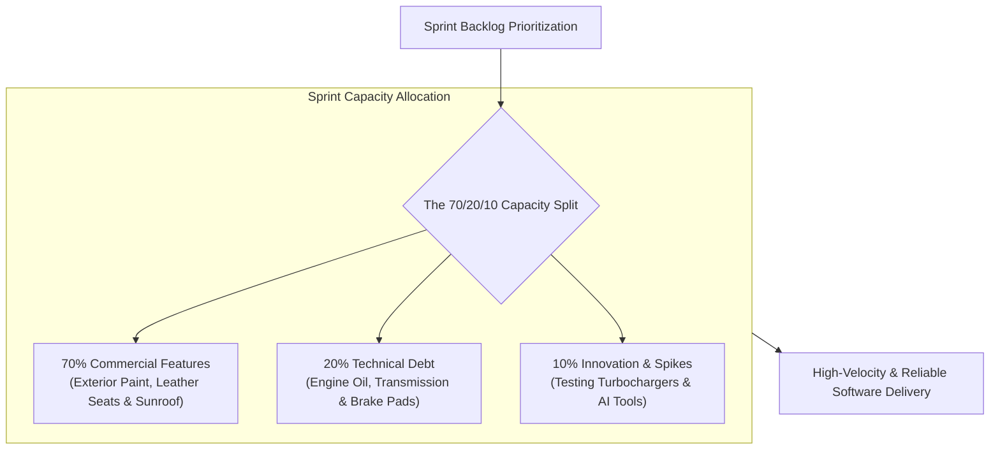

```ppt
# Slide 1: Prioritizing Technical vs Commercial Tasks
- **The Ongoing Tension:** Balancing internal technical refactoring with external commercial feature requests.
- **The Executive Dilemma:** Product managers demand new features for revenue; engineers demand refactoring to prevent system crashes.
- **Author:** Pankaj Kumar | Associate Architect & Tech Leadership
<!-- slide -->
# Slide 2: Engine Oil Change vs Exterior Paint Analogy
- **Commercial Features (Exterior Car Paint):** Bright shiny metallic red paint, spoiler, and custom chrome wheels that impress buyers in the showroom!
- **Technical Refactoring (Engine Oil & Brake Replacement):** Changing dirty engine oil, replacing worn brake pads, and fixing transmission fluid leaks so the car doesn't break down on the highway!
<!-- slide -->
# Slide 3: The 4 Quadrants of Prioritization (RICE Framework)
- **1. Reach:** How many users will benefit from this deliverable?
- **2. Impact:** How much will this move our core business metrics?
- **3. Confidence:** How certain are we about our technical estimates?
- **4. Effort:** How many developer weeks does this require?
<!-- slide -->
# Slide 4: The 70/20/10 Capacity Allocation Rule
- **70% Commercial Features:** User stories that directly drive revenue, user acquisition, and product goals.
- **20% Technical Debt & Infrastructure:** Database indexing, security patches, API refactoring, and CI/CD pipelines.
- **10% Innovation & R&D:** Hackathons, spikes, and testing new AI tools.
<!-- slide -->
# Slide 5: How to Sell Technical Tasks to Non-Tech Executives
- **Don't say:** *"We need 3 weeks to refactor our legacy ORM layer."*
- **Do say:** *"Investing 3 weeks in database optimization will reduce checkout load times by 50%, preventing $200k in abandoned cart losses!"*
<!-- slide -->
# Slide 6: Managing Emergency Escalations
- **P0 Incidents:** Security vulnerability or revenue-blocking outage ➔ Stop all feature sprints immediately.
- **P1 Tech Debt:** Scheduled into upcoming 20% refactoring capacity.
<!-- slide -->
# Slide 7: Common Misconception
- **Myth:** "Refactoring should only happen during a 3-month 'Code Freeze'."
- **Fact:** Code freezes kill business momentum; refactoring must be continuously integrated into every 2-week sprint!
<!-- slide -->
# Slide 8: Summary for Beginners
- Allocate 70% to commercial features and 20% to technical debt, and always frame refactoring in business revenue terms!
```

# Prioritizing Technical Tasks vs Commercial Feature Delivery

In every software engineering organization, there is a constant tug-of-war between two opposing forces:

1. **The Commercial Force (Product & Sales):**  
   *"We need 5 new customer-facing features shipped this sprint to win deals and hit our quarterly revenue targets!"*

2. **The Technical Force (Engineering & Architecture):**  
   *"If we don't refactor our messy legacy database queries right now, the entire server will crash under peak traffic!"*

If you prioritize *only* commercial features, your codebase turns into unmaintainable spaghetti, causing catastrophic outages. If you prioritize *only* technical refactoring, your company runs out of money because competitors ship features faster!

How does a CTO strike the perfect balance?

Let me explain using **The Engine Oil Change vs. Car Exterior Paint Analogy**!

---

## 🚗 The Engine Oil Change vs. Car Exterior Paint Analogy

Imagine maintaining a high-performance sports car:



- **Commercial Features (The Metallic Exterior Paint & Sunroof):**  
  The sleek red paint, leather sports seats, and custom alloy wheels. This is what attracts buyers in the showroom and makes the car look amazing!

- **Technical Refactoring (The Engine Oil & Transmission Fluid):**  
  Replacing dirty engine oil, installing fresh brake pads, and flushing transmission fluid. Nobody sees these under the hood, but without them, the engine seizes and the car crashes at 100 mph!

---

## 📊 The Prioritization Framework (Commercial vs. Technical)

| Category | Typical Example | Business Value | Allocation Rule |
| :--- | :--- | :--- | :--- |
| **Commercial Feature** | Stripe Checkout Integration, Mobile Dark Mode | Direct Revenue Growth & Acquisition | **70% of Sprint Capacity** |
| **Technical Debt** | Database Indexing, Security Patch, API Cleanup | System Uptime & Velocity Protection | **20% of Sprint Capacity** |
| **R&D / Innovation** | AI Search Prototype, Evaluating New Framework | Long-Term Competitive Advantage | **10% of Sprint Capacity** |

---

## 💡 Summary for Beginners

- **The 70/20/10 Rule** = Allocate 70% of sprint capacity to commercial features, 20% to technical debt, and 10% to R&D.
- **Executive Translation** = Pitch technical refactoring by showing how it prevents revenue loss or speeds up future feature releases.
- **CTO Golden Rule** = **"Never ask permission for a 3-month code freeze — bake 20% technical debt maintenance into every single 2-week sprint!"**

---

*Written by **Pankaj Kumar** | Associate Architect & Tech Leadership.*
