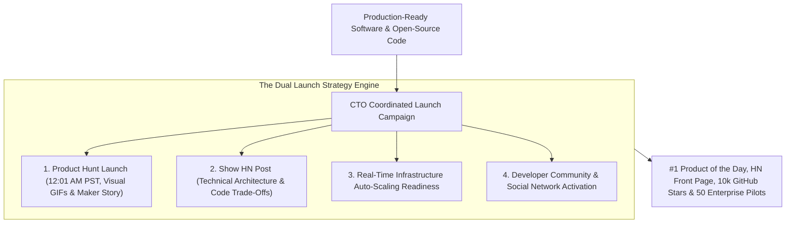
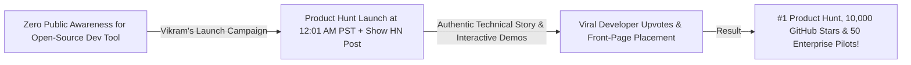

```ppt
# Slide 1: Product Hunt & Hacker News Launch Strategy (Series 6 Capstone)
- **The Executive Capstone Strategy:** Executing high-impact developer and product launch campaigns on Product Hunt and Hacker News (Show HN) to drive explosive early adoption, press coverage, and technical brand momentum.
- **Series 6 Capstone:** Marketing, Developer Relations & Technical Brand Strategy.
- **Author:** Pankaj Kumar | Associate Architect & Tech Leadership
<!-- slide -->
# Slide 2: The Quiet Side-Door Opening vs. Grand Gala Opening Analogy
- **Quiet Lonely Launch (Unplanned Silent Push):** Unlocking the side door of a new restaurant at midnight in a dark alley with no lights or signboards (**Quiet GitHub Release with Zero PR**). Customers walk right past without noticing the restaurant exists!
- **Grand Festival Opening (Synchronized Launch Campaign):** Opening grand golden doors under spotlights, throwing a festive launch parade with live food tastings, press reporters taking photos, and floating upvote balloons (**Product Hunt #1 Product of the Day & Hacker News Front Page**)!
<!-- slide -->
# Slide 3: The 4 Rules of a Top #1 Product Hunt Launch
- **1. Prepare a Hunter & Teaser Page:** Building early subscriber momentum 14 days before launch.
- **2. Launch at 12:01 AM PST:** Maximizing the full 24-hour voting window on Product Hunt.
- **3. High-Quality Visual Assets:** Including short 45-second demo GIFs, crisp screenshots, and maker comment stories.
- **4. Community Activation:** Engaging your existing Discord, email list, and social network on launch day.
<!-- slide -->
# Slide 4: Real-World Case Study: Vikram's #1 Product Hunt & HN Triumph
- **The Challenge:** An open-source developer tool led by Lead Architect **Vikram Patel** had zero public brand awareness.
- **The Launch Strategy:** Vikram executed a coordinated launch campaign: published a "Show HN" post detailing technical architecture trade-offs and launched on Product Hunt at 12:01 AM PST.
- **The Result:** Hit **#1 Product of the Day** on Product Hunt, reached the **Hacker News Front Page (#2 spot)**, gained 10,000 GitHub stars, and signed 50 enterprise pilots!
<!-- slide -->
# Slide 5: The Anatomy of a Winning "Show HN" Post
- **Title Formula:** Keep it simple & technical: *"Show HN: ToolName – An open-source alternative to [X] built with [Tech Stack]"*.
- **First Maker Comment:** Written by the CTO/Architect breaking down why you built it, technical challenges overcome, and architecture trade-offs.
- **Engage Respectfully:** Answering every single technical criticism and question constructively.
<!-- slide -->
# Slide 6: Post-Launch Growth Conversion Loop
- **Day 1 (Launch Day):** Handle high traffic spikes with auto-scaling infrastructure.
- **Day 2–7 (Follow-Up):** Convert launch traffic into permanent Discord members & GitHub stars.
- **Day 14 (Retrospective):** Publish an honest "How We Hit #1 Product Hunt" post-mortem blog.
<!-- slide -->
# Slide 7: Common Misconception
- **Myth:** "Hacker News community tolerates traditional marketing pitch posts."
- **Fact:** Hacker News instantly buries marketing sales pitches — engineers upvote authentic technical depth, open-source benchmarks, and honest architecture trade-offs!
<!-- slide -->
# Slide 8: Summary for Beginners
- Master technical launch campaigns: coordinate Product Hunt & Show HN launches, engage your developer community, share authentic technical maker stories, and convert launch spikes into long-term adoption!
```

# Product Hunt & Hacker News Launch Strategy for Tech Teams

Welcome to the **Series 6 Capstone Guide: Marketing, Developer Relations & Technical Brand Strategy!**

Across the past 10 articles in Series 6, we have explored how Chief Technology Officers (CTOs) demystify developer marketing, build developer relations (DevRel) advocacy teams, align software release cadences with marketing campaigns, write technical content that converts, build defensible engineering blogs, manage public PR during system outages, build authority on LinkedIn, and co-market with cloud hyperscalers (AWS, GCP, Azure).

Now comes the ultimate public milestone for any engineering organization:  
*"How does a CTO launch a new developer tool, open-source project, or SaaS platform on **Product Hunt** and **Hacker News (Show HN)** to achieve explosive global adoption?"*

In the software industry, many engineering teams make a critical mistake on launch day:
- They write great code, silently push a release tag to GitHub at midnight, and expect the world to magically discover their product.
- **Without a synchronized public launch strategy, even brilliant software projects die in obscurity!**

To achieve viral developer adoption, **CTOs execute coordinated launch campaigns on Product Hunt and Hacker News!**

Let's understand Launch Strategy using **The Quiet Side-Door Opening vs. Grand Gala Opening Analogy**!

---

## 🚀 The Quiet Side-Door Opening vs. Grand Gala Opening Analogy


Imagine opening a new flagship restaurant in a major city:



- **The Quiet Lonely Launch (Unplanned Silent Push):**  
  Unlocking the side door of a new restaurant at midnight in a dark alley with no lights or signboards (**Silent GitHub Release with Zero PR**). Customers walk right past without ever realizing the restaurant exists!

- **The Grand Festival Opening (Synchronized Launch Campaign):**  
  Opening grand golden doors under bright spotlights, throwing a festive parade with live food tastings, press reporters taking photos, and floating upvote balloons (**Product Hunt #1 Product of the Day & Hacker News Front Page**)!

---

## 📊 Real-World Case Study: Vikram's #1 Product Hunt & HN Triumph

Consider an open-source developer tool squad where **Vikram Patel** serves as Lead Architect.



1. **The Challenge:** Vikram's engineering squad spent 8 months building a high-performance open-source API gateway. Despite superior benchmarks, the repository had under 50 stars on GitHub.
2. **The Coordinated Launch Campaign:**  
   - Vikram executed a synchronized **Product Hunt + Hacker News Launch Playbook**:
   - **Product Hunt Setup:** Launched at **12:01 AM PST** sharp to capture the full 24-hour voting cycle. Included short 45-second demo GIFs showing 5-minute integration.
   - **Show HN Post:** Submitted an authentic text post titled *"Show HN: FastGateway – An open-source Rust alternative to NGINX built for sub-ms latency"*. Vikram wrote a 400-word maker comment detailing memory allocation trade-offs and benchmark reproduction steps.
   - **Community Engagement:** Personally answered every single technical question on Hacker News and Product Hunt within 15 minutes.
3. **The Result:** The project achieved **#1 Product of the Day on Product Hunt**, reached **#2 on the Hacker News Front Page**, gained **10,000 GitHub stars in 48 hours**, and signed **50 enterprise pilots**!

---

## 📊 Product Hunt Launch vs. Hacker News (Show HN) Launch

| Strategy Dimension | Product Hunt Launch (Visual & Product-Focused) | Hacker News / Show HN (Technical & Code-Focused) |
| :--- | :--- | :--- |
| **Primary Audience** | Product managers, founders, designers, & tech enthusiasts | Software engineers, cloud architects, & system hackers |
| **Content Style** | Visual, crisp screenshots, short demo GIFs, & maker stories | Text-first, deep technical architecture trade-offs, & benchmarks |
| **Optimal Launch Time** | **12:01 AM PST** (To capture full 24-hour leaderboard window) | Tuesday / Wednesday morning (8:00 AM – 10:00 AM EST) |
| **Community Expectations** | Supportive upvotes, product feedback, & feature requests | Brutally honest technical critique, code inspection, & security scrutiny |
| **Key Performance Metric** | Product of the Day badge & user signups | **GitHub Stars, Front-Page Rank Time, & Developer Respect** |

---

## 💡 Summary for Beginners

- **Product Hunt** = A global launch platform where makers showcase new software products and compete for daily community upvotes.
- **Show HN** = A dedicated submission format on Hacker News where software engineers present working products they built to the developer community.
- **Maker Comment** = The introductory comment written by the product creator explaining why they built the software, challenges overcome, and technical architecture.
- **CTO Golden Rule** = **"Don't let great software die in obscurity — execute synchronized Product Hunt and Hacker News launches, share authentic technical maker stories, and turn launch spikes into long-term developer adoption!"**

---

*Written by **Pankaj Kumar** | Associate Architect & Tech Leadership.*
