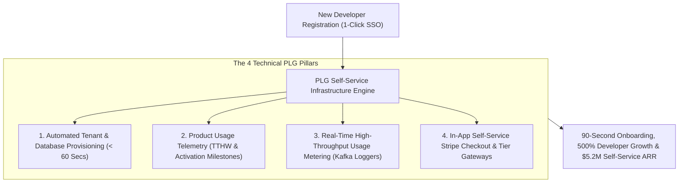
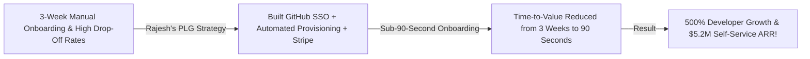

```ppt
# Slide 1: Product-Led Growth (PLG): Technical Requirements
- **The Core Strategy:** Architecting self-service developer onboarding, automated provisioning, friction-free billing, and product usage telemetry to drive exponential enterprise software adoption.
- **Executive Reality:** Product-Led Growth (PLG) is not just a marketing tactic — PLG requires deep system architecture engineering, sub-minute onboarding, and automated usage metering!
- **Author:** Pankaj Kumar | Associate Architect & Tech Leadership
<!-- slide -->
# Slide 2: Slow Waiter Queue vs. Self-Service Gourmet Buffet Analogy
- **Slow Waiter Queue (Legacy Enterprise Sales):** Customers standing in long lines waiting for waiters to bring menus and paper invoices (**Sales-Gated Demos & Manual Setup**). Frustrated users walk away before tasting the food!
- **Self-Service Gourmet Buffet (Product-Led Growth PLG):** Happy developers walking up freely, tasting delicious dishes instantly, serving themselves, and upgrading to VIP tables (**Self-Service API Sandbox & Credit Card Checkout**)!
<!-- slide -->
# Slide 3: The 4 Technical Pillars of a PLG Architecture
- **1. Instant Self-Service Provisioning:** Zero human intervention required to create accounts, generate API keys, & spin up databases.
- **2. Product Usage Telemetry:** Real-time tracking of user activation milestones & Time-to-Hello-World (TTHW < 3 Mins).
- **3. Usage-Based Metering Infrastructure:** Automated tracking of API calls, storage gigabytes, & active compute hours.
- **4. In-App Upgrade Gateways:** Seamless credit card payments & self-service tier upgrades via Stripe APIs.
<!-- slide -->
# Slide 4: Real-World Case Study: Rajesh's PLG Architecture Overhaul
- **The Challenge:** A developer database platform led by Lead Architect **Rajesh Sharma** had a 3-week sales-assisted onboarding process, resulting in high customer drop-offs.
- **The PLG Technical Overhaul:** Rajesh re-architected the platform: built 1-click GitHub SSO registration, automated Kubernetes tenant isolation, and implemented self-service Stripe billing.
- **The Result:** Cut onboarding time from 3 weeks to 90 seconds, grew monthly active developers by 500%, and expanded self-service ARR to $5.2M!
<!-- slide -->
# Slide 5: The PLG Technical Stack
- **Auth & Identity:** OAuth2, SAML, & 1-click GitHub/Google SSO.
- **Metering Engine:** High-throughput Kafka telemetry collectors logging billable usage events.
- **Self-Service Billing:** Stripe Billing & Chargebee automated billing webhooks.
<!-- slide -->
# Slide 6: Time-to-Value (TTV) Optimization Rule
- **The 3-Minute Rule:** A new developer MUST experience their first "Aha!" value moment within 3 minutes of signing up!
- **Zero Credit Card Upfront:** Offer a generous free tier or sandbox trial without requiring upfront credit card entry.
<!-- slide -->
# Slide 7: Common Misconception
- **Myth:** "Product-Led Growth means you don't need a commercial sales team."
- **Fact:** PLG feeds sales! Developers adopt the product via self-service, creating qualified product usage data that sales teams use to close large enterprise contracts!
<!-- slide -->
# Slide 8: Summary for Beginners
- Master PLG technical architecture: build self-service onboarding, minimize Time-to-Value to under 3 minutes, log real-time usage telemetry, and convert free self-service users into enterprise cloud accounts!
```

# Product-Led Growth (PLG): Technical Requirements for PLG

Welcome to **Post 100 — The Century Milestone of Technical Leadership!** 💯

In modern software engineering, **The Product is the Primary Sales Representative.**

Traditionally, enterprise software companies relied on heavy outbound sales models:
- **The Legacy Sales Trap:** A customer must fill out a contact form, schedule a sales demo, negotiate pricing with an Account Executive, and wait 3 weeks for an IT administrator to provision their account (**Sales-Gated Software**).
- **The PLG Revolution:** A developer visits your website at midnight, signs up with 1-click GitHub SSO, receives an API key instantly, and completes their first successful integration in 3 minutes (**Product-Led Growth**)!

**Product-Led Growth (PLG) is an Architectural Engineering Discipline, not just a marketing funnel.**

How do CTOs design, architect, and build the underlying technical infrastructure required to support seamless self-service Product-Led Growth?

Let's understand PLG Technical Requirements using **The Slow Waiter Queue vs. Self-Service Gourmet Buffet Analogy**!

---

## 🍽️ The Slow Waiter Queue vs. Self-Service Gourmet Buffet Analogy


Imagine dining at a premier culinary venue:



- **Slow Waiter Queue (Legacy Enterprise Sales):**  
  Customers standing in long, tiring lines waiting for waiters to bring printed menus and paper invoices (**Sales-Gated Demos & Manual Provisioning**). Frustrated users walk away before ever tasting the food!

- **Self-Service Gourmet Buffet (Product-Led Growth PLG):**  
  Happy developers walking up freely, tasting delicious dishes instantly, serving themselves, and upgrading to VIP tables (**Self-Service API Sandbox & Credit Card Checkout**)!

---

## 📊 Real-World Case Study: Rajesh's PLG Architecture Overhaul

Consider a cloud developer database platform where **Rajesh Sharma** serves as Lead Architect.



1. **The Challenge:** Rajesh's database startup had a manual onboarding process. Every new customer account required manual intervention by a DevOps engineer to provision database clusters, taking 3 weeks per customer.
2. **The PLG Technical Overhaul:**  
   - Rajesh led a complete **Self-Service Architecture Re-engineering**:
   - **1-Click Authentication:** Integrated GitHub and Google OAuth2 for instant registration.
   - **Automated Provisioning:** Built a Kubernetes operator that provisions isolated multi-tenant database namespaces in **45 seconds**.
   - **Real-Time Metering & Billing:** Implemented Kafka event loggers that calculate API query volume and automatically trigger Stripe usage billing webhooks.
3. **The Result:** Onboarding time dropped from **3 weeks to 90 seconds**, monthly active developers grew by **500%**, and self-service recurring revenue scaled to **$5.2 Million ARR**!

---

## 📊 Traditional Sales-Led Software vs. Product-Led Growth (PLG)

| Architecture Dimension | Traditional Sales-Led Software (Legacy) | Product-Led Growth PLG (Modern) |
| :--- | :--- | :--- |
| **Account Onboarding** | Manual provisioning by IT ops taking 1–3 weeks | **Fully automated 1-click self-service (< 90 Seconds)** |
| **Time-to-Value (TTV)** | Weeks of training & onboarding sessions required | **< 3 minutes to first successful API response** |
| **Authentication** | Custom enterprise password forms & manual approvals | 1-click GitHub, Google, & Okta Single Sign-On |
| **Usage Tracking** | Manual monthly audit spreadsheets | Automated real-time telemetry event logging |
| **Monetization Engine** | Negotiated annual upfront invoices | Self-service credit card billing & usage-based pricing |

---

## 💡 Summary for Beginners

- **Product-Led Growth (PLG)** = A business model where product usage and self-service onboarding drive user acquisition, retention, and expansion.
- **Time-to-Value (TTV)** = The duration between a user signing up and experiencing the core value of the product for the first time.
- **Usage-Based Pricing** = Monetizing software based on actual resource consumption (e.g. API requests, gigabytes stored, or active compute hours).
- **CTO Golden Rule** = **"Architect software for instant self-service — automate tenant provisioning, cut Time-to-Value to under 3 minutes, and let product quality drive enterprise expansion!"**

---

*Written by **Pankaj Kumar** | Associate Architect & Tech Leadership.*
