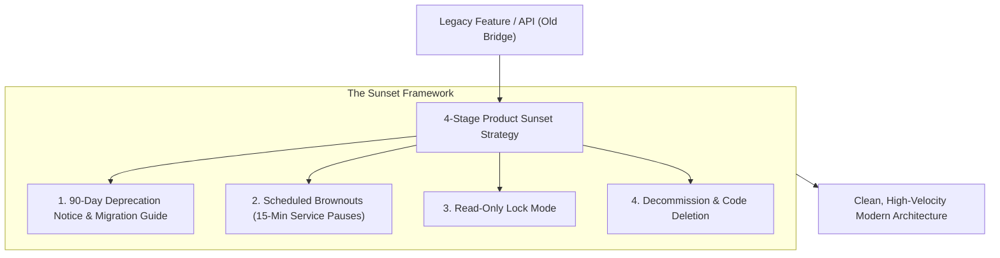

```ppt
# Slide 1: Product Sunset Strategy
- **The Core Practice:** Safely decommissioning and retiring legacy software features, APIs, and microservices without breaking customer operations.
- **Executive Rule:** A healthy codebase requires retiring old code just as much as building new features!
- **Author:** Pankaj Kumar | Associate Architect & Tech Leadership
<!-- slide -->
# Slide 2: Decommissioning the Old Bridge Analogy
- **Reckless City Council:** Blows up an old 50-year-old river bridge with dynamite while 500 commuters are still driving across it!
- **Master Civil Engineer (Product Sunset CTO):** Builds a modern 6-lane bridge alongside the old one (*Migration Path*), puts up clear highway detour signs 6 months in advance (*Deprecation Notices*), and dismantles the old bridge safely section-by-section (*Code Sunset*)!
<!-- slide -->
# Slide 3: Why Software Features Must Be Retired
- **1. Technical Debt Burden:** Maintaining legacy code consumes 30% of engineering bandwidth.
- **2. Security Vulnerabilities:** Unmaintained legacy APIs are prime targets for cyberattacks.
- **3. System Complexity:** Legacy database tables complicate new schema migrations.
<!-- slide -->
# Slide 4: The 4-Stage Product Sunset Framework
- **Stage 1 (Announcement):** Publish formal Deprecation Notice 90 days in advance with migration guides.
- **Stage 2 (Brownouts):** Introduce intentional short 15-minute API service pauses to alert lingering users.
- **Stage 3 (Read-Only Mode):** Disable write operations to lock state.
- **Stage 4 (Decommission):** Delete code repository, database tables, and cloud resources.
<!-- slide -->
# Slide 5: Managing Customer Pushback
- **Enterprise SLA Protections:** Giving enterprise clients extended migration windows (180 days).
- **Automated Migration Scripts:** Providing SDK migration helpers to reduce customer developer effort.
<!-- slide -->
# Slide 6: The Financial Benefit of Sunsetting
- **Cloud Savings:** Terminating idle AWS servers and legacy database instances.
- **Developer Velocity:** Deleting 50,000 lines of dead code increases test suite execution speed.
<!-- slide -->
# Slide 7: Common Misconception
- **Myth:** "Retiring features angers customers and should be avoided at all costs."
- **Fact:** Sunsetting legacy code allows your team to focus 100% on making core features faster, safer, and better!
<!-- slide -->
# Slide 8: Summary for Beginners
- Retire legacy software safely: build migration paths, send advance deprecation notices, run brownouts, and delete dead code!
```

# Product Sunset Strategy: Safely Retiring Old Software Features

In software engineering, adding new features is easy. **Safely retiring old, legacy features is hard!**

As companies grow, codebases accumulate outdated API endpoints, legacy UI dashboards, and obsolete database tables built 5 years ago.

If a CTO never retires legacy code:
- Engineering velocity slows to a crawl because developers must maintain backward compatibility for 10 different versions.
- Cloud costs balloon from running idle legacy servers.
- Security risks skyrocket because unmaintained legacy APIs become prime entry points for hackers.

How does a technology leader execute a **Product Sunset Strategy** without alienating customers?

Let's understand Product Sunsetting using **The Old Bridge Decommissioning Analogy**!

---

## 🌉 The Old Bridge Decommissioning Analogy

Imagine replacing a aging river bridge:



- **The Reckless City Council:**  
  Blows up an old 50-year-old steel bridge with dynamite at 8:00 AM on a Monday while hundreds of commuters are still driving across it. Traffic halts in chaos!

- **The Master Civil Engineer (Product Sunset CTO):**  
  1. Builds a modern 6-lane bridge right alongside the old one (**Migration Path**).  
  2. Posts clear highway detour signs 6 months in advance (**Deprecation Notices**).  
  3. Diverts traffic smoothly to the new bridge, then safely dismantles the old structure beam-by-beam (**Code Decommissioning**)!

---

## 📊 The 4-Stage Product Sunset Timeline

| Stage | Timeline | Technical Action | Customer Impact |
| :--- | :--- | :--- | :--- |
| **1. Deprecation Notice** | T-minus 90 Days | Mark API endpoints as `[Deprecated]` in OpenAPI spec & send email notifications | Customers receive migration documentation and new API keys |
| **2. Brownout Testing** | T-minus 30 Days | Intentionally pause legacy API for 15 minutes during non-peak hours | Alerts lingering customers who ignored email notices |
| **3. Read-Only Mode** | T-minus 7 Days | Disable database writes; return HTTP 410 Gone for creation requests | Final transition window for remaining automated scripts |
| **4. Decommissioning** | Day 0 | Delete code repository, teardown cloud servers, drop legacy database tables | Zero active users remaining; cloud savings realized |

---

## 💡 Summary for Beginners

- **Product Sunset** = The planned decommissioning and deletion of legacy software features, APIs, or infrastructure.
- **Brownouts** = Brief, planned service pauses designed to identify active users who missed deprecation notices.
- **CTO Golden Rule** = **"Build new bridges before destroying old ones — give customers clear migration paths, run brownouts, and delete dead code!"**

---

*Written by **Pankaj Kumar** | Associate Architect & Tech Leadership.*
