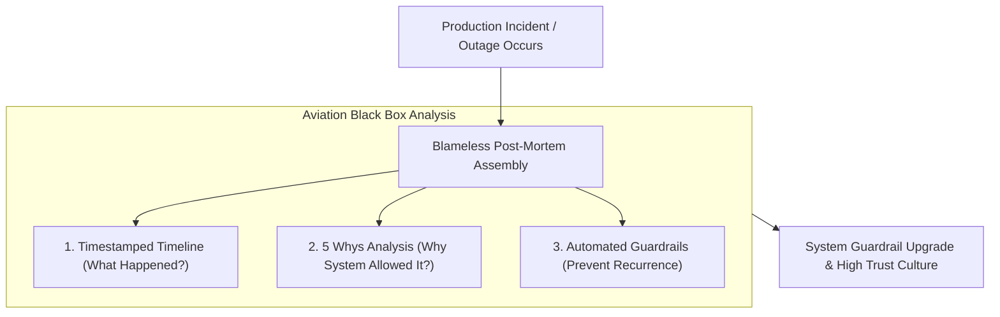

```ppt
# Slide 1: Psychological Safety & Blameless Post-Mortems
- **The Core Discipline:** Cultivating a culture of psychological safety where developers report production incidents transparently without fear of blame.
- **Golden Rule:** Focus on fixing broken systems and processes, not blaming human engineers!
- **Author:** Pankaj Kumar | Associate Architect & Tech Leadership
<!-- slide -->
# Slide 2: The Aviation Black Box Audit Analogy
- **Punitive Aviation (Broken Culture):** When an aircraft experiences an engine glitch, the airline immediately fires the pilot, blames human error, and buries the report. The same engine glitch causes another crash 6 months later!
- **Master Aviation Industry (Blameless Post-Mortem):** Investigators extract the flight black box recorder, analyze sensor telemetry, identify a faulty fuel valve design (*System Flaw*), and upgrade every aircraft fleet-wide so the error can NEVER happen again!
<!-- slide -->
# Slide 3: What is Psychological Safety in Tech?
- **Definition:** The shared belief that team members can take risks, report mistakes, and propose wild ideas without fear of embarrassment or punishment.
- **Key Metric:** High psychological safety directly correlates with DORA engineering velocity and low turnover rates.
<!-- slide -->
# Slide 4: The 4 Steps of a Blameless Post-Mortem
- **Step 1 (Incident Timeline):** Reconstructing exact timestamped events without subjective blame.
- **Step 2 (Root Cause Analysis - 5 Whys):** Digging past human error to uncover underlying system flaws.
- **Step 3 (Action Items):** Assigning engineering owners to implement automated safeguards.
- **Step 4 (Knowledge Sharing):** Publishing post-mortem reports publicly across the organization.
<!-- slide -->
# Slide 5: Human Error vs System Vulnerability
- **Human Mistake:** A developer ran a `DROP TABLE` command on the wrong terminal.
- **System Vulnerability:** Why did a production database allow raw unauthenticated write access from a local terminal script without confirmation prompts?
<!-- slide -->
# Slide 6: Leading by Example as CTO
- **Share Personal Mistakes:** CTOs openly discussing their own past technical blunders to normalize vulnerability.
- **Reward Incident Reporting:** Thanking developers who catch and report critical bugs in production early.
<!-- slide -->
# Slide 7: Common Misconception
- **Myth:** "Blameless culture means zero accountability for software quality."
- **Fact:** Blameless culture increases accountability by focusing 100% of effort on building bulletproof automated system safeguards!
<!-- slide -->
# Slide 8: Summary for Beginners
- Treat production outages as learning opportunities: conduct blameless post-mortems, fix root system flaws, and foster psychological safety!
```

# Psychological Safety in Tech Teams: Blameless Post-Mortems

What happens in your engineering organization when a developer accidentally drops a production database table, or deploys a code change that causes a 45-minute customer outage?

In low-trust, punitive engineering cultures, managers hunt for a scapegoat:
- Who broke the build?
- Which engineer made this stupid mistake?
- Who can we punish or publicly humiliate in Slack?

The result of this blame culture is catastrophic: **Developers stop taking risks, hide production bugs, delay deployments, and code in constant fear.**

In high-performing technology organizations, CTOs build **Psychological Safety through Blameless Post-Mortems!**

Let's understand Psychological Safety using **The Aviation Black Box Audit Analogy**!

---

## ✈️ The Aviation Black Box Audit Analogy

Imagine investigating an in-flight commercial aircraft malfunction:



- **The Punitive Airline (Blame Culture):**  
  The moment an engine sensor glitches, the executive committee fires the pilot, blames "human error", and sweeps the incident under the rug. Six months later, the exact same faulty sensor causes another plane to crash because the root system flaw was never fixed!

- **The Master Aviation Authority (Blameless Post-Mortem Leader):**  
  Inspectors retrieve the flight black box recorder, analyze sensor telemetry, identify a faulty fuel valve design (**System Vulnerability**), and mandate an immediate hardware upgrade across the entire global fleet! *The pilot is praised for reporting the glitch safely.*

---

## 📊 Blame Culture vs. Blameless Engineering Culture

| Dimension | Punitive Blame Culture (Avoid) | Blameless Engineering Culture (Adopt) |
| :--- | :--- | :--- |
| **Outage Reaction** | *"Who wrote this broken code?"* | *"What system guardrail was missing that allowed this code to reach production?"* |
| **Developer Behavior** | Hides mistakes, delays deployments, avoids risk | Reports incidents immediately, deploys fast with confidence |
| **Post-Mortem Focus** | Assigning individual personal blame | Conducting 5 Whys to fix automated CI/CD & database safeguards |
| **Long-Term Outcome** | High turnover, low velocity, repeated outages | High trust, rapid DORA velocity, bulletproof system resilience |

---

## 💡 Summary for Beginners

- **Psychological Safety** = A culture where team members feel safe to take technical risks, report bugs, and admit mistakes without fear of punishment.
- **Blameless Post-Mortem** = An outage investigation that focuses 100% on fixing root system vulnerabilities rather than blaming individual humans.
- **CTO Golden Rule** = **"Never blame human engineers for software outages — upgrade your automated testing and system guardrails so the error can never happen again!"**

---

*Written by **Pankaj Kumar** | Associate Architect & Tech Leadership.*
