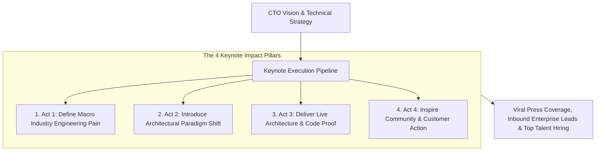
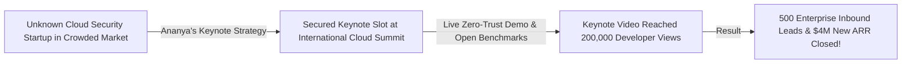

```ppt
# Slide 1: Public Speaking & Tech Keynotes: Executive Leadership
- **The Core Strategy:** Representing your engineering organization on global keynote stages to inspire customer trust, attract senior talent, and position your company as an industry visionary.
- **Executive Reality:** When a CTO steps onto a keynote stage, they are not just presenting slides — they are projecting the technical authority and reliability of the entire company!
- **Author:** Pankaj Kumar | Associate Architect & Tech Leadership
<!-- slide -->
# Slide 2: The Boring Podium Reader vs. Inspiring Keynote Leader Analogy
- **Anxious Podium Reader (Weak Corporate Presence):** Clinging nervously to a wooden podium, reading 50 bullet points off printed notes in a monotone voice while the audience falls asleep (**Boring Corporate Presentations**). The company loses credibility!
- **Inspiring Keynote Leader (Authoritative Brand Catalyst):** Walking confidently across an open keynote stage, delivering a compelling story of technical innovation backed by live architecture demos (**Executive Thought Leadership**)! Developers cheer, press reporters tweet quotes, and enterprise buyers sign contracts!
<!-- slide -->
# Slide 3: The 4 Objectives of Executive Tech Keynotes
- **1. Technical Brand Authority:** Positioning your company as the undisputed leader in cloud architecture.
- **2. Executive Talent Recruitment:** Inspiring Principal Engineers & VP candidates in the audience.
- **3. Media & Analyst Coverage:** Generating organic tech press coverage without paying PR agencies.
- **4. Customer Executive Trust:** Reassuring enterprise buyers that your platform is built on world-class engineering.
<!-- slide -->
# Slide 4: Real-World Case Study: Ananya's Global Keynote Impact
- **The Challenge:** A cloud security startup led by VP **Ananya Verma** was unknown in a crowded market dominated by legacy vendors.
- **The Keynote Strategy:** Ananya secured a keynote slot at an international cloud summit, breaking down a live zero-trust architecture demo and sharing open benchmark data.
- **The Result:** The keynote video went viral with 200,000 views, generated 500 enterprise inbound leads, and closed $4M in new ARR!
<!-- slide -->
# Slide 5: The Anatomy of a Winning Tech Keynote
- **Act 1: The Macro Industry Problem:** Defining a massive technical challenge facing engineers today.
- **Act 2: The Paradigm Shift:** Introducing the new architectural philosophy required to solve it.
- **Act 3: The Live Technical Proof:** Demonstrating live working code, benchmarks, or system architecture.
- **Act 4: The Visionary Call to Action:** Inviting developers and customers to join the open movement.
<!-- slide -->
# Slide 6: Keynote Preparation Rule
- **The 10:1 Rehearsal Rule:** Spend 10 hours rehearsing and refining story flow for every 1 hour of keynote stage time.
- **Ditch Wall-of-Text Slides:** Use high-contrast visual diagrams and single bold statements on slides.
<!-- slide -->
# Slide 7: Common Misconception
- **Myth:** "Public speaking is only for charismatic salespeople, not technical architects."
- **Fact:** Technical audiences value authentic engineering insight over sales charisma — developers trust CTOs who explain real system trade-offs!
<!-- slide -->
# Slide 8: Summary for Beginners
- Master executive public speaking: tell compelling technical stories, ditch wall-of-text slides, deliver live architecture proof, and inspire trust across customers, developers, and investors!
```

# Public Speaking & Tech Keynotes: Representing Your Company

In the modern technology industry, **A CTO is the Chief Evangelist of the Engineering Organization.**

When executive technology leaders step onto global conference stages (such as AWS re:Invent, Google I/O, or KubeCon), they carry immense strategic responsibility:
- If a speaker reads dry bullet points from a paper notes binder behind a wooden podium, the audience tunes out and assumes the company is stagnant.
- If a CTO delivers an inspiring, story-driven keynote backed by live architecture demos and real-world trade-offs, the presentation captures media headlines, attracts top-tier engineering talent, and reassures enterprise buyers!

**Public speaking and tech keynotes are high-leverage multipliers for your company's technical brand.**

How do technology executives master public speaking, craft high-impact keynotes, and represent their companies with authority?

Let's understand Executive Keynotes using **The Boring Podium Reader vs. Inspiring Keynote Leader Analogy**!

---

## 🎤 The Boring Podium Reader vs. Inspiring Keynote Leader Analogy


Imagine addressing 5,000 technology leaders at a global industry summit:



- **The Anxious Podium Reader (Weak Corporate Presence):**  
  Clinging nervously to a wooden podium, reading 50 text-heavy bullet points off printed notes in a monotone voice while the audience falls asleep (**Boring Corporate Presentations**). The company loses credibility and wastes a prime spotlight.

- **The Inspiring Keynote Leader (Authoritative Brand Catalyst):**  
  Walking confidently across an open keynote stage, delivering a compelling story of technical innovation backed by live architecture demos (**Executive Thought Leadership**)! Developers cheer, press reporters tweet quotes, and enterprise buyers sign contracts.

---

## 📊 Real-World Case Study: Ananya's Global Keynote Impact

Consider a cloud security startup where **Ananya Verma** serves as Technology VP.



1. **The Challenge:** Ananya's cloud security startup was competing against legacy multi-billion-dollar vendors. Enterprise buyers were hesitant to trust an unknown startup with their mission-critical infrastructure.
2. **The Keynote Strategy:**  
   - Ananya secured a main-stage keynote slot at an international cloud architecture summit:
   - **Story-Driven Opening:** Started by dissecting a famous recent industry data breach, explaining the exact architectural flaw that caused it.
   - **Live Architecture Demo:** Discarded slide bullet points and ran a live 3-minute terminal demo demonstrating zero-trust microsegmentation in action.
   - **Open Transparency:** Shared benchmark datasets and opened the underlying SDK on GitHub during the presentation.
3. **The Result:** The recording went viral with **200,000 views**, generated **500 enterprise inbound inquiries**, and directly closed **$4 Million in new annual recurring revenue (ARR)**!

---

## 📊 Boring Corporate Speeches vs. High-Impact Tech Keynotes

| Dimension | Boring Corporate Speech (Avoid) | High-Impact Tech Keynote (Adopt) |
| :--- | :--- | :--- |
| **Stage Presence** | Static behind podium reading printed notes | Mobile on open stage, engaging audience directly |
| **Slide Design** | 50 slides crammed with tiny bullet points & logos | Clean visual schematics, diagrams, & single bold phrases |
| **Presentation Focus** | Self-congratulatory corporate product promotion | Educational storytelling solving macro industry problems |
| **Technical Content** | High-level marketing buzzwords with zero code | Live technical architecture demos & benchmark proof |
| **Target Outcome** | Polite applause and empty room | Viral media coverage, developer trust, & enterprise deals |

---

## 💡 Summary for Beginners

- **Executive Thought Leadership** = Establishing a company leader as a trusted, authoritative voice in their industry through public speaking, articles, and keynotes.
- **The 10:1 Rehearsal Rule** = Spending 10 hours rehearsing and refining presentation delivery for every 1 hour of actual stage time.
- **Live Technical Proof** = Demonstrating working software, live system code, or real-time architecture diagrams during a presentation to build absolute credibility.
- **CTO Golden Rule** = **"Step onto the stage as an authentic technical leader — tell compelling engineering stories, ditch wall-of-text slides, deliver live proof, and inspire trust!"**

---

*Written by **Pankaj Kumar** | Associate Architect & Tech Leadership.*
