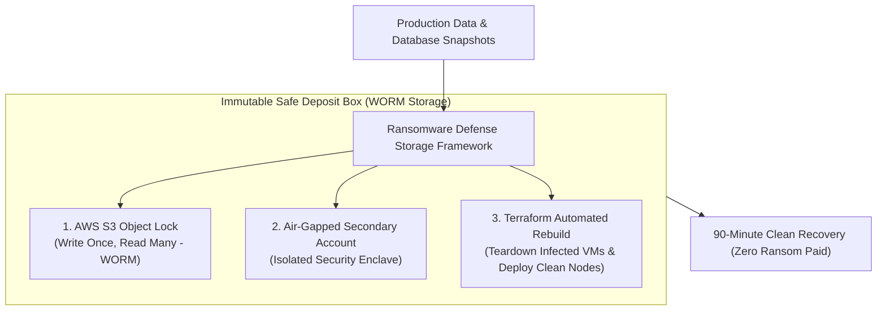
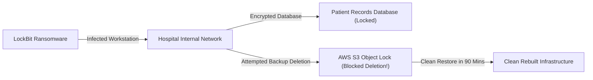

```ppt
# Slide 1: Ransomware Defense & Immutable Backups
- **The Core Survival Strategy:** Protecting enterprise data against extortion attacks using WORM (Write Once, Read Many) storage and incident playbooks.
- **Executive Motto:** Never pay a extortion ransom — restore clean systems from immutable backups in under 2 hours!
- **Author:** Pankaj Kumar | Associate Architect & Tech Leadership
<!-- slide -->
# Slide 2: The Bank Safe Deposit Box Duplicate Analogy


- **Careless Homeowner (Paying Ransom):** Keeps only one set of house keys. A burglar steals the keys, locks the owner out, and demands $50,000 to return them. The homeowner pays, but the burglar makes a copy of the key anyway!
- **Master Security Warden (CTO Immutable Strategy):** Keeps an encrypted duplicate set of keys locked inside a bank safe deposit box (*Immutable WORM Storage*). When a burglar locks the front door, the homeowner retrieves the safe deposit key, unlocks the door in 10 minutes, and ignores the extortionist!
<!-- slide -->
# Slide 3: What Makes Modern Ransomware Deadly?
- **1. Double Extortion:** Attackers encrypt production databases AND steal sensitive customer data to threaten public leaks.
- **2. Backup Destruction:** Modern malware actively hunts and deletes online database backups before encrypting primary servers.
- **3. Air-Gapped Need:** Traditional connected backups get encrypted alongside live production systems.
<!-- slide -->
# Slide 4: Real-World Case Study: Ananya's Healthcare Network Attack
- **The Incident:** A regional hospital network led by IT VP **Ananya Verma** was hit by LockBit ransomware.
- **The Ransom Demand:** Extortionists demanded $3 Million in Bitcoin to unlock patient medical records.
- **The Recovery:** Ananya's team activated AWS Object Lock (Immutable WORM S3 backups). They wiped infected servers and restored 100% clean data in 90 minutes without paying a single dollar!
<!-- slide -->
# Slide 5: The 4 Pillars of Ransomware Defense
- **1. Immutable Storage (WORM):** AWS S3 Object Lock in Compliance Mode (cannot be deleted or overwritten by anyone, including root admins).
- **2. Air-Gapped Network Isolation:** Storing secondary backups in an isolated secondary AWS account.
- **3. Automated System Wiping:** Infrastructure-as-Code (Terraform) to rebuild clean server clusters automatically.
- **4. Quarterly Tabletop Exercises:** Simulating ransomware attacks with executive C-suite teams.
<!-- slide -->
# Slide 6: The Ransomware Incident Response Playbook
- **Step 1 (Isolate):** Disconnect infected network subnets instantly (< 5 mins).
- **Step 2 (Assess):** Identify ransomware strain and entry point.
- **Step 3 (Rebuild):** Teardown infected virtual machines; deploy clean Terraform clusters.
- **Step 4 (Restore & Verify):** Restore data from immutable WORM snapshots and audit clean state.
<!-- slide -->
# Slide 7: Common Misconception
- **Myth:** "Paying the cyber ransom is the fastest way to get company operations back online."
- **Fact:** Research shows 42% of companies that pay ransomware never recover all their data, and 80% get attacked again!
<!-- slide -->
# Slide 8: Summary for Beginners
- Build immutable ransomware defenses: enforce AWS S3 Object Lock, air-gap backup accounts, run recovery drills, and never pay ransoms!
```

# Ransomware Defense: Immutable Backups & Recovery Playbooks

Among all cybersecurity threats facing modern businesses, **Ransomware is the most destructive.**

Ransomware is a malicious software attack that encrypts an entire company's databases, file servers, and cloud infrastructure. The cyber criminals then demand millions of dollars in Bitcoin to provide the decryption key.

Worst of all, modern ransomware attackers use **Double Extortion**:
1. They encrypt your live production servers so operations halt completely.
2. They actively hunt down and delete your online database backups!

If a company has no un-corrupted backups, executives face a terrible choice: **Pay millions to criminal extortionists or face complete business bankruptcy.**

How does a Chief Technology Officer build an impenetrable **Ransomware Defense System**?

Let's understand Ransomware Defense using **The Bank Safe Deposit Box Analogy**!

---

## 🔐 The Bank Safe Deposit Box Analogy

Imagine protecting the keys to your home:



- **The Careless Homeowner (Paying Ransom):**  
  Keeps only one set of house keys on their kitchen counter. A burglar sneaks in, locks the front door from the inside, and demands $50,000 in cash to hand back the keys. The desperate homeowner pays, but the burglar keeps a duplicate copy anyway!

- **The Master Security Warden (CTO Immutable Strategy):**  
  Locks an encrypted duplicate set of keys inside a bank safe deposit box (**AWS S3 Object Lock WORM Storage**). When a burglar locks the front door, the homeowner retrieves the duplicate key from the bank, unlocks the door in 10 minutes, and ignores the extortionist completely!

---

## 📊 Real-World Case Study: Ananya's Healthcare Network Attack

Consider a regional healthcare hospital network managed by Vice President of Technology **Ananya Verma**.



1. **The Attack:** In 2024, a sophisticated ransomware group infected a hospital workstation via a malicious email attachment and encrypted patient medical databases across 12 clinics.
2. **The Extortion Demand:** The cyber criminals demanded $3 Million in Bitcoin within 24 hours to decrypt the patient files.
3. **The Recovery Execution:**  
   - Ananya's engineering team had configured **AWS S3 Object Lock in Compliance Mode** — a write-once, read-many (WORM) storage policy that prevents ANY user (including AWS root administrators) from modifying or deleting backups for 90 days.
   - The ransomware attempted to delete the S3 backups, but AWS automatically rejected the deletion commands.
   - Ananya's team isolated the infected network subnets, wiped the infected virtual machines, ran automated **Terraform deployment scripts**, and restored 100% clean patient data in **90 minutes** without paying a single dollar to the hackers!

---

## 📊 Traditional Backups vs. Immutable WORM Defense

| Feature Dimension | Traditional Online Backups (Vulnerable) | Immutable WORM Defense (Resilient) |
| :--- | :--- | :--- |
| **Storage Technology** | Standard cloud storage / connected NAS drives | AWS S3 Object Lock / Immutable WORM Storage |
| **Deletion Protection** | Can be deleted by compromised admin credentials | Cannot be deleted or altered by ANY user, including root |
| **Network Architecture** | Connected to main production AWS account | Air-gapped in an isolated secondary AWS security account |
| **Ransomware Vulnerability**| High Risk (Malware encrypts backups alongside live data) | Zero Risk (Write Once, Read Many policy enforces lock) |
| **Recovery SLA** | Days or weeks (or forced to pay extortion ransom) | Verified < 2 hours clean automated restoration |

---

## 💡 Summary for Beginners

- **Immutable Backup** = Data stored using Write Once, Read Many (WORM) technology that cannot be altered, overwritten, or deleted by anyone during a set retention period.
- **Air-Gapped Storage** = Storing secondary data backups in an isolated network environment completely disconnected from production networks.
- **CTO Golden Rule** = **"Never pay extortion ransoms — enforce immutable WORM backups on AWS S3 and test 2-hour clean recovery playbooks quarterly!"**

---

*Written by **Pankaj Kumar** | Associate Architect & Tech Leadership.*
