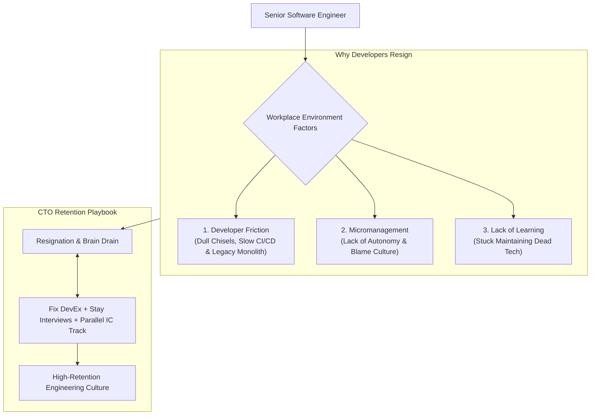

```ppt
# Slide 1: Reducing Developer Attrition
- **The Core Executive Challenge:** Why top software engineers resign, and how CTOs can build high-retention engineering organizations.
- **Key Insight:** Developers don't leave companies over salary alone — they leave rusty tools, toxic management, and slow deployment friction!
- **Author:** Pankaj Kumar | Associate Architect & Tech Leadership
<!-- slide -->
# Slide 2: The Master Craftsman & Dull Chisels Analogy
- **Frustrated Sculptor:** A master marble sculptor is given dull, rusty chisels and forced to fill out 10 permission forms every time they want to carve a block of stone. Frustrated by poor tools and bureaucracy, they pack up their tools and leave for a studio that values their craft!
- **CTO Parallel:** Elite developers quit when they spend 50% of their day fighting broken CI/CD pipelines, slow local builds, and micromanaging managers!
<!-- slide -->
# Slide 3: The 4 Main Reasons Great Engineers Quit
- **1. Developer Friction (Poor DevEx):** Slow builds, painful code reviews, and brittle legacy codebases.
- **2. Lack of Technical Growth:** Stuck maintaining dead legacy technologies without learning opportunities.
- **3. Bad Management & Micromanagement:** Lack of autonomy, missing 1-on-1s, and punitive blame culture.
- **4. Uncompetitive Compensation & Recognition:** Below-market pay and lack of career advancement.
<!-- slide -->
# Slide 4: The True Cost of Engineer Attrition
- **Financial Replacement Cost:** Replacing a Senior Engineer costs $50,000+ in recruiting fees, onboarding time, and lost velocity.
- **Brain Drain:** Loss of historical system context and domain knowledge.
- **Team Morale:** Resignations trigger domino effects across remaining squad members.
<!-- slide -->
# Slide 5: The Retention Playbook for CTOs
- **1. Invest in DevEx:** Upgrade developer laptops, speed up CI/CD builds (< 5 mins), and automate local setup.
- **2. Clear Career Paths:** Transparent parallel IC and Management career ladders.
- **3. Quarterly Stay Interviews:** Asking engineers *"What is annoying you most in our codebase right now?"* before they resign!
- **4. Competitive Market Adjustments:** Annual compensation benchmarking.
<!-- slide -->
# Slide 6: Conducting Effective Stay Interviews
- **Proactive Retention:** Meeting high-performing engineers 1-on-1 before they update their LinkedIn profiles.
- **Actionable Follow-up:** Fixing reported engineering bottlenecks within 30 days to build executive trust.
<!-- slide -->
# Slide 7: Common Misconception
- **Myth:** "Developers only quit for a 20% higher salary offer from a big tech company."
- **Fact:** Salary is often just the final excuse — friction, poor culture, and lack of growth drive them away first!
<!-- slide -->
# Slide 8: Summary for Beginners
- Remove developer friction, provide clear career progression, conduct stay interviews, and empower your engineering team!
```

# Reducing Developer Attrition: Why Great Engineers Quit

In technology leadership, **losing a senior software engineer or principal architect is one of the most expensive setbacks a company can face.**

When a key developer submits their 2-week resignation letter:
- You lose years of deep historical domain knowledge and system context.
- Your hiring team spends $50,000+ in recruiter fees and interview hours to find a replacement.
- The remaining engineering team gets overloaded with extra work, triggering a dangerous domino effect of secondary resignations.

Most CEOs assume developers quit purely for a higher salary offer. However, CTO exit interview data tells a completely different story!

Let's understand Developer Attrition using **The Master Craftsman & Dull Chisels Analogy**!

---

## 🎨 The Master Craftsman & Dull Chisels Analogy

Imagine a world-class marble sculptor working in a stone carving studio:



- **The Frustrated Sculptor:**  
  A master sculptor arrives eager to carve masterpieces. However, the studio manager hands them dull, rusted chisels and requires them to fill out 5 approval forms before carving a single line. After months of frustration, the sculptor packs up their tools and leaves for a studio that respects their craft!

- **The Empathetic Studio Manager (The High-Retention CTO):**  
  Provides razor-sharp tools (*Fast M3 Laptops & Automated CI/CD*), removes administrative bureaucracy, gives the sculptor creative freedom (*Autonomy*), and checks in regularly to ask: *"What tools do you need to create your best work?"*

---

## 📊 High-Attrition Environment vs. High-Retention CTO Culture

| Workplace Dimension | High-Attrition Environment (Avoid) | High-Retention CTO Culture (Adopt) |
| :--- | :--- | :--- |
| **Developer Tooling** | Slow build pipelines (> 45 mins), old laptops | Modern laptops, CI/CD pipeline < 5 mins, automated dev env |
| **Career Growth** | Management is the only path to higher pay | Parallel IC Track (Staff/Principal) equal in pay to Management |
| **Executive Feedback** | Exit interviews conducted after candidate resigns | Proactive quarterly "Stay Interviews" to fix developer pain early |
| **Autonomy** | Micromanaging managers & rigid top-down mandates | Autonomous stream-aligned squads empowered to make tech choices |

---

## 💡 Summary for Beginners

- **Developer Attrition** = The rate at which software engineers leave an organization.
- **Stay Interviews** = Proactive 1-on-1 conversations asking engineers what frustrates them in the codebase *before* they decide to resign.
- **CTO Golden Rule** = **"Engineers don't leave great codebases and supportive cultures — remove developer friction and provide clear career growth to keep your best talent!"**

---

*Written by **Pankaj Kumar** | Associate Architect & Tech Leadership.*
