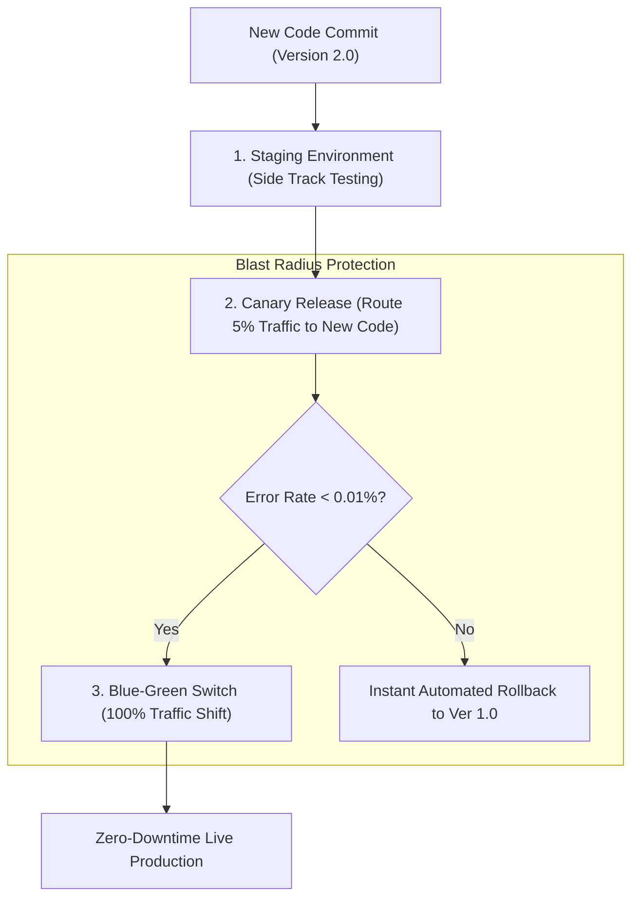

```ppt
# Slide 1: Release Management & Safe Deployments
- **The Core Goal:** Deploying software updates to production smoothly with zero downtime and minimal blast radius.
- **Executive Rule:** Continuous deployment requires continuous safety controls!
- **Author:** Pankaj Kumar | Associate Architect & Tech Leadership
<!-- slide -->
# Slide 2: The Side Track Train Testing Analogy
- **Amateur Railroad Manager:** Switches a brand-new high-speed locomotive directly onto the main passenger track at 8:00 AM rush hour without testing brakes or switches first!
- **Master Railway Inspector (Release Management Leader):** Tests the locomotive on a secluded side track (*Staging*), routes 5% of non-peak freight trains to test switches (*Canary*), and flips the main track signals seamlessly (*Blue-Green*)!
<!-- slide -->
# Slide 3: The 3 Primary Deployment Strategies
- **1. Staging Environment:** A mirror replica of production where code is tested isolated from real users.
- **2. Blue-Green Deployments:** Two identical production environments (Blue = Active, Green = Idle). Flip router traffic instantly once Green is verified!
- **3. Canary Releases:** Routing 1% ➔ 5% ➔ 25% ➔ 100% of user traffic to new code gradually while monitoring error rates.
<!-- slide -->
# Slide 4: Blue-Green Deployment Architecture
- **Blue (Active):** Running Version 1.0 handling 100% of live customer traffic.
- **Green (Idle):** Deployed Version 2.0 undergoing final smoke tests.
- **Instant Switch:** Router flips traffic to Green in < 1 second. If errors occur, instant rollback to Blue!
<!-- slide -->
# Slide 5: Canary Release & Blast Radius Control
- **5% Traffic Allocation:** Exposing new features to a small random user subset.
- **Automated Rollback Triggers:** If P99 API latency increases by > 15% or error rate exceeds 0.1%, automated rollback cancels the canary deployment!
<!-- slide -->
# Slide 6: Database Migrations & Zero-Downtime Releases
- **Expand-Contract Pattern:** Adding new database columns without breaking old code versions.
- **Backward Compatibility:** Ensuring Version 1.0 and Version 2.0 can both read the database simultaneously during rollout.
<!-- slide -->
# Slide 7: Common Misconception
- **Myth:** "Deploying to production 10 times a day is dangerous and increases outages."
- **Fact:** Smaller, automated micro-deployments drastically reduce release risk compared to giant quarterly releases!
<!-- slide -->
# Slide 8: Summary for Beginners
- Master Staging, Blue-Green, and Canary releases to achieve zero-downtime deployments and instant automated rollbacks!
```

# Release Management: Staging, Canary & Blue-Green Releases

How do leading technology companies deploy code updates 50 times a day without causing site outages or disrupting paying customers?

In the early days of software, deployments were terrifying weekend events. Engineers stayed up until 3:00 AM on a Sunday, manually copying files to production servers, praying that nothing broke. If a bug slipped through, rolling back took hours of panic.

Modern software engineering uses automated **Release Management Strategies** to make deployments risk-free, instant, and invisible to users!

Let's demystify Release Management using **The Side Track Train Testing Analogy**!

---

## 🚆 The Side Track Train Testing Analogy

Imagine managing a busy passenger railway network:



- **The Reckless Train Manager:**  
  Switches a brand-new, un-inspected high-speed locomotive directly onto the main track during Monday 8:00 AM rush hour. If the brakes fail, thousands of passengers are stranded!

- **The Master Railway Inspector (Release Management CTO):**  
  1. Tests the locomotive on a private side track first (**Staging Environment**).  
  2. Runs the locomotive on 5% of early morning freight trains (**Canary Release**).  
  3. Prepares an parallel track switch so traffic flips instantly without stopping any passenger trains (**Blue-Green Deployment**)!

---

## 📊 Deployment Strategy Comparison Matrix

| Strategy | Target Audience | Rollback Time | Downtime | Best Use Case |
| :--- | :--- | :--- | :--- | :--- |
| **Staging Environment** | Internal QA & Automated Tests | Instant (Local) | Zero | Pre-production validation & integration tests |
| **Canary Release** | 1% to 10% of Live Users | < 5 Seconds (Automated) | Zero | High-risk backend API & algorithm changes |
| **Blue-Green Deployment** | 100% Live Users | < 1 Second (Router Switch) | Zero | Major version upgrades & database migrations |

---

## 💡 Summary for Beginners

- **Staging** = Isolated sandbox mirroring production for pre-release testing.
- **Canary** = Gradually exposing new code to 5% of users to test for errors safely.
- **Blue-Green** = Maintaining two live environments to switch production traffic instantly with zero downtime.
- **CTO Golden Rule** = **"Reduce your blast radius — never deploy directly to 100% of users without staging validation and automated canary rollbacks!"**

---

*Written by **Pankaj Kumar** | Associate Architect & Tech Leadership.*
