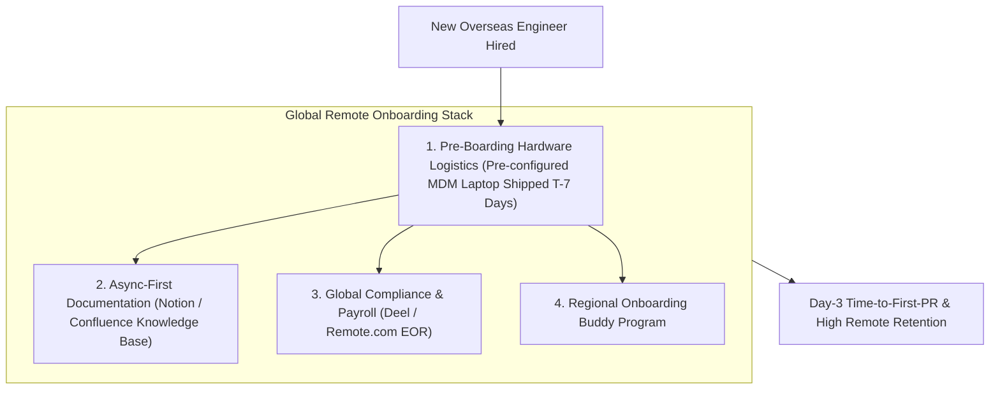

```ppt
# Slide 1: Remote Engineering Onboarding for Global Hires
- **The Global Leadership Strategy:** Onboarding international developers and remote engineering hires seamlessly across different time zones.
- **Executive Purpose:** Accessing global tech talent while ensuring Day-1 productivity, security, and cultural inclusion.
- **Author:** Pankaj Kumar | Associate Architect & Tech Leadership
<!-- slide -->
# Slide 2: Global Maritime Fleet Coordination Analogy
- **Disorganized Fleet (Uncoordinated Remote Onboarding):** A shipping company hires a ship captain in Tokyo and a navigator in London, but forgets to send them satellite radio codes or ship logs. The ships sail blindly, collide in international waters, and miss cargo deadlines!
- **Master Maritime Fleet Command (CTO Remote Playbook):** Ships pre-configured navigation equipment (*Pre-provisioned MDM Laptop*) via secure courier, sets up satellite communication channels (*Async Slack & Notion Docs*), and pairs the new captain with an experienced fleet mentor on Day 1!
<!-- slide -->
# Slide 3: The 3 Pillars of Global Remote Onboarding
- **1. Pre-Boarding Hardware & Access Logistics:** Shipping pre-provisioned laptops 7 days before Day 1 with MDM (Jamf/Kandji) and Zero-Trust access.
- **2. Asynchronous First Communication:** Documenting processes in Notion / Confluence so overseas engineers don't wait 12 hours for answers.
- **3. Virtual Onboarding Buddy Program:** Pairing overseas hires with a peer mentor in an overlapping time zone.
<!-- slide -->
# Slide 4: Overcoming Time-Zone Silos
- **The 4-Hour Overlap Rule:** Ensuring distributed squads have at least 4 hours of shared working time for sync discussions.
- **Async Code Reviews:** Establishing a 12-hour global code review handoff protocol between US, EU, and Asia teams.
<!-- slide -->
# Slide 5: Global Compliance & Legal Infrastructure
- **Employer of Record (EOR):** Using platforms like Deel / Remote.com for global payroll, local tax compliance, and benefit management.
- **Global IP Protections:** Ensuring local employment contracts contain valid intellectual property assignment clauses.
<!-- slide -->
# Slide 6: Fostering Virtual Belonging
- **Virtual Coffee Chats:** Scheduling informal 1-on-1 video chats to build personal trust.
- **Global All-Hands:** Rotating all-hands meeting times so overseas teams aren't forced to join at 2:00 AM.
<!-- slide -->
# Slide 7: Common Misconception
- **Myth:** "Remote onboarding is just sending a Zoom link and a PDF document on Day 1."
- **Fact:** World-class remote onboarding requires automated hardware logistics, async documentation, and dedicated peer mentorship!
<!-- slide -->
# Slide 8: Summary for Beginners
- Master global remote onboarding: pre-ship MDM laptops, enforce async documentation, use EOR compliance platforms, and target < 3 days Time-to-First-PR!
```

# Remote Engineering Onboarding: Setting Up Overseas Hires

In today's global software economy, top engineering talent is distributed across the entire world.

A software startup in San Francisco might hire a Staff Architect in London, a Senior React Engineer in Bangalore, and a DevOps Lead in Warsaw.

However, when companies expand globally without adapting their onboarding processes, **remote hires face severe isolation and friction!**
- The new international hire waits 2 weeks for their company laptop to clear customs.
- They spend 12 hours blocked on every question because internal documentation is missing, and their US teammates are asleep.
- They feel isolated, confused, and resign within 90 days.

How does a CTO build a seamless **Global Remote Engineering Onboarding Pipeline**?

Let's understand Remote Onboarding using **The Global Maritime Fleet Coordination Analogy**!

---

## 🚢 The Global Maritime Fleet Coordination Analogy

Imagine managing a global commercial shipping fleet:



- **The Disorganized Fleet (Poor Remote Onboarding):**  
  A shipping company hires a ship captain in Tokyo and a navigator in London, but forgets to send them satellite radio codes or ship logbooks. The ships sail blindly in opposite directions, collide in international waters, and miss cargo deadlines!

- **Master Maritime Fleet Command (CTO Remote Playbook):**  
  Ships pre-configured navigation equipment (**Pre-provisioned MDM Laptop**) via secure international courier 7 days before Day 1, establishes satellite communication protocols (**Async Slack & Notion Docs**), and pairs the new captain with a regional fleet mentor!

---

## 📊 Traditional Local Onboarding vs. Global Remote CTO Playbook

| Onboarding Dimension | Traditional Local Office Onboarding | Global Remote CTO Playbook |
| :--- | :--- | :--- |
| **Hardware Logistics** | Handing laptop in-person on Day 1 | Pre-shipping MDM laptop (Jamf) 7 days in advance via secure global courier |
| **Knowledge Sharing** | Tap teammate on shoulder to ask questions | Async-first documentation in Notion/Confluence with searchable Q&A |
| **Global Payroll & Legal** | Local W2 / 1099 payroll setup | Employer of Record (EOR) via Deel/Remote for local tax & benefit compliance |
| **Time-Zone Alignment** | Synchronous 9-to-5 office hours | Enforcing "4-Hour Overlap Rule" & 12-hour global async code review handoffs |

---

## 💡 Summary for Beginners

- **Employer of Record (EOR)** = A global platform (Deel, Remote.com) that legally hires and pays overseas developers in compliance with local country labor laws.
- **Async-First Culture** = Defaulting to written documentation and video recordings so developers can work productively without waiting for live meetings.
- **CTO Golden Rule** = **"Build an async-first onboarding culture — pre-ship pre-configured laptops and document every system so global hires ship their first PR within 3 days!"**

---

*Written by **Pankaj Kumar** | Associate Architect & Tech Leadership.*
