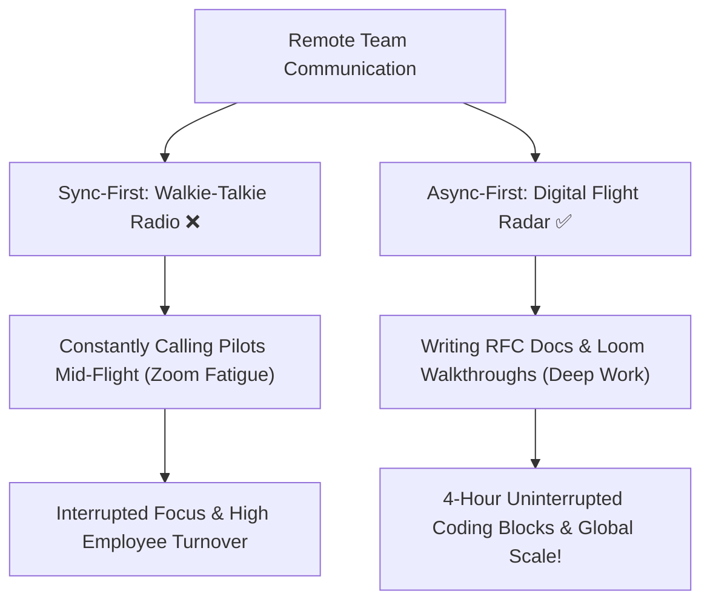

```ppt
# Slide 1: Remote & Hybrid Engineering Teams
- **The Core Problem:** Forcing office-style synchronous meetings onto remote teams causes Zoom fatigue, context switching, and low productivity.
- **The Solution:** Async-First Communication & Protecting Deep Work.
- **Author:** Pankaj Kumar | Associate Architect & Tech Leadership
<!-- slide -->
# Slide 2: The Airport Traffic Control vs Walkie-Talkie Analogy
- **Sync-First (Walkie-Talkie):** Constantly interrupting 50 pilots on open radio channels with minor status updates.
- **Async-First (Airport Radar & Digital Signs):** Flight info updated automatically on digital boards so pilots review information without stopping mid-flight!
<!-- slide -->
# Slide 3: Synchronous vs Asynchronous Communication
- **Synchronous (Real-time):** Live Zoom calls, in-person meetings, instant Slack pings (High interruption risk).
- **Asynchronous (Decoupled):** Written RFC documents, recorded Loom video walkthroughs, detailed PR descriptions (Low interruption risk).
<!-- slide -->
# Slide 4: Protecting Developer "Deep Work"
- **Maker's Schedule vs Manager's Schedule:** Managers operate in 30-minute meeting slots; Developers need 4-hour uninterrupted blocks to write code.
- **No-Meeting Days:** Reserving Wednesdays and Fridays for pure uninterrupted coding.
<!-- slide -->
# Slide 5: The 5 Levels of Remote Work Maturity
- **Level 1:** Office mimicry (Forcing 8 hours of active status lights on Slack).
- **Level 2:** Async adoption (Documenting decisions in Notion / Confluence before meeting).
- **Level 5:** Complete asynchronous autonomy across global time zones!
<!-- slide -->
# Slide 6: Asynchronous Decision Making (RFCs)
- **Request for Comments (RFC):** Writing a detailed 2-page design proposal document instead of hosting a 1-hour brainstorming meeting.
- **Benefit:** Engineers in Tokyo, London, and San Francisco contribute asynchronously without midnight calls!
<!-- slide -->
# Slide 7: Common Beginner Misconception
- **Myth:** "Async-first communication means teams never talk or socialize."
- **Fact:** Async frees up calendar time so team social hangouts are meaningful rather than exhausting!
<!-- slide -->
# Slide 8: Summary for Beginners
- Transition from real-time meeting ping-pong to written documentation for high-velocity remote teams!
```

# Remote & Hybrid Engineering Teams: Async-First Communication & Deep Work

When tech companies shifted to remote and hybrid work, many non-technical managers attempted to recreate office environments online.

They scheduled 6 hours of daily Zoom meetings, demanded instant Slack responses within 2 minutes, and tracked employee green status lights on chat apps!

The result? Severe developer burnout, constant context switching, and plunging code output.

Building software is a high-concentration mental task. Every time an engineer is interrupted by a Slack notification or a 15-minute status call, it takes them **23 minutes** to regain deep focus!

Modern engineering leaders operate on an **Async-First Communication** model.

Let's break down **Async-First Communication** using **The Airport Radar Analogy**!

---

## ✈️ The Airport Radar Analogy

Imagine managing a busy international airport:



- **Sync-First (Walkie-Talkie Radio):**  
  The tower controller shouts over a shared radio frequency every 2 minutes: *"Flight 102, state your status! Flight 304, where are you now?"* Pilots are forced to stop flying the plane to answer radio calls!

- **Async-First (Digital Flight Radar):**  
  The system updates digital radar screens automatically. Pilots and controllers check flight status on their own schedules without interrupting airplane navigation!  
  - *Tech Equivalent:* **Written RFC Documents & Automated Dashboards** where team members read updates when taking a break between deep work sessions.

---

## 📅 Maker's Schedule vs. Manager's Schedule

Paul Graham's classic framework explains why meetings destroy developer output:

| Schedule Type | Operating Block | Primary Impact of a 15-Min Meeting |
| :--- | :--- | :--- |
| **Manager's Schedule** | 30-minute slots | Fits neatly between calls; zero loss in momentum. |
| **Maker's Schedule** | 4-hour deep blocks | Fractures a half-day block, destroying focus for hours! |

---

## 💡 Summary for Beginners

- **Async-First** = Defaulting to written documentation and recorded walkthroughs rather than live meetings.
- **Deep Work** = Uninterrupted cognitive focus required to write complex software algorithms.
- **The CTO's Remote Rule** = *"If a meeting could have been a 2-page RFC document, write the document!"*

---

*Written by **Pankaj Kumar** | Associate Architect & Tech Leadership.*
