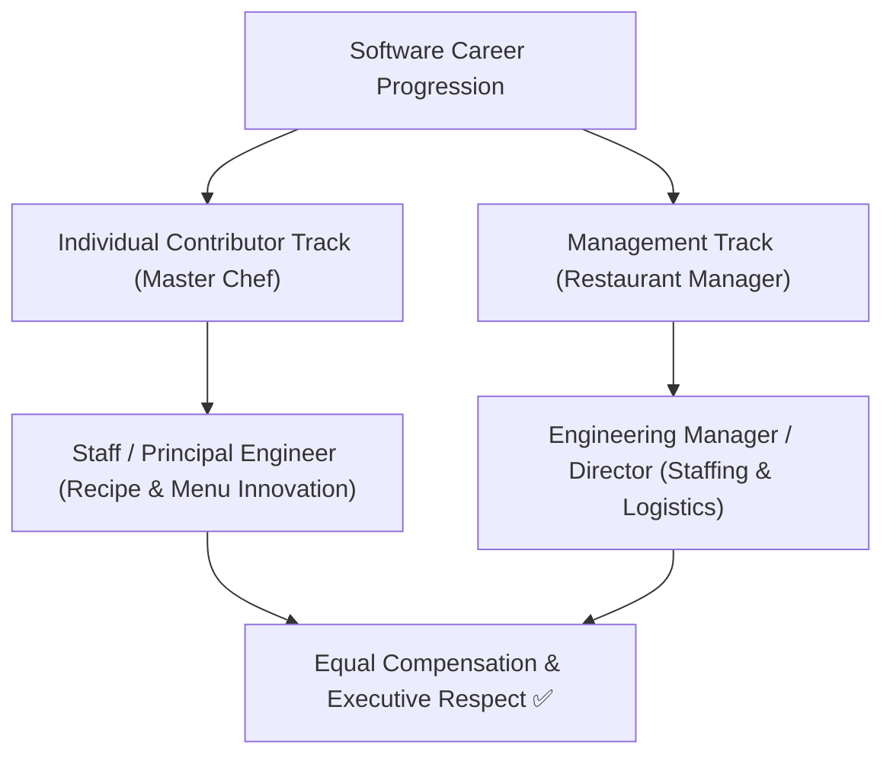

```ppt
# Slide 1: Retaining Senior Technical Talent
- **The Core Leadership Challenge:** Forcing brilliant senior engineers to become managers just to earn higher salaries.
- **The Solution:** Dual Career Ladder — Parallel career tracks for Individual Contributors (ICs) and Engineering Managers.
- **Author:** Pankaj Kumar | Associate Architect & Tech Leadership
<!-- slide -->
# Slide 2: The Master Chef vs Restaurant Manager Analogy
- **Individual Contributor (Master Chef):** Focuses on creating world-class recipes, taste innovation, and culinary mastery.
- **Engineering Manager (Restaurant Manager):** Focuses on staff scheduling, supplier contracts, hiring, and payroll.
- **The Mistake:** Forcing a Master Chef to become a Restaurant Manager just to get a raise!
<!-- slide -->
# Slide 3: The Parallel Dual Career Ladder
- **Senior Engineer** <---> **Engineering Manager** (Level 5)
- **Staff Engineer** <---> **Senior Engineering Manager** (Level 6)
- **Principal Engineer** <---> **Director of Engineering** (Level 7)
- **Distinguished Engineer / Fellow** <---> **VP of Engineering / CTO** (Level 8)
<!-- slide -->
# Slide 4: What Does a Staff/Principal IC Do?
- **Technical Strategy:** Designing multi-year software architectures.
- **Cross-Team Mentorship:** Leveling up 20+ junior developers across the company.
- **Technical Risk Reduction:** Identifying security and scalability risks before they cause outages.
<!-- slide -->
# Slide 5: What Does an Engineering Manager Do?
- **People Growth:** Conducting 1-on-1s, career planning, and performance reviews.
- **Project Execution:** Resource allocation, sprint planning, and removing team blockers.
- **Team Culture:** Hiring top talent, resolving conflicts, and building team morale.
<!-- slide -->
# Slide 6: The "Peter Principle" in Tech
- **Peter Principle:** Promoting an engineer to their level of incompetence (Making a great coder a terrible manager).
- **Solution:** Allowing engineers to switch between IC and Management tracks fluidly without losing status or pay!
<!-- slide -->
# Slide 7: Common Beginner Misconception
- **Myth:** "Individual Contributors don't show leadership; only managers are true leaders."
- **Fact:** Principal & Staff ICs provide massive technical leadership, influencing company-wide architecture!
<!-- slide -->
# Slide 8: Summary for Beginners
- Build a Dual Career Ladder to pay master technical architects as much as directors, retaining your best talent!
```

# Retaining Senior Technical Talent: Dual Career Tracks (IC vs Management)

In traditional corporate companies, if an employee wants to earn a higher salary, get a bigger title, or gain executive respect, there is only one path: **they must become a manager.**

In software engineering, forcing this single promotion path leads to disaster!

A brilliant senior developer who loves coding and designing complex software architectures gets promoted to **Engineering Manager**. Suddenly, 90% of their day is spent in budget meetings, conducting 1-on-1 performance reviews, and managing team schedules.

The result? The company loses its best technical architect and gains a frustrated, unhappy manager!

Modern tech companies solve this problem by implementing a **Dual Career Track (IC vs Management)**.

Let's break down **Dual Career Tracks** using **The Master Chef vs Restaurant Manager Analogy**!

---

## 👨‍🍳 The Master Chef vs Restaurant Manager Analogy

Imagine managing a 5-star Michelin restaurant:



- **Individual Contributor Track (The Master Chef):**  
  They spend 100% of their time in the kitchen. They master rare culinary techniques, design innovative menus, and ensure every dish tastes incredible. They don't manage restaurant payroll or supplier contracts!
  - *Tech Equivalent:* **Staff & Principal Engineers.** They design cloud architectures, solve complex performance bugs, and mentor junior developers without managing people.

- **Management Track (The Restaurant Manager):**  
  They don't cook the food. Their job is hiring waiters, managing food supply contracts, handling customer complaints, and running restaurant operations smoothly!
  - *Tech Equivalent:* **Engineering Managers & VPs.** They handle hiring, team morale, 1-on-1 reviews, and project delivery schedules.

---

## 📊 The Parallel Dual Career Ladder

In modern engineering organizations, compensation and status are strictly equal across both tracks:

| Level | Individual Contributor (IC) Track | Management Track | Primary Focus |
| :--- | :--- | :--- | :--- |
| **L5** | Senior Software Engineer | Engineering Manager | Team-level execution & code quality |
| **L6** | Staff Software Engineer | Senior Engineering Manager | Cross-team technical architecture / Org management |
| **L7** | Principal Software Engineer | Director of Engineering | Company-wide tech strategy / Department budget |
| **L8** | Distinguished Fellow / VP | VP of Engineering / CTO | Multi-year vision & executive governance |

---

## 💡 Summary for Beginners

- **IC (Individual Contributor)** = Software engineers who grow in technical mastery without managing people.
- **Peter Principle** = Promoting someone to a role where they become incompetent (e.g. forcing a great coder to be a bad manager).
- **The CTO's Retention Rule** = *"Pay your top technical architects as much as your directors so you never lose master builders!"*

---

*Written by **Pankaj Kumar** | Associate Architect & Tech Leadership.*
