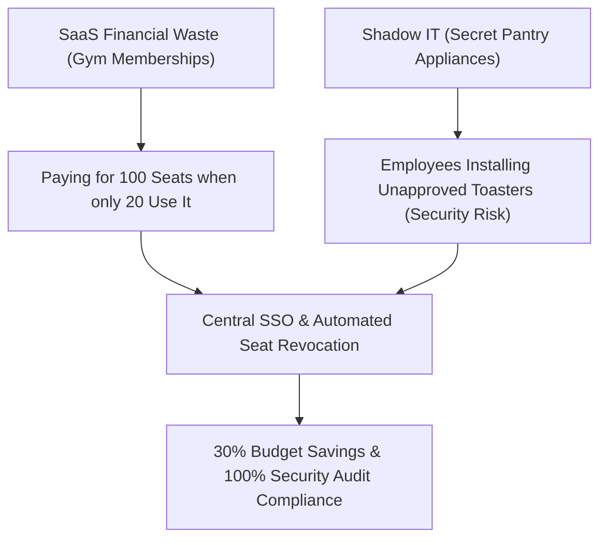

```ppt
# Slide 1: SaaS License Management & Shadow IT
- **Executive Reality:** 30% of corporate SaaS budgets are wasted on unused seats and redundant software tools.
- **Shadow IT:** Unapproved software tools purchased by individual employees using company credit cards.
- **Author:** Pankaj Kumar | Associate Architect & Tech Leadership
<!-- slide -->
# Slide 2: The Gym Membership & Secret Pantry Analogy
- **Unused SaaS Licenses:** Buying 100 annual gym memberships when only 20 employees visit the gym.
- **Shadow IT:** Employees secretly bringing their own uninspected electrical appliances into an office pantry!
<!-- slide -->
# Slide 3: The Top 3 Sources of SaaS Budget Waste
- **1. Forgotten Zombie Licenses:** Paying $50/month for employees who left the company 6 months ago.
- **2. Tool Duplication:** Marketing using Asana, Engineering using Jira, and Product using Trello simultaneously.
- **3. Automatic Credit Card Renewals:** Surprise annual renewals on credit cards with 20% price hikes.
<!-- slide -->
# Slide 4: Real-World Risk: Data Breaches from Shadow IT
- **The Story:** A sales manager uses a free unapproved file-converter website to convert customer PDFs.
- **The Disaster:** The website leaks 5,000 customer email records on the dark web!
<!-- slide -->
# Slide 5: The 4-Step SaaS Governance Playbook
- **1. Centralize Single Sign-On (SSO):** Routing all logins through Google Workspace / Okta.
- **2. Quarterly Access Audits:** Automatically revoking seats when employees leave HR software.
- **3. Standardize Tooling Stack:** Mandating one official project management tool across all departments.
- **4. Vendor Contract Negotiation:** Consolidating licenses to unlock 30% volume discounts.
<!-- slide -->
# Slide 6: The Executive CTO KPI
- **SaaS Utilization Rate:** Active Monthly Users / Total Paid Seats (Target: > 85%).
- **Goal:** Ensuring zero unapproved software tools touch corporate customer data.
<!-- slide -->
# Slide 7: Common Beginner Misconception
- **Myth:** "Employees use Shadow IT because they want to break company rules."
- **Fact:** Employees use Shadow IT because official company tools are slow, outdated, or frustrating!
<!-- slide -->
# Slide 8: Summary for Beginners
- Eliminate zombie SaaS subscriptions to save 30% on tech spending while securing company data!
```

# SaaS License Management & Shadow IT: Eliminating Hidden Software Spend

In modern tech companies, buying software is no longer restricted to the IT department. 

A marketing manager signs up for a $100/month graphic design tool on corporate credit cards. A sales team buys an automated email sequence app. A product manager buys a AI transcript summarizer.

Before long, the company is paying for 80 different **SaaS (Software-as-a-Service)** subscriptions across 10 departments!

This creates two massive executive problems:
1. **Financial Waste:** Paying for "Zombie Licenses" (seats assigned to employees who left the company).
2. **Shadow IT:** Unapproved software tools operating without security inspection.

Let's break down SaaS Governance using **The Gym Membership & Secret Office Pantry Analogy**!

---

## 🏋️ The Gym Membership & Secret Pantry Analogy

Imagine managing an office building:



- **SaaS Waste (The Unused Gym Memberships):**  
  Your company buys **100 enterprise licenses** for a video editing tool. However, only 20 designers actually open the app. The remaining 80 licenses sit completely unused, wasting $40,000 every year!

- **Shadow IT (Secret Office Pantry Appliances):**  
  An employee secretly brings an old uninspected toaster from home and plugs it into an office outlet. One day, the toaster short-circuits, blowing out the building's main fuse box!  
  - *Tech Equivalent:* An employee uploads sensitive customer databases into a free, unapproved web tool that leaks customer data on the internet.

---

## 📊 4 Executive Steps to Eliminate SaaS Waste

1. **🔐 Enforce Single Sign-On (SSO):** Connect all software tools to Okta or Google Workspace. When an employee leaves the company, revoking their main email instantly locks them out of all 50 SaaS apps automatically.
2. **🧹 Quarterly Zombie Audits:** Compare active app usage logs against corporate paid seat counts. Reassign or cancel any seat inactive for over 30 days.
3. **🛠️ Standardize Department Stacks:** Don't let Marketing use Asana while Engineering uses Jira and Sales uses Trello. Consolidate into 1 standard project tool to unlock tier discounts.
4. **💳 Block Expense Card Purchases:** Require IT security approval before corporate cards can pay for recurring software subscriptions.

---

## 💡 Summary for Beginners

- **Shadow IT** = Unapproved software tools bought outside IT security oversight.
- **Zombie Licenses** = Paid software seats assigned to inactive users or former employees.
- **The CTO's Job** = Providing fast, modern approved tools so employees never feel the need to use Shadow IT!

---

*Written by **Pankaj Kumar** | Associate Architect & Tech Leadership.*
