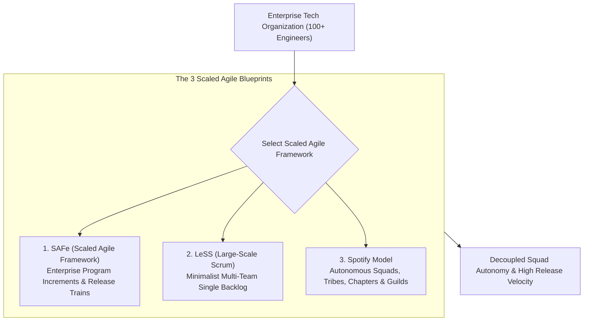
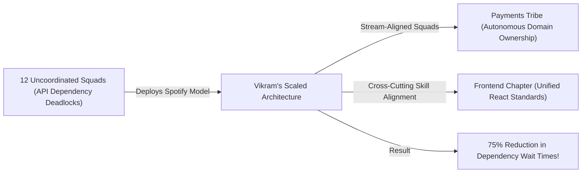

```ppt
# Slide 1: Scaling Agile Across Multiple Squads
- **The Core Leadership Challenge:** Coordinating 5, 10, or 50 engineering squads without causing bureaucratic paralysis or architectural chaos.
- **Executive Purpose:** Scaling engineering delivery from a single startup team to a high-velocity enterprise organization.
- **Author:** Pankaj Kumar | Associate Architect & Tech Leadership
<!-- slide -->
# Slide 2: The National Sports League Coordination Analogy
- **Single Pickup Game (Startup Team):** 10 friends play a casual basketball game on a neighborhood court. No complex league rules needed — players talk directly and make quick calls!
- **National Basketball League (Enterprise Scaled Agile):** 30 professional teams, 500 players, 82-game regular seasons, unified referee rulebooks (*SAFe / LeSS*), and stadium coordinators (*Release Train Engineers*). Everyone plays by the same strategic calendar!
<!-- slide -->
# Slide 3: The 3 Major Scaled Agile Frameworks
- **1. Scaled Agile Framework (SAFe):** Structured enterprise framework introducing Program Increments (PI Planning) and Release Trains.
- **2. Large-Scale Scrum (LeSS):** Minimalist framework extending single-team Scrum principles across multiple squads with 1 Product Backlog.
- **3. Spotify Model (Squads, Tribes, Chapters, Guilds):** Autonomous cross-functional squads grouped by domain, aligned by technical chapters.
<!-- slide -->
# Slide 4: Real-World Case Study: Vikram's 12-Squad Scaling Crisis
- **The Challenge:** A growing fintech platform led by Lead Architect **Vikram Patel** scaled from 15 to 120 engineers, creating massive API dependency deadlocks between teams.
- **The Scaling Solution:** Vikram deployed a lightweight Spotify Model with autonomous Stream-Aligned Squads and cross-cutting Architecture Guilds.
- **The Result:** Cross-team dependency wait times dropped by 75% and release velocity doubled!
<!-- slide -->
# Slide 5: Anatomy of the Spotify Model
- **Squad:** Autonomous cross-functional team (Dev, QA, PM, Design) owning a specific feature stream.
- **Tribe:** Collection of related squads (e.g. Payments Tribe).
- **Chapter:** Functional discipline group (e.g. Frontend Engineers Chapter across all squads).
- **Guild:** Company-wide community of interest (e.g. Security & AI Guild).
<!-- slide -->
# Slide 6: SAFe PI Planning (Program Increment)
- **2-Day Quarterly Alignment:** Bringing 100+ engineers together to map dependencies on a Program Board.
- **Predictable Cadence:** 8-week development iterations followed by 2-week Innovation & Planning (IP) sprints.
<!-- slide -->
# Slide 7: Common Misconception
- **Myth:** "Copying the Spotify Model or SAFe organization chart guarantees high engineering velocity."
- **Fact:** Frameworks are blueprints — culture, trust, and microservice decoupled architecture determine real velocity!
<!-- slide -->
# Slide 8: Summary for Beginners
- Scale Agile thoughtfully: choose SAFe for heavy enterprise compliance, LeSS for lean Scrum simplicity, and Spotify Model for squad autonomy!
```

# Scaling Agile: SAFe vs LeSS vs Spotify Model Explained

When an engineering organization grows from 1 small startup squad (5 engineers) to an enterprise department with 15 squads (120+ engineers), **simple Scrum breaks down!**

Without a framework to coordinate multiple engineering squads:
- Team A builds a new feature, only to discover Team B changed the database schema yesterday without telling them.
- Release deployments get blocked for 3 weeks waiting for cross-team API dependencies.
- Product managers fight over priorities, and engineering velocity grinds to a halt.

This operational deadlock is called **The Agile Scaling Problem.**

To coordinate dozens of engineering squads seamlessly, **CTOs implement Scaled Agile Frameworks!**

Let's understand Scaling Agile using **The National Sports League Analogy**!

---

## 🏀 The National Sports League Analogy

Imagine managing a sports organization:



- **The Neighborhood Pickup Game (Single Startup Squad):**  
  10 friends play a casual pickup basketball game at the local park. They don't need referees, league rulebooks, or season schedules — they talk directly on the court and make quick calls!

- **The National Basketball League (Enterprise Scaled Agile):**  
  Coordinating 30 professional teams, 500 players, 82-game regular seasons, unified referee rulebooks (**SAFe / LeSS Guidelines**), and stadium coordinators (**Release Train Engineers**). Every team plays by the same synchronized league calendar!

---

## 📊 Real-World Case Study: Vikram's 12-Squad Dependency Crisis

Consider a fast-scaling fintech company led by Lead Architect **Vikram Patel**.



1. **The Problem:** Vikram's engineering department grew from 15 to 120 engineers spread across 12 uncoordinated teams. Feature releases were delayed by 6 weeks because squads were constantly blocked waiting for other teams to build backend API endpoints.
2. **The Scaled Solution:** Vikram implemented a lightweight version of **The Spotify Model**:
   - Organized engineers into autonomous, cross-functional **Stream-Aligned Squads** (containing Dev, QA, PM, and UX) that owned complete end-to-end product features.
   - Grouped related squads into a **Payments Tribe**.
   - Created a **Frontend Chapter** where frontend engineers from every squad met weekly to align on React architecture.
3. **The Result:** Cross-team API dependency wait times dropped by **75%**, and the engineering department doubled its quarterly release velocity!

---

## 📊 Executive Framework Comparison: SAFe vs. LeSS vs. Spotify Model

| Dimension | SAFe (Scaled Agile Framework) | LeSS (Large-Scale Scrum) | Spotify Model |
| :--- | :--- | :--- | :--- |
| **Core Philosophy** | Highly structured enterprise governance with rigid roles | Minimalist extension of classic single-team Scrum | Culture-driven squad autonomy and cross-cutting alignment |
| **Key Mechanism** | Program Increments (PI Planning) & Agile Release Trains (ART) | Single Product Backlog & Sprint Planning for 8 squads | Squads, Tribes, Chapters, and Guilds |
| **Prescriptiveness** | High (Heavy rules, certifications, and enterprise roles) | Low (Lean, minimal extra management layers) | Medium (Flexible organizational pattern, not a rigid framework) |
| **Best Used For** | Large enterprise corporations with heavy compliance needs | Software companies committed to pure Scrum principles | Fast-scaling tech scaleups seeking high squad autonomy |

---

## 💡 Summary for Beginners

- **SAFe (Scaled Agile Framework)** = A comprehensive enterprise framework aligning strategy, execution, and delivery across large multi-team organizations.
- **Squad** = A small, autonomous, cross-functional engineering team (5–9 members) focused on a specific product area.
- **Guild** = A company-wide community of practice where engineers across different squads share knowledge on specific topics (e.g. AI Guild, Security Guild).
- **CTO Golden Rule** = **"Don't copy framework charts blindly — organize engineers into autonomous stream-aligned squads and decouple software architecture to scale velocity!"**

---

*Written by **Pankaj Kumar** | Associate Architect & Tech Leadership.*
